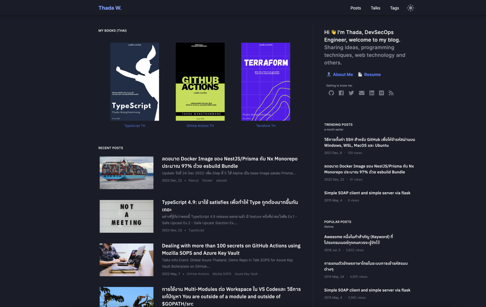
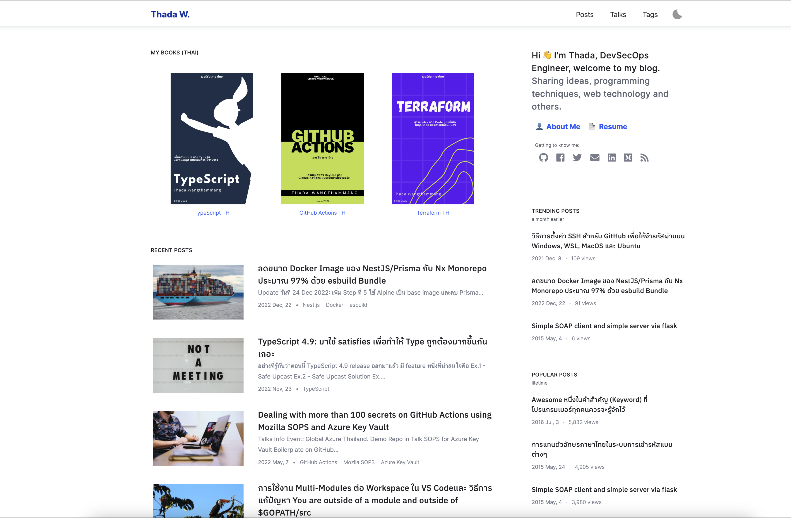
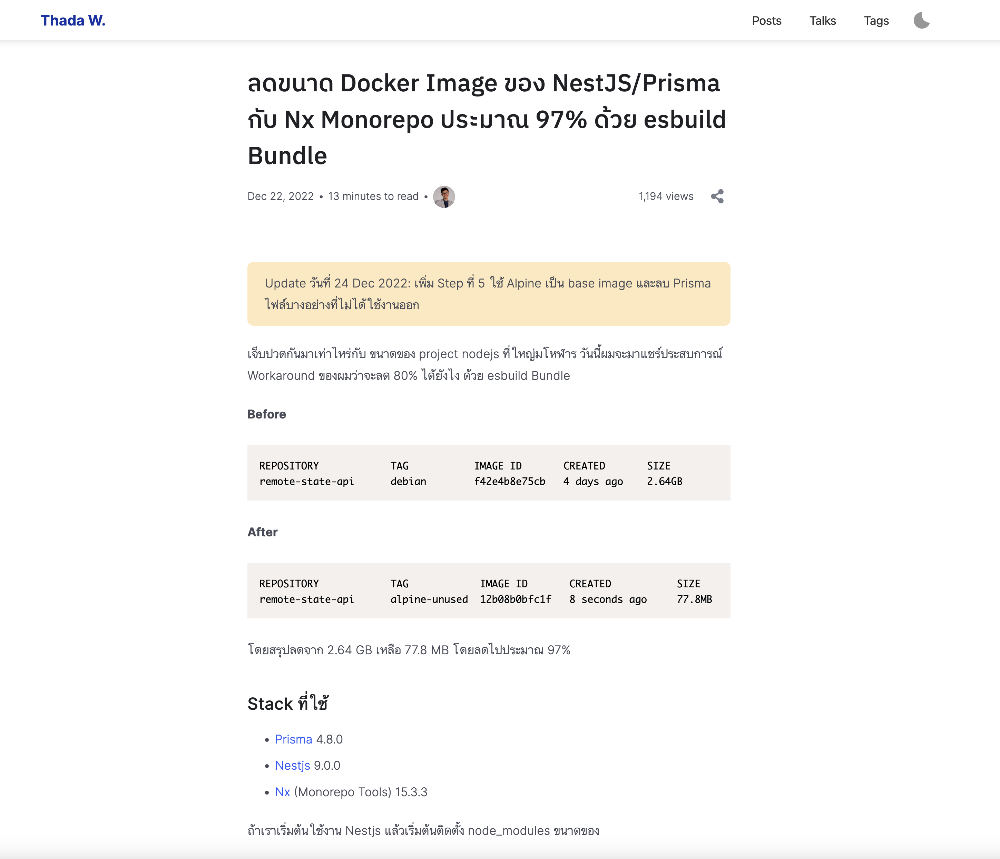

# My personal site

> No longer used
## Some Screenshot





Available  Field in frontmatter
```
- title
- uuid
```

Rendered Field
```js
// gatsby-node.js
createNodeField({ node, name: "isDraft", value: isDraft });

// Slug means uuid of the post
createNodeField({ node, name: "slug", value: nodeSlug });  // No starting and trailing slash ex: whaab42

// "Readable Slug" means title of the post (Slug and URL friendly)
createNodeField({ node, name: "readableSlug", value: nodeReadableSlug });

// "Rendered Slug" means the final pathname of the post
createNodeField({ node, name: "renderedSlug", value: `/${draftSlug}${nodeReadableSlug}-${nodeSlug}` });
```

https://www.knutmelvaer.no/blog/2019/06/getting-started-with-webmentions-in-gatsby/
# Todo
- [ ] Migrate to TS
- [ ] Search
- [ ] SEO Support

# Inspire Design
https://www.happyhues.co/


# Blog Inspire
https://www.swyx.io/
https://mxb.dev/

# Run your GitHub Actions locally 🚀

```bash
# Install act
curl https://raw.githubusercontent.com/nektos/act/master/install.sh | sudo bash

# Run Act with secret https://githact -lub.com/nektos/act#secrets
act -s PUBLIC_REPO_ACCESS_TOKEN=somevalue
```

https://sanderknape.com/2020/05/deploy-pull-requests-github-actions-deployments/


# Based on Gatsby Advanced Starter

A starter skeleton with advanced features for [Gatsby](https://github.com/gatsbyjs/gatsby/), author: Ruben Harutyunyan ([@Vagr9K](https://twitter.com/Vagr9K))
