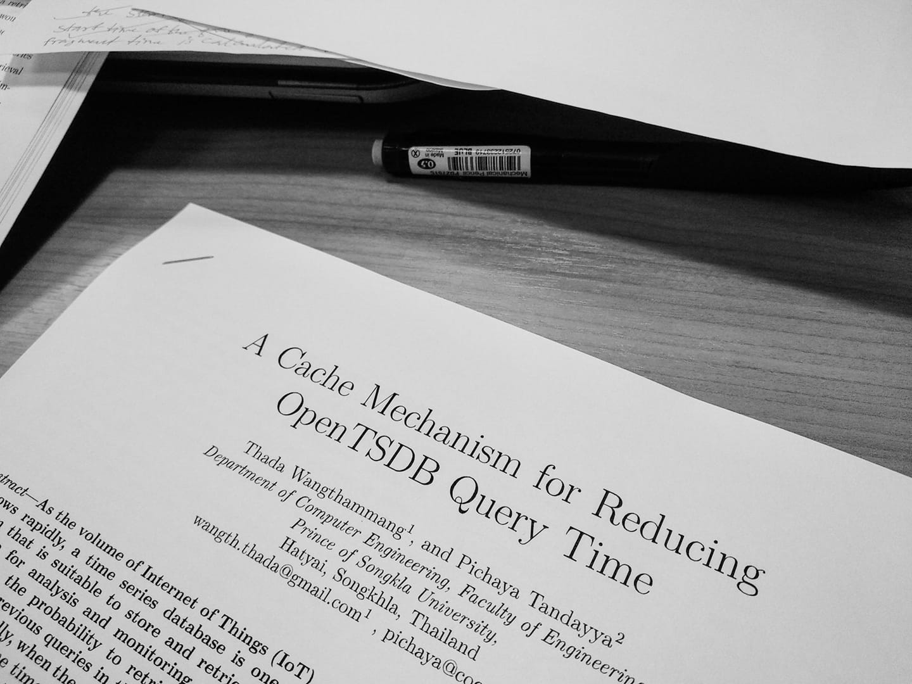

ขอบันทึกการเดินทาง งานวิจัย หน่อย กว่าจะออกเป็น เปเปอร์ของตัวเองอันแรก

ตั้งแต่เริ่มเรียนป.โท ละ ตอนนี้ก็ปี จะครบปีที่ 3 แล้ว

ใช้เวลา 1 เทอมสำหรับการอ่านงานวิจัยคนอื่น แล้วก็เปลี่ยนเรื่องที่จะทำจากหน้ามือเป็นหลังมือ จากจะทำเรื่อง game sever มาเป็น cache บน database

ใช้เวลา 1 เทอม กว่าๆ สำหรับชีวิตในค่ายทหาร ที่ตัดสินใจสมัครทหารไป รู้สึกว่าตัวเองคิดไม่ผิด เสมอมา เพราะทุกอย่างที่เกิดขึ้นล้วนดีเสมอ

ตั้งแต่ออกจากค่ายทหารมา ก็ได้รับโจทย์ที่ท้าทาย อย่างนึงคือ จบให้ทันภายใน เดือน ก.ค. หรือ เวลา 6 เดือน กับความก้าวหน้าของงานอันน้อยนิด ถ้าจะแผนเดิมคือ จะใช้ เวลา 1 ปี กว่าจะจบ

ปรับเป้าหมายใหม่ มีพันธสัญญากับตัวเอง ต้องทำงานดีขึ้นในทุกๆ วัน ตัวเองต้องมีการพํฒนา ใช้เวลาให้คุ้ม ใช้เวลากับการทำงาน แบบ work smart มากกว่าแบบ work hard ซึ่งโดยส่วนตัว เป็นคนประเภท work hard คือลุย ทำอย่างหนัก วันนึงอยู่หน้าจอคอม 14-16 ชม. ด้วยความ perfectionist ของตัวเอง เลยต้องปรับแก้ตัวเองใหม่

ซึ่งตั้งแต่ออกจากค่ายทหาร ต้องเขียนโปรแกรมไปต่อยอดงานคนอื่น หรือในรูป คือ OpenTSDB ซึ่งเป็นโปรเจ็คใหญ่มาก เขียนด้วย java 50 Classes + 30k line of code + Unit test อีกนับไม่ถ้วน เคยรัน unit test ทั้งระบบ ใช้เวลา ชมกว่า ดังนั้นถ้าแก้โปรแกรมที่รัน unitest ทั้งหมด คงรอกันตายเลย

ปัญหาใหญ่ๆ คือ การหาจุดที่จะลงไปแก้ปัญหาในงานคนอื่นนี่แหละ เพราะก่อนหน้านี้เวลา เทอมกว่าๆ 5-6 เดือนในการหาว่า ตรงไหนจะลงไปแก้ แต่ก็หาไม่เจอ ด้วยความที่ ทักษะ การเขียนโปรแกรมด้วย java หายไป 3-4 ปี กับไม่เคยเจอโปรเจ็คใหญ่ขนาดนี้ เลยทำให้หลงทางบ่อยมาก

สิ่งที่รู้สึก amazing กับตัวเอง คือ หลังจากออกจากค่ายทหารมา ใช้เวลาแค่ 2 สัปดาห์ในการหาว่าจุดไหน เราจะลงไปแก้ปัญหาให้เขา ทั้งๆ ที่ก่อนหน้า หาอยู่ 5-6 เดือน เพราะความมีพันธสัญญาตัวเองจริงๆ เราตั้งใจมากขึ้น work smart คิด วางแผน เดินช้าๆ แต่ถูกทาง ก่อนหน้านี้คือเดินเร็ว แต่ผิดทาง

ใช้เวลา 5 สัปดาห์ เขียนโปรแกรม พร้อม unitest และก็แก้บัคอยู้ 3-4 สัปดาห์ กว่า ผลการทำงานครั้งแรกจะออกมา

หลังจากนั้นวางแผนจะส่งงานประชุมวิชาการ เพราะต้องส่ง ไม่งั้นจะจบไม่ทัน เลยเตรียมตัวจะส่ง เขียนโปรแกรมสำหรับรันผลการทดลอง อีกนาน 2-3 สัปดาห์ เพื่อให้คอมทำงานให้เราทั้งหมด แต่พบปัญหารายทางตลอด เกิดจากความไม่รอบคอบ และเร่งรีบเกินไป ต่อเป้าหมาย (เนื่องจากรันผลหลังกรณีมาก จำนวนของ start ระบบ เทส และทำลาย น่าจะวนๆ อยู่ที่ 1000 รอบ ถ้าทำเองก็คงเดี้ยงซะก่อน 555+)

จากการทำงานอย่างหนักหน่วงในช่วง 3-4 วันนี้ (ไม่ได้เพิ่งมาเร่งทีหลังนะ แต่ผลการทดลองยังเอาไปเขียนงานไม่ได้ ต้องแก้โปรแกรมกันหลายรอบ) จนถึง ตี 3 ของวันที่ 9 เมษา ส่งงานเรียบร้อย เป็นงานประชุมวิชาการระดับนานาชาติ ซึ่ง deadline คือ 9 โมงเช้า

ถึงแม้ว่ายังเป็นแค่ candidate paper แต่เราก็ลุยสุดๆ ทำเต็มที่แล้วผลลัพธ์ที่ได้ออกมาจะเป็นยังไงก็ไม่สนใจแล้ว

ขอขอบคุณ อาจารย์ที่ปรึกษา อาจารย์ Pichaya Tandayya มากๆ ที่ลุยกันถึงช่วงโค้งสุดท้าย

Cross Publish at Facebook <https://www.facebook.com/photo?fbid=10216470924033685&set=a.1962315945623> (Sorry this link is not public)

