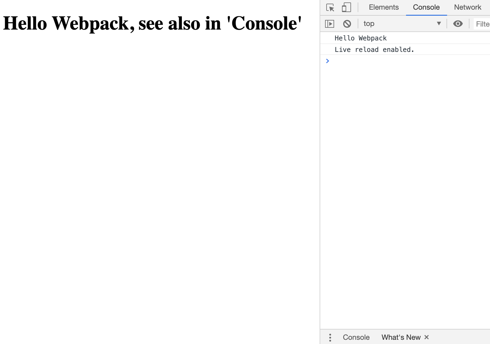

สวัสดีครับ วันนี้ผมจะมาแบ่งปันเรื่องการตั้งค่าการใช้งาน Webpack เบื้องต้น และน่าจะเป็นคำถามและข้อสงสัยสำหรับคนที่หัดใช้ครับ

> หมายเหตุ: ณ วันที่เขียน Blog อ้างอิงจาก Webpack 4

อย่างที่เราทราบกันดีว่า [Webpack](https://webpack.js.org/) ถูกใช้กันอย่างมากใน Library พัฒนาเว็บไซต์ที่ใช้ Javascript เป็นหลัก อย่างเช่นเครื่องมือดังๆ อย่าง React, Angular หรือ Vue ก็ตาม หรือหลายๆ เว็บก็ใช้งานเยอะมาก ซึ่งเมื่อตั้งค่าของ Webpack แล้ว เราก็แทบไม่ต้องไปยุ่งกับมันอีก แต่ตอนตั้งค่าครั้งแรกนี่สิ อาจจะเหนื่อยหน่อยสำหรับบางคน

อ่ะ เข้าเรื่องกัน

## Webpack คือ

Webpack พูดง่ายๆ ก็คือการที่รวมโค๊ดเราที่เป็นหลายๆ ไฟล์ ซึ่งจัดเรียงการให้สามารถ Maintainance ได้ง่าย มารวมกันใน 1 Bundle หรือ หลาย Bundle ก็ได้ (ซึ่ง Bundle ก็คือไฟล์ JS ไฟล์ 1 ไฟล์นั้นเอง) เพื่อให้ง่ายต่อการนำไปใช้ และจัดการ


หลายๆ คนอาจจะสงสัยว่า ในเมื่อ React ก็มี [create-react-app](https://github.com/facebook/create-react-app) หรือเครื่องมืออื่นที่สามารถสร้างเว็บได้เลย โดยไม่ต้องตั้งค่า Webpack อะไรเลย แล้วเมื่อไหร่เราควรจะใช้ Webpack

## เมื่อไหร่เราควรจะใช้ Webpack

คำตอบคือ แล้วแต่เราเลย ถ้าคิดว่าไม่ต้องใช้ก็ไม่ต้องใช้ 555+ ตาม Style เวลาคนชอบพูดถึง [Redux](https://redux.js.org/) ชอบมาก คือ **คุณไม่จำต้องใช้ Redux หากไม่รู้ว่าทำไมถึงต้องใช้** ผมก็คงตอบเหมือนกันกับ Webpack

แต่ในกรณีนี้ผมตั้งค่า Webpack เนื่องจาก

1. จะมีการใช้ Javascript ES2015 (ES6) และสูงขึ้นไป ในที่นี้จัดการโดย [Babel](https://babeljs.io/)
2. จะมีการใช้ React แบบบางส่วน บางโมดูลเท่านั้น

ที่นี้ แล้วถ้าเราจะเขียน JS โดยสั่งควบคุม DOM หรือ select DOM ผ่าน JS ที่อยู่ใน Bundle มันก็ทำปกติ ขอเล่าการใช้ประโยชน์ของ Webpack ใน React App กันนะครับ ถ้าเข้าใจตรงนี้ ก็จะเห็นภาพมากขึ้น

1. React จะมีไฟล์ `index.html` ซึ่งเป็น Template หลักในการรันแอพ React
2. ซึ่งในไฟล์ `index.html` แล้วจะมี Tag `<div id="root"></div>` ซึ่งเป็นตำแหน่งสำหรับให้ React App ทำงาน
3. จากนั้น React จะเขียน config ของ Webpack ให้ compile โค๊ด React ทั้งหมดลงไฟล์ JS 1 ไฟล์ (หรือ หลายไฟล์ แล้วแต่ออกแบบ) ซึ่ง 1 ไฟล์นี้แหละ เค้าเรียกว่า Bundle ของ Webpack
4. จากนั้น React ก็จะมีการเขียนโค๊ดให้รันเจ้า React ตรง `root` นั้นแหละ ที่เราเขียนไว้ใน `index.html` ถ้าจำกันได้เวลาเราใช้ `create-react-app` จะสั่ง Render React App ที่ id `root` ในไฟล์แรกที่เราเขียนคือ `index.js` ตามข้างล่างเลย

  ```javascript
  render(<App />, document.getElementById('root'));
  ```

นี่คือประโยชน์อย่างนึงของ Webpack เห็นมั้ยครับ จากตัวอย่างข้างบนคือ เราเรียกออกมาข้างนอก Bundle แต่จะเรียก function ใน  Bundle ล่ะ ทำยังไง

ซึ่งหน้าตาที่เราอยากคือ ประมาณนี้

```html
<script src="dist/index.js"></script>
<script type="text/javascript">
    hello("Webpack");
</script>
```

คือ function `hello` ซึ่งในอยู่ใน Bundle ของ Webpack ที่ชื่อ `dist/index.js` ที่นี่มาเข้าเรื่องของเรากันคือ

## วิธีการรัน JavaScript ข้างนอก Bundle ของ Webpack

Webpack ค่อนข้างเรียนรู้ยากสำหรับคนที่เพิ่งเริ่มต้น ซึ่งเท่าที่ลองศึกษาดู ก็มีคนพูดวิธีให้ไปแก้ไข config ใน `webpack.config.js` อย่าง[โพสนี้]((https://stackoverflow.com/questions/34357489/calling-webpacked-code-from-outside-html-script-tag))
อย่างไรก็ตาม เรามาลองวิธีนี้กัน


1. ตั้งค่า `webpack.config.js` ตามโค๊ดข้างล่างตามนี้ คือใช้การตั้งค่าทั่วๆ ไป (ไม่ลงรายละเอียดตรงนี้นะครับ)

```js
const path = require('path');

module.exports = {
  entry: './src/index.js',
  output: {
    path: path.resolve(__dirname, 'src/dist'),
    filename: 'index.js'
  },
  module: {
    rules: [
      {
        test: /\.m?js$/,
        exclude: /(node_modules|bower_components)/,
        use: {
          loader: 'babel-loader',
          options: {
            presets: ['@babel/preset-env']
          }
        }
      }
    ]
  }
}
```

2. แล้วในไฟล์ `src/index.js` เราก็เขียน JS กันและมีตัวอย่างการเรียกใช้ `JQuery` ซึ่งหลักการก็คือเอา function ไปใส่ไว้ใน `window` ซึ่งเวลานำ Bundle นี้ไปใช้งานก็จะสามารถเข้าถึง function นี้ได้

```js
window.$ = window.jQuery = require("jquery");

let hello = (name) => {
    console.log(`Hello ${name}`);
    $("#hello-text").html(`Hello ${name}, see also in 'Console'`);
};

(function(window){
    window.EntryPoint = {
        hello
    }
})(window)
```

โดยผมสั่งให้พิมพ์ parameter และสั่งแก้ DOM ชื่อ `hello-text`

3. ต่อไปก็คือเขียนไฟล์ HTML โดยไฟล์ bundle คือ `dist/index.js` เราก็สามารถเรียกผ่านตัวแปร `EntryPoint` ได้เลย หรือตัวแปรอื่นๆ ก็ได้ โดยหน้าตาก็ประมาณนี้

```html
<h1 id="hello-text"></h1>

<script src="dist/index.js"></script>
<script type="text/javascript">
    EntryPoint.hello("Webpack");
</script>
```

นี้คือตัวอย่างการทำงาน




เพื่อเข้าใจมากขึ้นสามารถเข้าไปดู source ได้ที่ <https://github.com/mildronize/webpack-with-vanilla-js> ได้เลยครับ
