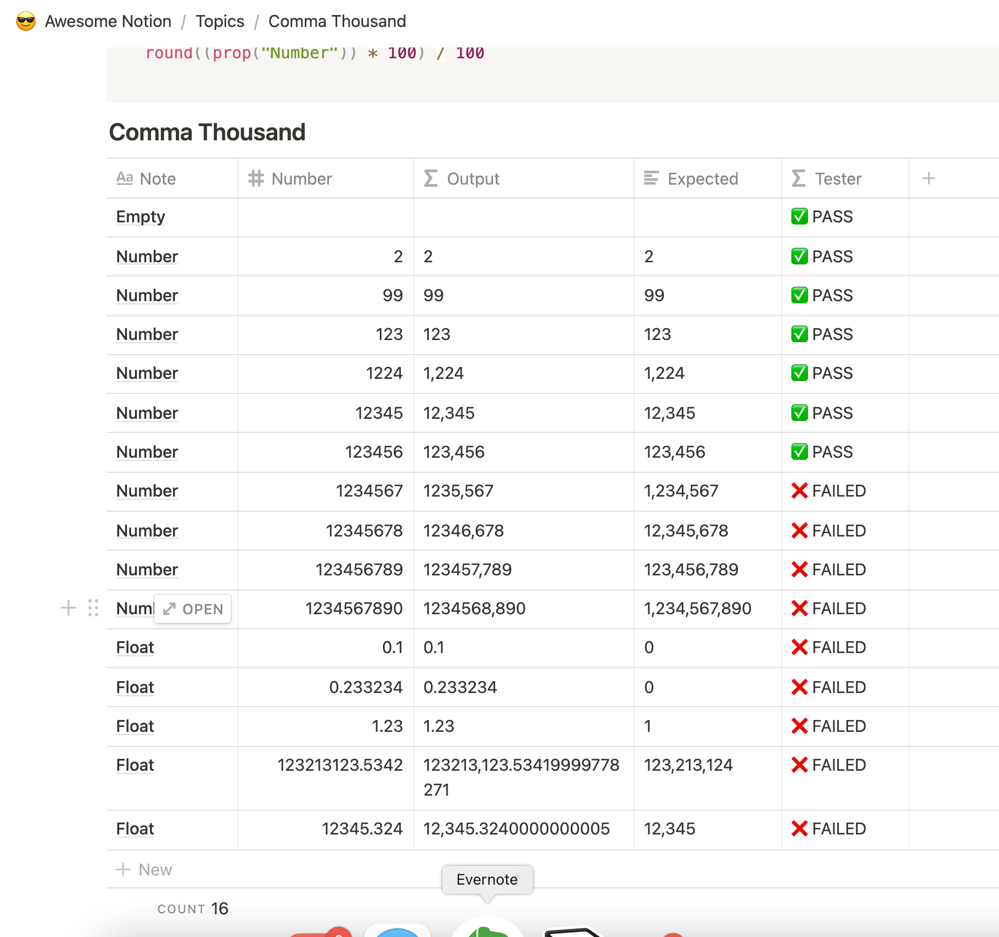
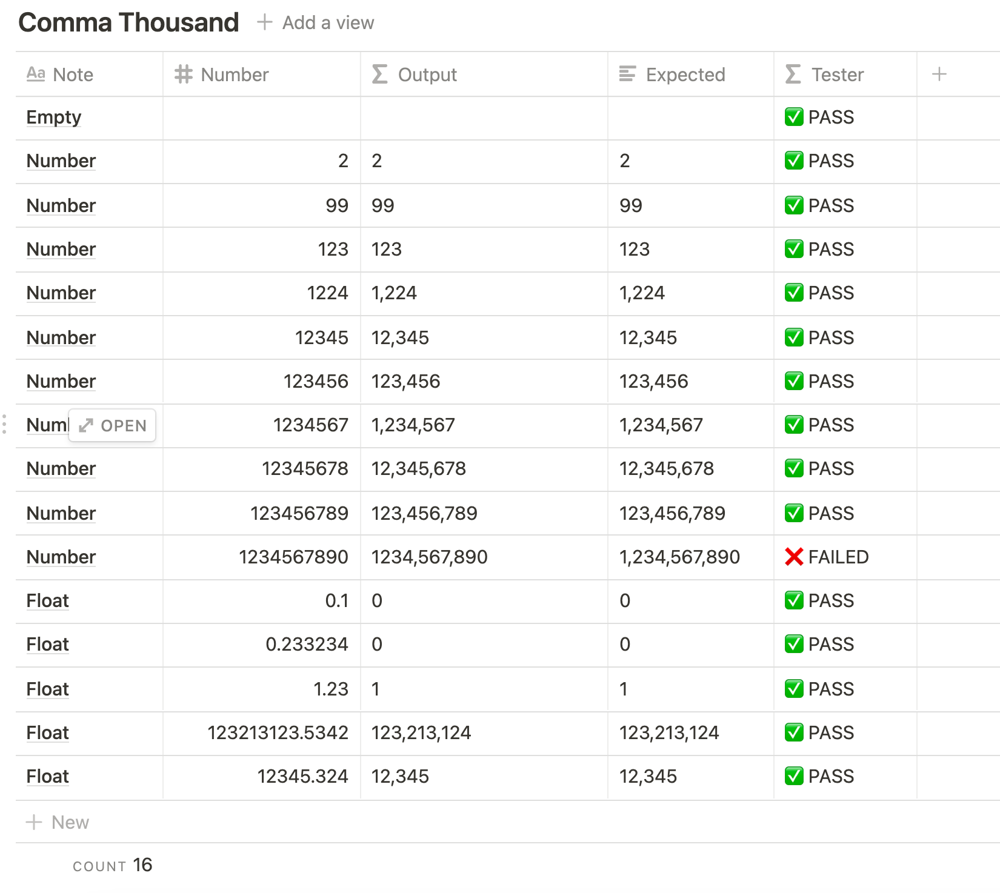

สวัสดีครับ วันนี้ผมมาแชร์เทคนิคการเขียน สูตรแบบ ยังไงก็ไม่พลาดแน่ๆ กันครับ เทคนิคที่ใช้ TDD (Test-Driven Development) คือ โดยผมประยุกต์ใช้ใน Notion โดย

ในตัวอย่างนี้จะใช้สูตรการใส่ comma เลขหลักพันนะครับ มาเริ่มกันเลย!

1. การสร้าง Table มา 
2. กำหนด Column
    - Number = คือค่าตั้งต้น
    - Output = สูตรของเรา
    - Expected = สิ่งที่เราอยากให้เป็น คำตอบที่ถูกต้อง
    - Tester = สูตรง่ายๆ สำหรับเช็คว่า Output กับ Expected เท่ากันมั้ย

3. เราจะเริ่มจากให้ Pass บางเคสก่อน (เอาจริงๆ ต้องเริ่มจาก Fail ทุกเคส แต่นี้ขอข้ามขั้นตอนนั้นไป)

    
4. จากนั้น เราจะค่อยๆ ปรับแก้สูตรไปเรื่อยๆ จนผ่านครบทุกเคสครับ

## Thousand Comma Formula


<div class="word-wrap">

```js
if(empty(prop("Number")), "", concat(if(round(prop("Number")) > 1000000, concat(format(floor(round(prop("Number")) / 1000000)), ","), ""), if(mod(round(prop("Number")), 1000000) > 1000, concat(format(floor(mod(round(prop("Number")), 1000000) / 1000)), ",", if(mod(mod(round(prop("Number")), 1000000), 1000) < 10, "00", if(mod(mod(round(prop("Number")), 1000000), 1000) < 100, "0", "")), format(mod(mod(round(prop("Number")), 1000000), 1000))), format(mod(round(prop("Number")), 1000000)))))
```

</div>

## Tester Formula

<div class="word-wrap">

```js
if(prop("Output") == prop("Expected"), "✅ PASS", "❌ FAILED")
```
</div>

## Finally, All Test Pass 



## Download TDD Template with Thousand Comma

https://www.notion.so/TDD-Formula-Notion-using-Comma-Thousand-as-a-case-study-80199bc04990423c8e250e7d20fd8f6b
