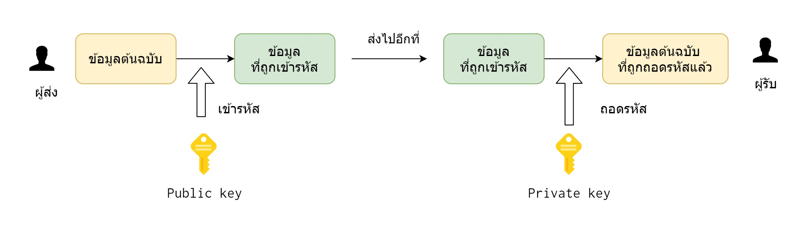
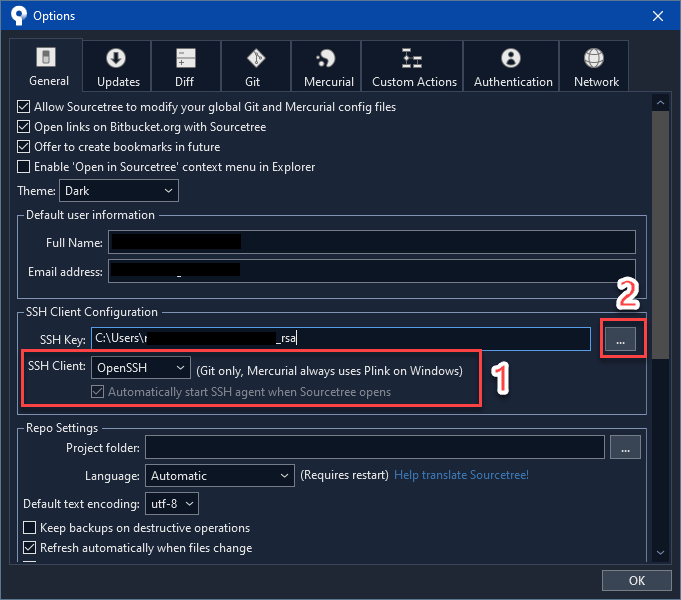

ถ้าใครจะตั้งค่า SSH สำหรับ Remote Server อื่นๆ ก็ใช้หลักการเดียวกันได้ เพียงแต่ในบทความนี้ยกตัวอย่าง GitHub

บทความนี้จะแบ่งจะเป็น 2 ส่วนใหญ่ๆ คือฝั่ง Unix-based (Mac OS, Ubuntu, WSL) และฝั่ง Windows ครับ ก่อนจะเข้าเรื่อง ผมขออธิบายหลักการของ SSH เบื้องต้นนะครับ การเชื่อมต่อผ่าน SSH หรือ Secure Shell นั้น คือการเชื่อมต่อไปเครื่องต้นทาง (Local) ไปยังเครื่องปลายทาง (Remote) ผ่านการเข้ารหัส ซึ่งมั่นใจได้ว่าการเชื่อมต่อนั้นปลอดภัยในระดับที่ยอมรับได้ในระดับสากล

ในการเชื่อมต่อนั้นจะเป็นแบบ Asymmetric Encryption หรือ การเข้ารหัสแบบไม่สมมาตร
โดยก่อนจะมีการส่งข้อมูลจะมีการสร้างคู่ของกุญแจ ที่ก็ต้องใช้ร่วมกันเท่านั้น เราจะเรียกว่า Public key และ Private key ซึ่งวิธีเข้ารหัสที่ได้รับนิยมคือ RSA

- Public key คือ กุญแจสาธารณะ ซึ่งคือสามารถเผยแพร่ให้ เครื่องปลายทางได้
- Private key คือ กุญแจส่วนตัว ซึ่งไม่ควรเผยแพร่ และเจ้าของข้อมูลควรจะถือไว้เท่านั้น

โดยก่อนที่จะมีการส่งข้อมูลจะมีการเข้ารหัสด้วย Public Key ทุกครั้ง และเมื่อข้อมูลถูกส่งมายั่งเครื่องต้นทางที่มี Private key แล้วก็จะสามารถถอดรหัสเพื่อเห็นข้อมูลจริงๆ ได้



สามารถอ่านเพิ่มได้ที่ [4 Cryptography Concept ที่ Developer ทุกคนควรรู้][4-crypto] โดยคุณ Kittitorn Kanokwalai

ก่อนที่เข้าเรื่องในบทความนี้จะเป็นวิธีการใช้ OpenSSH ที่ใช้อยากแพร่หลายใน Linux และ Mac มาอย่างยาวนาน และแนะนำวิธีการตั้งค่า OpenSSH บน Windows (แทนที่จะเป็น Putty) โดยการใช้งาน OpenSSH จะมี `ssh-agent` ที่เป็น service ที่ทำงานหลังบ้าน เพื่อให้เราสามารถนำ key ของเราไปเชื่อมต่อกับ server ปลายทางได้

## 1. Mac OS, Ubuntu, WSL
### 1.1 วิธีการสร้าง SSH Keys และการใช้งาน

สร้าง SSH key

```bash
$ ssh-keygen -t rsa -b 4096 -C "your_email@example.com" -f ~/.ssh/id_rsa
```

> Note: ถ้าเป็น Windows ต้องใส่ `-f ~/.ssh/id_rsa` ไม่งั้นจะ error ว่า [SSH-Keygen "no such file or directory"][3]

Copy ข้อมูลในไฟล์ `~/.ssh/id_rsa.pub` (ซึ่งก็คือ Public Key) ไปวางที่ GitHub account settings (https://github.com/settings/keys).

ติดตั้ง SSH Agent

```bash
eval "$(ssh-agent -s)"
```

Add ตัว private key

```
ssh-add ~/.ssh/id_rsa
```

ลองทดสอบ SSH key:

```bash
$ ssh -T git@github.com
Hi [Your Username]! You've successfully authenticated, but GitHub does not provide shell access.
```

ไปยังโฟลเดอร์ที่ของ Git Repo ในเครื่องเราแล้วเปลี่ยน Git remote ให้เป็นแบบ SSH

```bash
$ git remote set-url origin git@github.com:username/your-repository.git
```

จากนั้นลอง commit และ push ดู ระบบไม่ควรถามหารหัสผ่านแล้ว

Ref: [Finnian Anderson][4], [GitHub Official Doc](https://docs.github.com/en/github-ae@latest/authentication/connecting-to-github-with-ssh/generating-a-new-ssh-key-and-adding-it-to-the-ssh-agent)


## 2. Windows 10, 11

เมื่อปี 2018 ผมได้เขียนบทความ [วิธีตั้งค่าการใช้งาน Github (แบบไม่ต้องกรอกรหัสผ่านทุกครั้ง) ผ่าน SSH บน Windows](/s/mo4feik/) ซึ่งได้แนะนำวิธีการใช้ Putty สำหรับทำงานเป็นเบื้องหลัง แต่เราจำเป็นต้องเปิดตัว agent ขึ้นมาทุกครั้ง หรือถ้าไม่อย่างนั้นก็ต้อง ตั้งค่า startup เอง

เมื่อปี 2019 Windows ได้ปล่อยความสามารถอย่างหนึ่งคือ OpenSSH Client ที่เป็น service อยู่บน Windows ซึ่งดีมากๆ เลย ที่เราไม่ต้องพึ่งโปรแกรมอื่นๆ อย่างเช่น Putty

ในหัวข้อนี้จะเน้นที่ Powershell เท่านั้นนะครับ ถ้าใครใช้ WSL หรือ Git Bash บน Windows แล้วแนะนำให้ใช้หัวข้อข้างบนแทน

### 2.1 เตรียม SSH สำหรับ Windows 10

OpenSSH ได้ถูกปล่อยออกมาเป็นส่วนหนึ่งของ Windows 10 ทำให้เราสามารถใช้คำสั่ง SSH ผ่าน cmd หรือ powershell ได้ เพื่อให้สามารถใช้งาน OpenSSH ได้เราจำเป็นจะต้องติดตั้ง OpenSSH และสั่งให้ service `ssh-agent` ทำงานเบื้องหลังไว้

1. เปิด `Manage optional features` จาก start menu แล้วติดตั้ง `OpenSSH Client`

2. เปิด Powershell แบบ Admin

  ```powershell
  Get-Service -Name ssh-agent | Set-Service -StartupType Automatic
  Get-Service -Name ssh-agent | Set-Service -Status Running
  ```

  แนะนำให้อ่าน[บทความการตั้งค่า OpenSSH ของ Microsoft][ms-official-docs] เพิ่มเติม

ถ้าใครไม่ถนัดการใช้ผ่าน command-line สามารถดูการตั้งค่าแบบ UI ได้ที่ [newbedev.com][1] หรือ [SSH keys on Windows 10][5] โดย Richard Ballard

### 2.2 วิธีการสร้าง SSH Keys และการใช้งาน บน PowerShell

สามารถใช้วิธีการเดียวกันจาก Mac OS, Ubuntu, WSL ได้เลย ที่เขียนไว้แล้วข้างบน

## 3. วิธีการที่ทำ SSH Agent จำ Key passphrase

เราสามารถใช้งานทั้ง Mac OS, Ubuntu, WSL และ Windows เลย โดยมี 2 วิธี  ขอบคุณ [Daniel Dogeanu][2]

### 3.1 ใช้ Command ssh-add

1. Add your SSH key to the `ssh-agent` by issuing the `ssh-add` command and entering your passphrase:

  ```
  ssh-add $HOME/.ssh/your_file_name
  ```

> ถ้าใครจะใช้ SSH Key มากกว่าหนึ่ง แนะนำให้ใช้วิธีการที่ 2 ซึ่งเราสามารถ setup ชื่อของ Host ที่แตกต่างกันได้ เมื่อเราใช้คนละ account กัน แนะนำให้ดูเพิ่มใน หัวข้อที่ 4. การใช้งานหลาย Key ในเครื่องเดียวกัน

### 3.2 ตั้งค่าไฟล์ใน `~/.ssh/config`

1. ตั้งค่าให้ SSH สามารถที่จะเพิ่ม key ลงไปใน agent โดยการแก้ไขไฟล์ config ที่อยู่ใน `$HOME\.ssh\config`

  ```
  Host *
    AddKeysToAgent yes
    IdentitiesOnly yes
  ```

  โดยที่เราสามารถใส่ config ของ SSH key ที่เราสร้างขึ้นมาได้ หรือจะสามารถใส่หลาย key ได้ด้วย

  ```
  Host github.com
    HostName github.com
    User your_user_name
    IdentityFile ~/.ssh/your_file_name
  ```

2. เรียบร้อยแล้ว ถ้ายังใช้งานไม่ได้ให้ restart shell

## 4. การใช้งานหลาย Key ในเครื่องเดียวกัน
เราสามารถใช้งานทั้ง Mac OS, Ubuntu, WSL และ Windows เลย
โดยการเข้าไปแก้ไขไฟล์ `~/.ssh/config` และเพิ่มหัวข้อ Host ใหม่ โดยในทีนี้ผมเลือกให้ `Host github.com` เป็นค่าเริ่มต้นของ account github ส่วนตัว และใช้ `Host work.github.com` เป็น host สำหรับ account github ที่ทำงาน

```
Host *
	AddKeysToAgent yes
	IdentitiesOnly yes

Host github.com
	HostName github.com
	User personal-user
	IdentityFile ~/.ssh/personal_rsa

Host work.github.com
	HostName github.com
	User work-user
	IdentityFile ~/.ssh/work_rsa
```

ลองตรวจสอบดูว่า key ของเราถูกติดตั้งหรือยัง?

```bash
ssh-add -l
4096 SHA256:XXXXXXXXXXXXXX personal@email.com (RSA)
4096 SHA256:XXXXXXXXXXXXXX work@email.com (RSA)
```

ตัวอย่างวิธีการใช้ เราสามารถใช้

```bash
## สำหรับเปลี่ยน Remote location ของบัญชีส่วนตัว
git remote set-url origin git@work.github.com:your-username/your-repo.git
## สำหรับเปลี่ยน Clone ของบัญชีส่วนตัว
git clone git@work.github.com:your-username/your-repo.git
```
> ซึ่งตรงนี้จะเหมือนกับหน้าเว็บ GitHub แนะนำเลย

แต่ถ้าเราจะใช้ `Host work.github.com` เป็น host สำหรับ account github ที่ทำงาน เพียงแค่เปลี่ยน host ใน URL เท่านั้นเอง

```bash
## สำหรับเปลี่ยน Remote location ของบัญชีที่ทำงาน
git remote set-url origin git@github.com:your-username/your-repo.git
## สำหรับเปลี่ยน Remote location ของบัญชีที่ทำงาน
git clone origin git@github.com:your-username/your-repo.git
```

## 5. วิธีการแก้ปัญหา

1. ถ้าเป็นแบบนี้ แสดงว่า SSH Agent ยังไม่ได้ทำงาน background ให้ใช้ คำสั่ง `eval "$(ssh-agent -s)"` เพื่อ Start Agent ขึ้นมา (เฉพาะ Mac, Linux, WSL)

  ```bash
  $ ssh-add -l
  Could not open a connection to your authentication agent.
  ```

2. ถ้าเป็นแบบนี้ แสดงว่า SSH Agent ทำงานแล้ว แต่ยังไม่ได้ติดตั้ง key ของเราเลย อาจจะต้องใช้คำสั่ง `ssh-add /path/key` ไปก่อน เพื่อเพิ่ม key เข้าไป

  ```bash
  $ ssh-add -l
  The agent has no identities.
  ```

3. ถ้ายังไม่ได้ลองดู Verbose ของ SSH ดู

  ```bash
  ssh -vv -T git@work.github.com
  ```

ถ้าลองทำแล้วได้ไม่ได้ยังไง มาแบ่งปันกันได้นะครับ

### วิธีใช้งานร่วมกับ SourceTree



> เราจำเป็นต้องใช้ **SourceTree แบบ Admin** ถ้าสังเกตุในหัวข้อ 2.1 เตรียม SSH สำหรับ Windows 10 มีการสั่งให้ service `ssh-agent` เริ่มทำงาน จำเป็นต้องใช้สิทธิ Admin ไปด้วยในการใช้งานบน SourceTree มิเช่นนั้นมันจะ Error "ssh-agent failed with code-1 system.componentmodel.win32exception access is denied"

Sourcetree สามารถอ่านไฟล์ `~/.ssh/config` ได้ ดังนั้น custom hostname เราจะสามารถใช้งานได้

ให้เราอัพเดท Remote ไปที่

```
git@work.github.com:your-username/your-repo.git
```


## อ่านเพิ่มเติม

- [4 Cryptography Concept ที่ Developer ทุกคนควรรู้][4-crypto] โดยคุณ Kittitorn Kanokwalai
- [SSH keys on Windows 10][5] - Richard Ballard
- [OpenSSH key management][ms-official-docs] by Microsoft
- [วิธีการใช้งาน ~/.ssh/config เพิ่มเติม](https://linuxize.com/post/using-the-ssh-config-file/)
- [Understand Basic SSH Agent](https://www.ssh.com/academy/ssh/agent)
- [Using SSH agent forwarding](https://docs.github.com/en/enterprise-server@3.4/developers/overview/using-ssh-agent-forwarding) - GitHub Official Doc

## อ้างอิง

- [How to run ssh-add on windows?][1] - Newbedev.com
- [How to make Powershell remember the SSH key passphrase.][2] - Daniel Dogeanu
- [SSH-Keygen "no such file or directory" ][3] - Newbedev.com
- [Setup SSH keys for use with GitHub/GitLab/BitBucket etc ][4] - Finnian Anderson

[1]: https://newbedev.com/how-to-run-ssh-add-on-windows
[2]: https://gist.github.com/danieldogeanu/16c61e9b80345c5837b9e5045a701c99 "How to make Powershell remember the SSH key passphrase."
[3]: https://newbedev.com/ssh-keygen-no-such-file-or-directory
[4]: https://gist.github.com/developius/c81f021eb5c5916013dc
[5]: https://richardballard.co.uk/ssh-keys-on-windows-10/ "SSH keys on Windows 10"
[ms-official-docs]: https://docs.microsoft.com/en-us/windows-server/administration/openssh/openssh_keymanagement "Official Docs"
[4-crypto]: https://medium.com/scb-techx/4-cryptography-concept-%E0%B8%97%E0%B8%B5%E0%B9%88-developer-%E0%B8%97%E0%B8%B8%E0%B8%81%E0%B8%84%E0%B8%99%E0%B8%84%E0%B8%A7%E0%B8%A3%E0%B8%A3%E0%B8%B9%E0%B9%89-15a806b6771d "4 Cryptography Concept ที่ Developer ทุกคนควรรู้"
