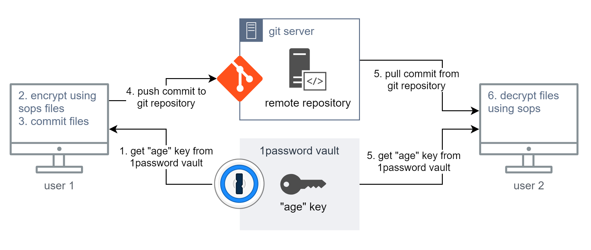
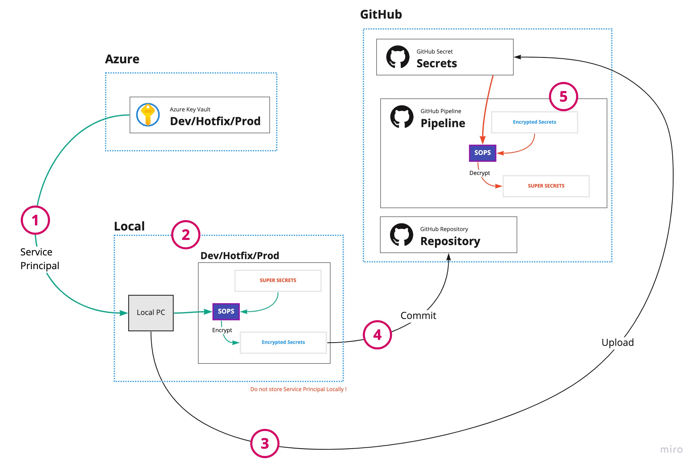
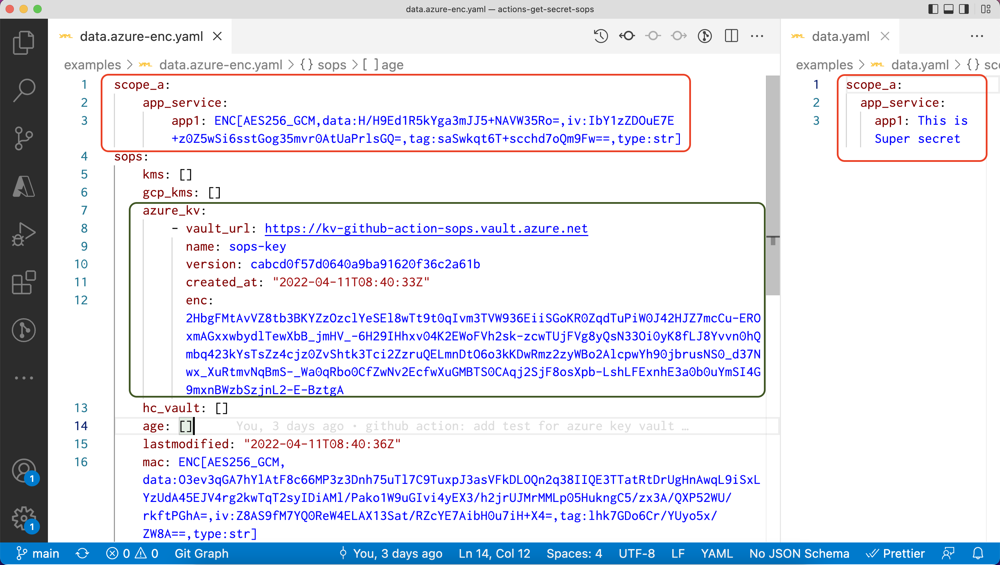

## Talks Info

- Event: Global Azure Thailand.
- [Demo Repo in Talk](https://github.com/mildronize/100-secrets-github-actions-sops-with-azure-key-vault)
- [SOPS for Azure Key Vault Boilerplate on GitHub](https://github.com/mildronize/sops-with-azure-keyvault-secrets)

---

ก่อนที่จะอ่านบทความนี้ควรที่จะเข้าใจการใช้งาน GitHub Actions เบื้องต้นก่อน

# 1. Introduction

เชื่อว่าหลายๆ คนมีการอัพโหลด secret ไปที่ GitHub Secrets เพื่อที่จะ deploy ไปที่ server

แต่ประเด็นคือ ใน 1 GitHub Action repo เราใช้ secret ของ GitHub Action ได้ไม่เกิน 100 ตัว เพื่อแก้ปัญหาดังกล่าว เราเลยมีทางออกประมาณ 3 วิธี

## Possible Solution

1. ย้ายไปสร้างที่ Organization แทน มันใส่ได้ 1,000 ตัว เพราะว่า secret จะไปเห็นที่ repo อื่นๆ ด้วย จึงไม่ผ่านเรื่อง security
2. สร้าง Service Principal ของแต่ละ resource group แล้ว ตอน deploy ให้ไป download publish profile ทุกครั้ง แทน เพื่อลดจำนวน secrets แต่วิธีการนี้ ก็ปัญหาเรื่อง security เช่นกัน เพราะ เรามี secret  ที่มีสิทธิสูงเกินความจำเป็น ถ้าใช้หลักการของ zero trust เราควรทำให้ secret มีสิทธิ์เพียงแค่เท่าที่ใช้งานเท่านั้น (Principle of least privilege)
3. เราจะเก็บ Decryption Key ใน Github secrets โดยแยกแต่ละ Environment หรือ group ที่เรากำหนดไว้ เวลาจะใช้ ก็ decrypt ออกมา ซึ่งไฟล์ encrypted secrets อยู่ใน Private Repo แทน อ่านเพิ่ม [https://docs.github.com/en/actions/security-guides/encrypted-secrets#limits-for-secrets](https://docs.github.com/en/actions/security-guides/encrypted-secrets#limits-for-secrets)

[https://github.com/mozilla/sops](https://github.com/mozilla/sops)

## Our Solution

เราเลือกที่จะไปทางข้อ Solution ข้อที่ 3 โดยเราเลือกใช้ [Mozilla SOPS](https://github.com/mozilla/sops) ซึ่งเป็น Tools ที่เป็นที่นิยมมากๆ ในการจัดการ secrets โดยใช้วิธีการ symmetric encyption ไฟล์ Yaml เพื่อจะ encrypt secrets ต่างๆ โดย SOPS support การ Encrypt จาก Cloud ไม่ว่าจะเป็น Azure, AWS, หรือ GCP รวมถึง [HashiCorp Vault](https://www.vaultproject.io/) ด้วย และยังสามารถใช้ Local Encrypt จาก [Age](https://github.com/FiloSottile/age) และ [PGP](https://www.openpgp.org/) ได้อีกด้วย

### สาเหตุที่เลือกใช้ SOPS

มีการพูดถึง SOPS ใน [Cloud Native Computing Foundation (CNCF)](https://www.cncf.io/) เกี่ยวกับการจัดการ Secrets [สำหรับ Kubernates](https://www.cncf.io/blog/2021/04/22/revealing-the-secrets-of-kubernetes-secrets/) และอยู่ใน [CNCF Radar 2021 ระดับ Assess](https://radar.cncf.io/2021-02-secrets-management) และอยู่ใน [thoughtworks Technology Radar 2021 ระดับ Assess](https://www.thoughtworks.com/en-th/radar/tools/mozilla-sops) เครื่องมือ [Flux CD ก็เขียนคู่มือการใช้งาน SOPS ไว้](https://fluxcd.io/docs/guides/mozilla-sops/)

แต่ SOPS เองก็มีประเด็นต้องพิจารณาเพิ่มเติมด้วย

1. เราจะเก็บ Cipher text (Encrypted data) ไว้ที่ไหนถึงจะปลอดภัย
2. เรื่องของ Key Rotation อาจจะต้องการจัดเอง


เราไม่สามารถเก็บ secrets ทั้งหมดได้ใน github Secrets เพราะจากจำนวน secrets ที่เยอะ จึงไม่สามารถเก็บใน 1 Github Secrets ที่มีขนาดไม่เกิน 64 KB

> Secrets are limited to 64 KB in size. To use secrets that are larger than 64 KB, you can store encrypted secrets in your repository and save the decryption passphrase as a secret on GitHub. อ่านเพิ่ม [https://docs.github.com/en/actions/security-guides/encrypted-secrets#limits-for-secrets](https://docs.github.com/en/actions/security-guides/encrypted-secrets#limits-for-secrets)
>

ดังนั้น ถ้าเราเก็บ SOPS Encrypted Secrets ตรงๆ ใน GitHub Secrets ไม่ได้เนื่องจากขนาดเกิน การเก็บ Encrypted Secrets ใน Git Repo ก็ทางเลือกหนึ่งที่พอรับได้ แต่สิ่งที่ต้องเผชิญต่อไปคือ Internal Threat

## ทางเลือกอื่นๆ เพื่อปิดช่องโหว่เรื่อง Internal Treat

ถ้าการใช้ SOPS อาจจะยังไม่ตอบโจทย์เรื่องความปลอดภัยเพียงพอ เราอาจจะต้องใช้ External Secret Management Tool เช่น [HashiCorp Vault](https://www.vaultproject.io/)

แต่สิ่งที่พิจารณาเพิ่มเติมคือ เรื่อง External Threat แทนที่จะเป็นเรื่องของ Internal Threat เวลาใช้ SOPS เก็บ secrets ใน Git Repo

ดังนั้น การที่ทำให้อุดช่องโหว่เรื่อง External Threat คือการทำ Private Connection ระหว่าง HashiCorp Vault Server และ GitHub Action Runner แทน ซึ่งเราจะต้อง Setup Self-Host GitHub Action Runner ขึ้นมาเอง และตั้งค่าให้อยู่ภายใน Private Network เดียวกันกับ HashiCorp Vault Server ดูตัวอย่างได้ใน **[Secure GitOps Workflows with GitHub Actions and HashiCorp Vault](https://www.youtube.com/watch?v=rhB72KFiL48)**

ถ้าเราจะเชื่อมต่อ HashiCorp ******Cloud Platform (HCP) กับ Cloud AWS แบบ Private connection เราสามารถใช้ [AWS VPC](https://learn.hashicorp.com/tutorials/cloud/amazon-peering-hcp?in=vault/cloud-ops)

แต่สำหรับ Azure เองยังไม่ support HCP เราอาจจะต้องตั้งค่า deploy vault server เอง

## Our Final Decision

เนื่องจากข้อจำกัดทางด้านเวลา และทรัพยากรที่เรามี เราจึงเลือกที่เก็บ SOPS encrypted secrets ใน Git Repo แทน จึงทำให้เราต้องมาพิจารณาเรื่อง internal threat แทน และขอไม่รับ External Threat มาเพิ่ม

# 2. การใช้งาน SOPS ด้วย Age Encryption

[ใน Docs ของ SOPS ไม่แนะนำให้ใช้ PGP แล้ว ให้เปลี่ยนมาใช้ Age Encryption แทน](https://github.com/mozilla/sops#22encrypting-using-age) โดย Age Encryption ใช้เป็น X25519 is an elliptic curve [Diffie-Hellman key exchange](https://en.wikipedia.org/wiki/Diffie%E2%80%93Hellman_key_exchange) using [Curve25519](https://en.wikipedia.org/wiki/Curve25519).

Install age via brew

```bash
brew install age
```

Generate Age Key

```bash
age-keygen -o key.txt
```

The contain in file `key.txt` :

```bash
# created: 2022-04-11T15:36:32+07:00
# public key: age1js5yl37ghup68pzf8f2kutf6xtuwc4m6lpha0llgmcup93q3sp9qtfwvr8
AGE-SECRET-KEY-15YXVYTPWNT4UF3KY05K27LZN2SAT83SJKX7UH4MXQEQAWRWPFNYSDHK860
```

**DO NOT PUBLISH AGE SECRET KEY** (This is for example in this repo only)

Encrypt

```bash
sops --encrypt --age age1js5yl37ghup68pzf8f2kutf6xtuwc4m6lpha0llgmcup93q3sp9qtfwvr8 examples/data.yaml > examples/data.age-enc.yaml
```

เราก็ได้ไฟล์ `data.age-enc.yaml`  ที่ถูกเข้ารหัสแล้ว เราก็นำไฟล์นี้ Commit ขึ้น Git Repo ได้เลย

อันนี้เป็นตัวอย่างไฟล์ SOPS ที่ถูก Encrypt แล้ว


หลังจากนั้น ตั้งค่า GitHub Secret ด้วย Age Secret key

ตัวอย่างการใช้งาน

```yaml
steps:
  - uses: actions/checkout@v3
  - uses: mildronize/actions-get-secret-sops@v1
    id: sops
    with:
      path: "examples/data.age-enc.yaml" # Encrypted SOPS yaml path
      property-path: ".scope_a.app_service.app1" # yq/jq expression syntax for getting a particular value
      decrypting-key: ${{ secrets.Age_SOPS_github_action }} # Age Secret Key
      sops-version: '3.7.2'
  - run: echo "${{ steps.sops.outputs.secret }}"
```

> ในการใช้งาน [mildronize/actions-get-secret-sops](https://github.com/marketplace/actions/get-secrets-from-encrypted-sops) จะต้องกำหนด `property-path` สำหรับเข้าถึง secret ที่เราต้องการผ่าน path ของ yaml ไฟล์ โดยใช้ syntax ของ [jq](https://stedolan.github.io/jq/) หรือ [yq](https://github.com/mikefarah/yq) ก็ได้
>

การ Decrypt ให้เราใช้ Age Secret key ตั้งค่าไว้ใน environment variable ชื่อ `SOPS_AGE_KEY`

โดยใช้

```yaml
sops --decrypt examples/data.age-enc.yaml > examples/data.yaml
```

แต่ปัญหาก็คือใครเป็นคนเก็บ Age Secret Key และการแจกจ่าย key ให้คนอื่นใช้โดยไม่รู้ว่าใครเป็นคนใช้งาน ถือว่าเป็นปัญหาหนึ่งของ security ในรูปเป็นตัวอย่างในการใช้ Age Encryption โดยเก็บ  Age Secret Key ไว้ใน 1password



[https://blog.thenets.org/how-to-commit-encrypted-files-to-git-with-mozilla-sops/](https://blog.thenets.org/how-to-commit-encrypted-files-to-git-with-mozilla-sops/)

แต่ก็กลับมาประเด็นเดิมคือ การแจกจ่าย Key (Key Distribution) ให้คนอื่นใช้โดยไม่รู้ว่าใครเป็นคนใช้งาน อาจจะเกิดปัญหาเรื่อง Key หลุดแล้ว Track ไม่ได้ว่าเกิดอะไร ดังนั้นการใช้ 3rd Party Secret Management ช่วย ก็จะเป็นทางออกที่ดี ในที่นี้ผมจะใช้ Azure Key Vault เพราะแทนที่เราจะเก็บตัว Private Key นั้นเอง เราให้ Azure Key Vault ช่วยเก็บให้ และการเอาออกมาใช้ ด้วยสิทธิ์ของ User ที่อยู่ใน Azure แทน แบบนี้เราก็สามารถ track ได้ว่า user ที่มีสิทธิ์เท่านั้นนะ สามารถเข้าถึง key ได้ รวมถึงมีประวัติการใช้งาน key อีกด้วย

# 3. การใช้ SOPS ด้วย Azure Key Vault

ในการใช้ SOPS ด้วย Azure Key Vault ดูประกอบดังนี้



1. โดยเริ่มต้นสร้าง Azure Key Vault ก่อน และสร้าง Key สำหรับ SOPS แล้วก็สร้าง Service Principle สำหรับใช้ใน GitHub Actions

```bash
az login
# ตั้งค่า default subscription
az account set --subscription "Your subscription Name"
# สร้าง Resource Group ถ้ายังไม่มี
az group create --name rg-common --location "Central US"
# Create a Vault, a key, and give the service principal access:
az keyvault create --name "kv-github-action" --resource-group rg-common --location "Central US"

az keyvault key create --name "sops-key" --vault-name "kv-github-action" --protection software --ops encrypt decrypt
```

จากนั้นสร้าง Service Principle สำหรับ Key Vault เพื่อให้มีสิทธิ์เท่าที่จำเป็น (Principle of least privilege)

```bash
az ad sp create-for-rbac -n "Display Name of Service Principle" --role Contributor --scopes /subscriptions/[Subscription ID]/resourceGroups/[resource_Group_name]/providers/Microsoft.KeyVault/vaults/[vault_name]
```

เรื่อง Role Contributor อาจจะมีสิทธิสูงเกินไป อาจจะเลือก Role อื่นตามความเหมาะสม โดยผลลัพธ์จะออกมาหน้าตาประมาณนี้

```bash
{
  "appId": "<some-uuid>",
  "displayName": "my-keyvault-sp",
  "name": "http://my-keyvault-sp",
  "password": "<some-uuid>",
  "tenant": "<tenant-id>"
}
```

จากนั้นตั้งค่า Environment Variable โดยเอา Value จากข้างบน และให้สิทธิ์ Key Vault ให้กับ Service Principle

```bash
export AZURE_CLIENT_ID="appId"
export AZURE_TENANT_ID="tenant"
export AZURE_CLIENT_SECRET="password"

az keyvault set-policy --name "kv-github-action" --resource-group "rg-common" --spn $AZURE_CLIENT_ID --key-permissions encrypt decrypt
```

1. ต่อไปเราจะอ่าน Azure Key Vault ID มา จะเป็นหน้าตามประมาณนี้ `[https://sops.vault.azure.net/keys/sops-key/some-string](https://sops.vault.azure.net/keys/sops-key/some-string)` และใช้ในการ Encrypt SOPS

```bash
# Read the key id:
az keyvault key show --name "sops-key" --vault-name "kv-github-action" --query key.kid

# Encrypt
sops --encrypt --azure-kv https://sops.vault.azure.net/keys/sops-key/some-string examples/data.yaml > examples/data.azure-enc.yaml
```

โดยจะมีหน้าตาประมาณนี้



1. Upload Service Principle ไปที่ GitHub Secrets
2. จากนั้น Commit ไฟล์ที่ผ่านการ Encrypt แล้ว เช่น `examples/data.azure-enc.yaml` ไปยัง Private Git Repo
3. ตั้งค่าให้ GitHub Actions สามารถที่จะ Decrypt secret ที่เราต้องการออกมาได้ จาก Path ที่อยู่ใน yaml file

ตัวอย่างการใช้งาน

```yaml
steps:
  - uses: actions/checkout@v3
  - uses: mildronize/actions-get-secret-sops/azure@v1
    id: sops
    with:
      path: "azure.enc.yaml" # Encrypted SOPS yaml path
      property-path: ".scope_a.app_service.app1" # yq/jq expression syntax for getting a particular value
      decrypting-key: ${{ secrets.Azure_Credential }} # Azure Service Principle
      sops-version: '3.7.2'

  - run: echo "${{ steps.sops.outputs.secret }}"
```

> ในการใช้งาน [mildronize/actions-get-secret-sops](https://github.com/marketplace/actions/get-secrets-from-encrypted-sops) จะต้องกำหนด `property-path` สำหรับเข้าถึง secret ที่เราต้องการผ่าน path ของ yaml ไฟล์ โดยใช้ syntax ของ [jq](https://stedolan.github.io/jq/) หรือ [yq](https://github.com/mikefarah/yq) ก็ได้
>

# 4. ตัวอย่างการใช้งานจริง SOPS ด้วย Azure Key Vault และเก็บ Encrypted Secrets บน Private Git repo

โค๊ดนี้[ปรับปรุงโค๊ด GitHub Actions เดิม](https://github.com/mildronize/deploy-multiple-azure-app-services-using-github-actions-matrix/blob/main/.github/workflows/build-and-deploy.yml) สามารถไปตามการพูดของผมเรื่อง [“****Deploy .NET Core 6 to Multiple Azure App Services using GitHub Actions Matrix****”](https://github.com/mildronize/deploy-multiple-azure-app-services-using-github-actions-matrix) เมื่อวันที่ 7 เม.ย. 2565 ที่ผ่านมาได้

ตัวนี้จะเป็นการ Build .NET Core 6 และ Deploy ไปยัง Azure App Service จำนวน 3 servers พร้อมๆ กันโดยใช้ GitHub Actions และอ่าน Azure Service Principle จาก GitHub Secrets จากนั้น นำไปอ่านค่า SOPS Secrets จากใน Private Repo

โดยตั้งค่า GitHub Secret Name ดังนี้

- `AzureKeyVault_ServicePrinciple__kv_github_action__sp_sops_github_action` เอาไว้เก็บ Service Principal จากหัวข้อที่ผ่านมา
- `GH_TOKEN_PAT` เอาไว้เก็บ Personal Access Token สำหรับ Checkout GitHub Private Repo

และนี่เป็นตัวอย่าง SOPS data เก็บไว้ในไฟล์ `my-sops.enc.yaml` ที่เอาไว้เก็บ Publish Profile ของแต่ละ App Service

```yaml
thadaw:
  app_service:
    cat: Publish Profile of Cat Server from Azure App Service
    dog: Publish Profile of Dog Server from Azure App Service
    ant: Publish Profile of Ant Server from Azure App Service
```

GitHub Actions:

```yaml
name: "Build and Deploy .NET Core"

# Controls when the workflow will run
on:
  # Allows you to run this workflow manually from the Actions tab
  workflow_dispatch:

# This env is sharing between jobs
env:
  dotnet_version: '6.0'
  artifact_name: web-api
  project_path: src/DemoWebAPI

	my_private_repo_secrets_version: "0.0.1"
  sops_service_principle_gh_secret_name: AzureKeyVault_ServicePrinciple__kv_github_action__sp_sops_github_action
  sops_secrets_path: ./my-sops.enc.yaml
  sops_version: "3.7.2"

jobs:
  build:
    runs-on: ubuntu-latest
    steps:
      - name: Checkout Code
        uses: actions/checkout@v2

      - name: Setup .NET Core
        uses: actions/setup-dotnet@v1
        with:
          dotnet-version: ${{ env.dotnet_version }}

      - name: Publish folder
        run: |
          cd "./${{ env.project_path }}"
          dotnet restore
          dotnet build --configuration Release
          dotnet publish --configuration Release --output ./output

      - name: Upload artifact for deployment job
        uses: actions/upload-artifact@v2
        with:
          name: ${{ env.artifact_name }}
          path: '${{ env.project_path }}/output'
          retention-days: 1  # Keep artifact on remote only 1 day

  deploy:
    name: 🚀 Deploy to ${{ matrix.id }}
    runs-on: ubuntu-latest
    needs: build
    strategy:
      fail-fast: false
      matrix:
        include:
          - id: demo_multi_app_cat
            name: thadaw-demo-multi-app-cat
            property_path: .thadaw.app_service.cat

          - id: demo_multi_app_dog
            name: thadaw-demo-multi-app-dog
            property_path: .thadaw.app_service.dog

          - id: demo_multi_app_ant
            name: thadaw-demo-multi-app-ant
            property_path: .thadaw.app_service.ant

    steps:
      - name: Download artifact from build job
        uses: actions/download-artifact@v2
        with:
          name: ${{ env.artifact_name }}

      - name: Checkout My Private repo Secrets
        uses: actions/checkout@v3
        with:
          repository: mildronize/my-private-repo-secrets
          ref: '${{ env.my_private_repo_secrets_version }}'
          token: ${{ secrets.GH_TOKEN_PAT }}
          path: ./my-private-repo-secrets

      - name: Get Credential from SOPS
        uses: mildronize/actions-get-secret-sops/azure@v1
        id: sops
        with:
          path: "./my-private-repo-secrets/${{ env.sops_secrets_path }}"
          property-path: "${{ matrix.property_path }}"
          decrypting-key: ${{ secrets[env.sops_service_principle_gh_secret_name] }}
          sops-version: "${{ env.sops_version }}"

      - name: Deploy to Azure Web App
        id: deploy-to-webapp
        uses: azure/webapps-deploy@v2
        with:
          app-name: ${{ matrix.name }}
          publish-profile: ${{ steps.sops.outputs.secret }}
          package: .
```

ก็จบกันไปแล้วนะคับ ใครมีประเด็นเรื่องใดอยากจะนำเสนอ สามารถพูดคุยกันได้เสมอครับ

ขอบคุณที่อ่านจนจบ แล้วพบกันใหม่
