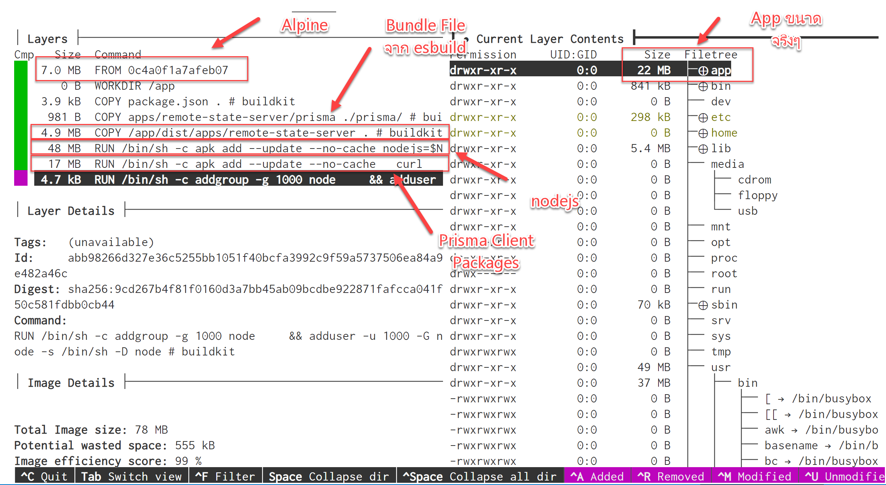

> Update วันที่ 24 Dec 2022:
> เพิ่ม Step ที่ 5 ใช้ Alpine เป็น base image และลบ Prisma ไฟล์บางอย่างที่ไม่ได้ใช้งานออก

เจ็บปวดกันมาเท่าไหร่กับ ขนาดของ project nodejs ที่ใหญ่มโหฬาร วันนี้ผมจะมาแชร์ประสบการณ์ Workaround ของผมว่าจะลด 80% ได้ยังไง ด้วย esbuild Bundle

**Before**

```
REPOSITORY            TAG           IMAGE ID       CREATED       SIZE
remote-state-api      debian        f42e4b8e75cb   4 days ago    2.64GB
```

**After**

```
REPOSITORY            TAG            IMAGE ID       CREATED           SIZE
remote-state-api      alpine-unused  12b08b0bfc1f   8 seconds ago     77.8MB
```


โดยสรุปลดจาก 2.64 GB เหลือ 77.8 MB โดยลดไปประมาณ 97%

## Stack ที่ใช้

- [Prisma](https://www.prisma.io/) 4.8.0
- [Nestjs](https://nestjs.com/) 9.0.0
- [Nx](https://nx.dev/) (Monorepo Tools) 15.3.3

ถ้าเราเริ่มต้นใช้งาน Nestjs แล้วเริ่มต้นติดตั้ง node_modules ขนาดของ

```
du -sh ./node_modules
495M   ./node_modules
```

แล้วถ้าเราใช้ Nx เพื่อกำหนดโครงสร้าง Monorepo ใน repo ของเรามันจะทำให้ใน node_modules ของเราใหญ่ขึ้นมากๆ โดยไม่จำเป็น
ซึ่ง Nx จะมี mode ให้ใช้หลักๆ อยู่ 2 แบบ คือ

1.  [Package-Based Repos](https://nx.dev/getting-started/package-based-repo-tutorial) อันนี้จะเป็นแนวเวลาเราใช้งาน monorepo ทั่วๆ ไป โดยที่แต่ละ project จะมี `package.json` แยกกันเลย จึงทำให้เราสามารถจัดการแต่ละ project แยกกันง่าย และเวลา deploy package แต่ละ Project จะไม่ปนกัน
    - แต่ข้อเสียคือ การ config ให้ tsconfig, eslint, jest ให้มีการใช้งานร่วมกันระหว่างโปรเจ็คได้ ค่อนข้างใช้เวลาเยอะ และ เราไม่สามารถใช้ความสามารถ Generator ของ Nx ได้ ที่สามารถเสก Template TypeScript Project ง่ายๆ
    - ตัวอย่าง Monorepo ที่ลักษณะคล้ายๆ กันก็คือจะมี [Yarn Workspace](https://yarnpkg.com/features/workspaces), [pnpm Workspace](https://pnpm.io/workspaces), [Lerna](https://github.com/lerna/lerna), [turborepo](https://turbo.build/repo)


2.  [Integrated Repos](https://nx.dev/getting-started/integrated-repo-tutorial) อันนี้จะเป็นลักษณะพิเศษที่จะมีเฉพาะ Nx อย่างที่บอกไปแล้วว่าข้อดีคือ สามารถใช้ความสามารถ Generator ของ Nx ได้ ที่สามารถเสก Template TypeScript Project ง่ายๆ พร้อม config ที่เราใช้งานโดยทั่วไปคือ tsconfig, eslint และ jest
    - แต่ข้อเสียคือ Learning Curve สูงกว่าแบบแรกแน่นอน แต่อย่าลืมว่า การ config ให้ tsconfig, eslint, jest ให้มีการใช้งานร่วมกันระหว่างโปรเจ็คได้ ก็ใช้เวลาเยอะเช่นกัน
    - อีกข้อดีและข้อเสีย ก็คือการที่มี package.json ที่เดียวในตำแหน่ง root ของ repo เท่านั้น ซึ่งข้อดีก็คือทำให้เราจัดการ package version ไม่ซ้ำซ้อนกัน เช่น Library ที่ใช้งานร่วมกันก็ควรมี dependencies ที่มี version เดียวกัน ดังนั้นการเปลี่ยน version ทุก project จึงเป็นเรื่องไม่ค่อยอยากทำ ส่วนข้อเสียก็คือ เวลาเราจะ deploy หรือ publish บาง project ขนาดของ node_modules จะอ้วนมากๆ
    - ตัวอย่าง Template ที่ Nx มีให้ใช้ก็เยอะมากๆ หลักๆ คือ React, Angular, Vue, Nestjs และพวก Library Project ต่างๆ ดู plugin ทั้งหมดได้ใน [Nx Packages](https://nx.dev/packages)

### จากมีมที่เค้าชอบแซวๆ กันใน node_modules

ใน Project นี้เราจะจึง Stack ที่มีแต่ทำให้ node_modules บวมๆ ขึ้นมากๆ


## ต่อๆ

ดังนั้นผมจึงเลือก Integrated Repos ของ Nx มาใช้ในงานนี้ อย่างที่บอกไปว่า Nx แบบ Integrated Repos นั้น ทำให้มี node_modules บางตัวที่ไม่ได้ใช้งาน การที่เราจะ Deploy หรือ Publish ทำให้ขนาดของแอพใหญ่ขึ้นมากๆ [nrwl/nx Issues#177](https://github.com/nrwl/nx/issues/1777)

## Step 1: First Docker Image

จากที่แสดงข้างบนบทความจะเห็นได้ว่าแอพตัวนี้มีขนาด 2.64GB

```
REPOSITORY            TAG           IMAGE ID       CREATED       SIZE
remote-state-api      debian        f42e4b8e75cb   4 days ago    2.64GB
```

โดยเรามีการใช้งาน image `node:18` แค่ Image เปล่าๆ ก็ขนาด 942 MB เข้าไปแล้ว

```
REPOSITORY            TAG       IMAGE ID       CREATED        SIZE
node                  18        c6b41dff69c8   20 hours ago   942MB
```

แสดงว่าแอพของเราไม่รวม base image จะมีขนาดประมาณ 1.72 GB โอ้วแม่เจ้า อะไรจะใหญ่ขนาดนี้

### ตัวอย่าง Dockerfile ที่ใช้ใน Step นี้

```dockerfile
FROM node:18 As development
RUN curl -f https://get.pnpm.io/v6.16.js | node - add --global pnpm
WORKDIR /app
COPY ./dist/apps/remote-state-server .
COPY apps/remote-state-server/prisma ./prisma/
COPY package.json pnpm-lock.yaml ./
ENV PORT=3333
EXPOSE ${PORT}
RUN pnpm fetch --prod
RUN pnpm install
RUN pnpx prisma generate
# We don't have the existing sqlite file
# So, we will create a fresh sqlite every time when build
# This migration should be run every time when build
RUN pnpx prisma migrate deploy
CMD node ./main.js
```

ซึ่งใน Dockerfile นี้ผมไม่ได้ Build ใน Docker แต่จะ Build ที่เครื่อง Host ให้เสร็จแล้ว copy เข้ามาตอน build แทน ซึ่งก่อน Build ผมจะรัน

```bash
nx run remote-state-server:build:production
```

ป.ล. `remote-state-server:build:production` ตัวนี้เป็น executor default ของ template Nestjs โดยจะใช้ executor ที่ชื่อว่า [@nrwl/webpack:webpack](https://nx.dev/packages/webpack/executors/webpack)

โดยใน Docker Image ผมจะมีการรัน `prisma generate` เพื่อรัน [script postinstall ของ Prisma เอง](https://www.prisma.io/docs/concepts/components/prisma-client/working-with-prismaclient/generating-prisma-client) และรัน `prisma migrate deploy` ทุกครั้งที่ Build เพราะผมใช้ Sqlite ใน image นี้ด้วย และต้องการให้มัน clean ทุกครั้งที่ build ส่วนใครที่ไม่ใช้งานสามารถลบออกไปได้คับ


## Step 2: สวัสดี Alpine Image

ใน Step นี้ผมจะใช้ Docker multi-stage และติดตั้งเฉพาะ dependencies สำหรับ Production อย่างเดียว ซึ่งผมจะไม่ลงรายละเอียด แต่ไปศึกษาเพิ่มเติมกันได้ [How to write a NestJS Dockerfile optimized for production](https://www.tomray.dev/nestjs-docker-production)

เมื่อเสร็จสิ้นกระบวนการ จะได้ขนาด Image ประมาณ 1.18 GB

```
REPOSITORY            TAG           IMAGE ID       CREATED       SIZE
remote-state-api      alpine        f42e4b8e75cb   4 days ago    1.18GB
```

เมื่อเราเช็คขนาด Image ของ Alpine จะอยู่ที่ 167 MB

```
REPOSITORY            TAG           IMAGE ID       CREATED       SIZE
node                  18-alpine   8a6b96edfa16   9 days ago     167MB
```

แสดงว่าแอพของเราไม่รวม base image จะมีขนาดประมาณ 1 GB อันนี้คือ Nx ที่รวม node_modules ทุก Project ที่อยู่ใน monorepo เดียวกันเลย แสดงว่า devDependencies จะอยู่ที่ประมาณ 700 MB เลยทีเดียว

### ตัวอย่าง Dockerfile

```dockerfile
###################
# BUILD FOR DEVELOPMENT
###################

FROM node:18 As development
RUN curl -f https://get.pnpm.io/v6.16.js | node - add --global pnpm
WORKDIR /app
COPY --chown=node:node . .
RUN pnpm install --frozen-lockfile
RUN pnpx nx run remote-state-server:build:production
USER node

###################
# BUILD FOR PRODUCTION
###################

FROM node:18 As build
RUN curl -f https://get.pnpm.io/v6.16.js | node - add --global pnpm
WORKDIR /app
COPY --chown=node:node package.json pnpm-lock.yaml ./
COPY --chown=node:node apps/remote-state-server/prisma ./prisma/
COPY --chown=node:node --from=development /app/dist/apps/remote-state-server .
ENV NODE_ENV production
RUN pnpm install --prod --frozen-lockfile
USER node

###################
# PRODUCTION
###################

FROM node:18-alpine As production

WORKDIR /app
COPY --chown=node:node --from=build /app .

RUN apk add --update --no-cache openssl1.1-compat curl
# We don't have the existing sqlite file
# So, we will create a fresh sqlite every time when build
# This migration should be run every time when build
RUN npx prisma migrate deploy
# Prepare prima library
RUN npx prisma generate

# Clean up with https://github.com/tj/node-prune
RUN curl -sf https://gobinaries.com/tj/node-prune | sh

# Run cleanup necessary dependencies Ref: Fix npm by https://bobbyhadz.com/blog/npm-fix-the-upstream-dependency-conflict-installing-npm-packages
# RUN npm prune --force --legacy-peer-deps --production
RUN /usr/local/bin/node-prune

# remove unused dependencies
# https://tsh.io/blog/reduce-node-modules-for-better-performance/
# https://medium.com/@alpercitak/nest-js-reducing-docker-container-size-4c2672369d30
RUN rm -rf node_modules/rxjs/src/
RUN rm -rf node_modules/rxjs/bundles/
RUN rm -rf node_modules/rxjs/_esm5/
RUN rm -rf node_modules/rxjs/_esm2015/
RUN rm -rf node_modules/swagger-ui-dist/*.map

ENV PORT=3333
EXPOSE ${PORT}

CMD [ "node", "main.js" ]
```

ถ้าสังเกตุใน dockerfile จะเห็นได้ว่าผมใช้ `prisma generate` ใน Alpine ซึ่งโดยปกติเราเวลาใช้ Alpine เรามักจะจัดการทุกอย่างให้เสร็จก่อนใน debian image แล้วค่อย copy file มาที่ Alpine

แต่ Prisma ไม่อนุญาตเรา build ไว้ก่อนใน debian เพราะ OS ไม่ตรงกับที่ runtime ผมเลยจำใจต้องมา build ใน Alpine แทน

ในการรัน Prisma ใน Alpine นั้นจะขาด libary ที่ชื่อว่า `openssl1.1-compat` ไม่งั้นจะ Error ว่า **"Error: Unable to establish a connection to query-engine-node-api library. It seems there is a problem with your OpenSSL installation!"** ขอบคุณ [prisma/prisma issues#14073](https://github.com/prisma/prisma/issues/14073)

## Step 3: จัดการ dependencies ที่ไม่เกี่ยวข้องกับโปรเจ็คนั้นๆ ออกไปจาก Nx

ซึ่งการที่จะหาว่าใน Project นั้นใช้ dependenies อะไรบ้างนั้น Nx ไม่ได้ให้ Tool สำหรับหา ดังนั้นเราต้องใช้ tool นอก ซึ่งผมจะใช้ [depcheck](https://github.com/depcheck/depcheck) ในการรันเช็คใน Project นั้นๆ

แต่มันก็ไม่ได้ง่ายแบบนั้น เพราะ Nx สามารถเรียก Library ที่อยู่ภายใน Monorepo เดียวกันได้เลย ดังนั้นเราต้องรัน depcheck ทุก project ที่เกี่ยวข้องทั้งหมด แล้วเราจะหาได้ยังไงว่า Project เราใช้ Libary อะไรบ้าง ในเมื่อมันไม่ได้มี package.json แยกแต่ละ project

เราสามารถหาได้ 2 วิธี
1. เราสามารถใช้ `depcheck` เพื่อดู **Missing dependencies** ใน Project เรา ส่วนใหญ่แล้ว Missing dependencies จะเป็นการอ้างอิงภายใน monorepo เดียวกัน เพราะมันไม่ได้อยู่ใน package.json ที่อยู่ root ของ repo
2. เราสามารถใช้ tool ของ Nx ในการ [Export Project Graph to JSON](https://nx.dev/recipes/other/export-project-graph) ได้โดยใช้ `nx graph --file=output.json`

จากนั้นในบทความหลายๆ ที่ก็แนะนำให้ใช้ `npm prune` และ [node-prune](https://github.com/tj/node-prune) และผมก็ได้ลอง
- [How We Reduce Node Docker Image Size In 3 Steps](https://medium.com/trendyol-tech/how-we-reduce-node-docker-image-size-in-3-steps-ff2762b51d5a)
- [Honey, I shrunk the node_modules! ...and improved app’s performance in the process. On node module size](https://tsh.io/blog/reduce-node-modules-for-better-performance/)

และเมื่อเราได้ dependencies ของทุก project ที่เกี่ยวข้องกันแล้ว เราก็เอา package.json ในแต่ละ project มารวมกันที่เดียวเรา npm install ใหม่เพื่อให้ได้ lock file มา  แล้วเอา 2 files นี้ไป build ใน docker image

และเมื่อผมทำมาทั้งหมดที่ว่ามาแล้ว ก็จะเหลือขนาด image ประมาณ 831 MB แสดงว่าขนาดแอพเราจะอยู่ที่ 664 MB ซึ่งก็ยังเยอะอยู่ดี

```
REPOSITORY            TAG             IMAGE ID       CREATED       SIZE
remote-state-api      alpine-unused   907254a67d28   4 days ago    831MB
```

ใน Step นี้จะใช้ dockerfile เดียวกันกับ step ที่แล้ว

## Step 4: Bundle Nestjs โดยใช้ esbuild

จริง ผมเคยมีความพยายามจะ Bundle Nestjs ด้วย esbuild หลายครั้งแล้ว ซึ่งเป็นวิธีเดียวกันกับเวลาเรา bundle JS เพื่อใช้ Browser เลย โดยที่เราไม่ต้องใส่ ืnode_modules ลงไปใน docker images เลย เย้ๆ จึงทำให้ขนาดของ Nestjs แอพที่ bundle แล้วจะอยู่ที่ 2.3 MB เท่านั้นเอง โอ้ว เล็กมากๆ

แต่มัน build แบบ bundle ไม่ผ่านครับ เพราะมันจะบอกว่าเราไม่ได้ลง packages พวก `cache-manager`, `@nestjs/microservices`, `class-transformer/storage` ไว้ ทำให้มันหาไม่เจอ

เพราะว่า Nestjs มีการเรียกหา packages พวกนั้นด้วย แต่เราไม่ได้ใช้งานนี่สิ ทำไมเราต้องลง ซึ่งใน esbuild เองเราสามารถเอา package ที่เราไม่ต้องการออกจาก bundle ให้ (ก็คือถ้าไม่อยู่ใน bundle มันจะไปหาใน node_modules แทน) โดยการใช้ config ประมาณนี้

```ts
import { build, BuildOptions } from 'esbuild';
const buildConfig: BuildOptions = {
   // ...
    external: [
      'cache-manager',
      '@nestjs/microservices',
      'class-transformer/storage',
    ],
    // ...
  };
await build(buildConfig);
```

แต่ว่าเราก็ไม่สามารถทำงานได้อีก รอบนี้ดูเหมือน Depedency Injection ของ Nestjs ไม่ทำงาน ต้องขอบคุณ คุณ Anton Golub ที่เขียน blog เรื่อง [NestJS + esbuild workarounds](https://dev.to/antongolub/nestjs-esbuild-workarounds-99i) ซึ่งเค้าได้อธิบายว่า esbuild จะไม่ได้ bundle พวก decorator ให้เรา ดังนั้นเค้าจึงเขียน plugin ใน esbuild ที่ชื่อ [@anatine/esbuild-decorators](https://github.com/anatine/esbuildnx) เพื่อมาจัดการตรงนี้

และผมก็เจอปัญหาลักษณะเดียวกันกับ Prisma เช่นกัน ผมเลยจึงเอา `prisma` และ `@prisma/client` ออกจาก bundle ด้วย แล้วค่อยไปลงใหม่ใน docker build แทน

โดยในที่สุดก็จะได้ image ขนาด 376 MB หรือถ้าตัด base image ออก จะเหลือ 209 MB

```
REPOSITORY            TAG            IMAGE ID       CREATED       SIZE
remote-state-api      alpine-bundle  022a0feda515   4 days ago    376MB
```


## ตัวอย่าง Dockerfile

custom esbuild config

```ts
import fs from 'fs';
import path from 'path';
import { program } from 'commander';
import { build, BuildOptions } from 'esbuild';
import { typecheckPlugin } from '@jgoz/esbuild-plugin-typecheck';
import { esbuildDecorators } from '@anatine/esbuild-decorators';

const cwd = process.cwd();
const outfile = path.resolve(cwd, 'output.js');
const tsconfig = path.resolve(cwd, 'tsconfig.json');

const isVerbose = process.env.verbose === 'true' ? true : false;

interface ICommandOption {
  output: string;
  watch: boolean;
}

program
  .description('Script for building atom CLI')
  .option('-w, --watch', 'Enable watch mode')
  .option('-o, --output <path>', 'output file')
  .action(async () => {
    const opts = program.opts() as ICommandOption;
    await main({
      watch: opts.watch ?? false,
      output: opts.output ? path.resolve(opts.output) : 'dist',
    });
  });

program.parse(process.argv);

async function main(option: ICommandOption) {

  const config: BuildOptions = {
    entryPoints: ['apps/remote-state-server/src/main.ts'],
    bundle: true,
    platform: 'node',
    target: ['node18', 'es2021'],
    outdir: option.output,
    tsconfig,
    plugins: [
      typecheckPlugin(),
      esbuildDecorators({
        tsconfig,
        cwd,
      }),
    ],
  };
  console.log(option.output);
  const buildConfig: BuildOptions = {
    external: [
      'commander',
      'cache-manager',
      '@nestjs/microservices',
      'prisma',
      '@prisma/client',
      'kafkajs',
      'mqtt',
      'amqplib',
      'amqp-connection-manager',
      'nats',
      '@grpc/grpc-js',
      '@grpc/proto-loader',
      '@nestjs/websockets/socket-module',
      'class-transformer/storage',
    ],
    ...config,
  };

  const developConfig: BuildOptions = {
    ...config,
    external: ['commander'],
    watch: {
      onRebuild,
    },
  };

  await build(option.watch ? developConfig : buildConfig);
}

function onRebuild(error: any, result: any): void {
  if (error) {
    console.error('watch build failed');
    if (isVerbose) console.error(result, error);
  } else console.log(new Date().toISOString() + ' watch build succeeded ');
}
```

project.json

```json
// project.json
{
  "targets": {
    "build-esbuild": {
      "executor": "nx:run-commands",
      "options": {
        "commands": [
          "tsx src/scripts/build.ts --output '../../dist/apps/remote-state-server'"
        ],
        "parallel": false,
        "cwd": "apps/remote-state-server"
      }
    }
}
```

Dockerfile

```dockerfile
###################
# BUILD
###################

FROM node:18 As development
RUN curl -f https://get.pnpm.io/v6.16.js | node - add --global pnpm

WORKDIR /app
COPY --chown=node:node . .
RUN pnpm install --frozen-lockfile
RUN pnpx nx run remote-state-server:build-esbuild
USER node

###################
# Install Dependencies
###################

FROM node:18 As build
RUN curl -f https://get.pnpm.io/v6.16.js | node - add --global pnpm

WORKDIR /app
COPY --chown=node:node apps/remote-state-server/prisma ./prisma/
COPY --chown=node:node --from=development /app/dist/apps/remote-state-server .
ENV NODE_ENV production
RUN pnpm install @prisma/client@^4.7.1
USER node

###################
# PRODUCTION
###################

FROM node:18-alpine As production

WORKDIR /app

COPY --chown=node:node --from=build /app .

# For Prisma client in Alpine
# Fix "Error: Unable to establish a connection to query-engine-node-api library. It seems there is a problem with your OpenSSL installation!"
# Ref: https://github.com/prisma/prisma/issues/14073
RUN apk add --update --no-cache openssl1.1-compat

# We don't have the existing sqlite file
# So, we will create a fresh sqlite every time when build
# This migration should be run every time when build
RUN npx prisma migrate deploy
# Prepare prima library
RUN npx prisma generate

ENV PORT=3333
EXPOSE ${PORT}

CMD [ "node", "main.js" ]
```

## Step 5: ใช้ Alpine เปล่าๆ และลบไฟล์ไม่จำเป็นออก

ใน Step นี้ เปลี่ยนไปใช้ alpine base image แล้วก็ลง nodejs เอง ลบไฟล์ที่ไม่จำเป็นออกทั้งหมด แล้วก็ติดตั้ง Prisma version โดยอ่านจาก `package.json` ไฟล์ รวมถึง set user เป็น non root

แล้วก็ใช้ [dive](https://github.com/wagoodman/dive) ในการวิเคราะห์ในแต่ละ Layer ว่ามีไฟล์อะไรอยู่บ้าง จะได้ลบไฟล์ที่ไม่ได้ใช้ออกไป

```dockerfile
###################
# BUILD FOR PRODUCTION
###################

FROM node:18 As build
RUN curl -f https://get.pnpm.io/v6.16.js | node - add --global pnpm

WORKDIR /app

COPY --chown=node:node . .

RUN pnpm install --frozen-lockfile

RUN pnpx nx run remote-state-server:build-esbuild

USER node

###################
# PRODUCTION
###################

# Not Natively support ARM64 (M1)
FROM alpine:3.17 As production

ENV PORT=3333
ENV NODE_VERSION 18.12.1-r0
ENV NPM_VERSION 9.1.2-r0
ENV OPENSSL_COMPAT_VERSION 1.1.1s-r0

WORKDIR /app
COPY --chown=node:node package.json .
COPY --chown=node:node apps/remote-state-server/prisma ./prisma/
COPY --chown=node:node --from=build /app/dist/apps/remote-state-server .

RUN apk add --update --no-cache nodejs=$NODE_VERSION

RUN apk add --update --no-cache \
  # For getting node-prune
  curl \
  # For Prisma client in Alpine
  # Fix "Error: Unable to establish a connection to query-engine-node-api library. It seems there is a problem with your OpenSSL installation!"
  # Ref: https://github.com/prisma/prisma/issues/14073
  openssl1.1-compat=$OPENSSL_COMPAT_VERSION \
  npm=$NPM_VERSION \
  # npx will look the local node_modules first, if not it will install globally
  # Ref: https://stackoverflow.com/questions/22420564/install-only-one-package-from-package-json
  && PRISMA_CLIENT_VERSION=$(node -pe "require('./package').dependencies['@prisma/client']") \
  && PRISMA_VERSION=$(node -pe "require('./package').dependencies['prisma']") \
  # We don't need package.json anymore
  && rm -rf package.json \
  && npm install @prisma/client@$PRISMA_CLIENT_VERSION \
  && npm install -D prisma@$PRISMA_VERSION \
  # We don't have the existing sqlite file
  # So, we will create a fresh sqlite every time when build
  # This migration should be run every time when build
  && npx prisma migrate deploy \
  # Prepare prisma library
  # If we don't have package.json, prisma will create for you, and create a local node_modules
  && npx prisma generate \
  # Prune non-used files
  && npm prune --production \
  # Clean Prisma non-used files https://github.com/prisma/prisma/issues/11577
  && rm -rf node_modules/.cache/ \
  && rm -rf node_modules/@prisma/engines/ \
  && rm -rf node_modules/@prisma/engines-version \
  && rm -rf node_modules/prisma \
  # Remove cache
  && rm -rf /root/.cache/ \
  && rm -rf /root/.npm/ \
  # Remove all unused dependecies
  && apk del openssl1.1-compat npm curl

EXPOSE ${PORT}

# Create a group and user
RUN addgroup -g 1000 node \
    && adduser -u 1000 -G node -s /bin/sh -D node

USER node

CMD [ "node", "main.js" ]
```

## สรุป

โดยในที่สุดก็จะได้ image ขนาด 77 MB เมื่อตัด runtime ทุกอย่างออก ตัว node app จะเหลือที่ 25 MB (ดูใน dive)

```
REPOSITORY            TAG            IMAGE ID       CREATED           SIZE
remote-state-api      alpine-unused  12b08b0bfc1f   8 seconds ago     77.8MB
```

พอได้ใช้ `dive` ส่องดูก็พบว่า ขนาดเล็กกำลังดีเลย



ป.ล. ได้มีการลองใช้ Distroless ของ Google ด้วยแต่ยังติดปัญหากับ Prisma ถ้าใครรู้วิธีก็มาแชร์กันได้น้าา

## Acknowledgement

ขอบคุณคุณ [Neutron Soutmun](https://www.facebook.com/neutrons) ใน Facebook Group Docker in Thai มากๆ เลยคับ พอดีไม่ได้จับ Docker นาน [เลยสงสัยว่าทำไมลบไฟล์ใน Dockerfile ไปแล้ว ทำไมขนาดของ image ถึงไม่เล็กลง](https://www.facebook.com/photo?fbid=10230189576151414&set=gm.6041709002535607&idorvanity=858633044176588)

> Docker image จะทำ RUN บน storage layer คนละ layer ครับ
> layer ที่ทำผ่านไปแล้ว ด้วย RUN ก่อนหน้า จะคงอยู่อย่างนั้น เปลี่ยนแปลงไม่ได้ ด้วย RUN ที่ตามหลังมาครับ
>
> ถ้าคาดหวังจะให้ files ถูกลบ ต้องทำภายใน RUN หรือ layer เดียวกันกับ layer ที่ files นั้น ๆ ถูกเพิ่มเข้ามาครับ
> RUN touch test.txt && rm -rf test.txt
> By [Neutron Soutmun](https://www.facebook.com/neutrons)

## แหล่งอ้างอิง

### Docker

- Multi-Stage: https://www.tomray.dev/nestjs-docker-production
- Best Practice: https://snyk.io/blog/10-best-practices-to-containerize-nodejs-web-applications-with-docker/
- Reduce File Size Node.js: https://medium.com/trendyol-tech/how-we-reduce-node-docker-image-size-in-3-steps-ff2762b51d5a
- Honey, I shrunk the node_modules! ...and improved app’s performance in the process. On node module size: https://tsh.io/blog/reduce-node-modules-for-better-performance/

### Docker Read more
- https://medium.com/swlh/nx-nestjs-react-docker-deploys-928a55fc19fd
- https://www.codefeetime.com/post/using-docker-compose-with-nx-monorepo-for-multi-apps-development/

### Kube
- https://creotip.io/posts/nx-monorepo-running-microservices-locally-with-docker-kubernetes

### BFF
- https://github.com/mildronize/bff-demo
