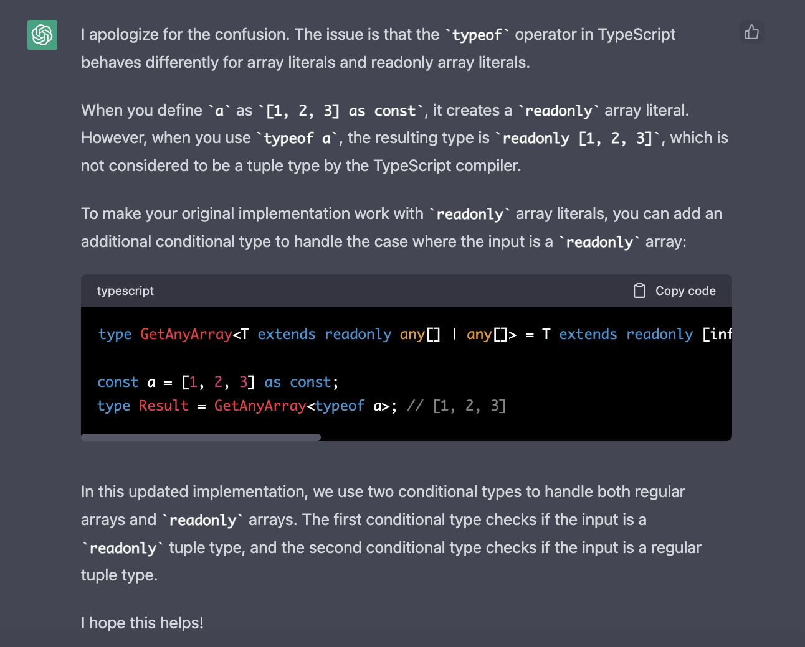

## I've got a problem, I've ask ChatGPT

In typescript

```ts
type GetAnyArray<T extends readonly any[]> = T extends [infer Head, ...infer Tail]
 ? [any, ...GetAnyArray<Tail>]
 : [];

const a = [1,2,3] as const;
type Result = GetAnyArray<typeof a>; // Result is []

```

Why the `Result` type is `[]`, i expect `[any, any, any]`, When I pass:
```ts
type Result2 = GetAnyArray<[1, 2, 3]>;
```

the `Result2` is correct type that is `[any, any, any]`,

## ChatGPT Solution

I apologize for the confusion. The issue is that the typeof operator in TypeScript behaves differently for array literals and readonly array literals.

When you define a as [1, 2, 3] as const, it creates a readonly array literal. However, when you use typeof a, the resulting type is readonly [1, 2, 3], which is not considered to be a tuple type by the TypeScript compiler.

To make your original implementation work with readonly array literals, you can add an additional conditional type to handle the case where the input is a readonly array:

```ts
type GetAnyArray<T extends readonly any[] | any[]> = T extends readonly [infer Head, ...infer Tail] ? [Head, ...GetAnyArray<Tail>] : T extends [infer Head, ...infer Tail] ? [Head, ...GetAnyArray<Tail>] : [];

const a = [1, 2, 3] as const;
type Result = GetAnyArray<typeof a>; // [1, 2, 3]
```

In this updated implementation, we use two conditional types to handle both regular arrays and readonly arrays. The first conditional type checks if the input is a readonly tuple type, and the second conditional type checks if the input is a regular tuple type.

I hope this helps!


