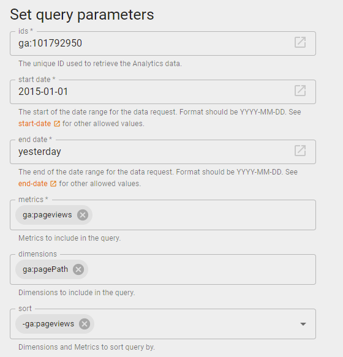
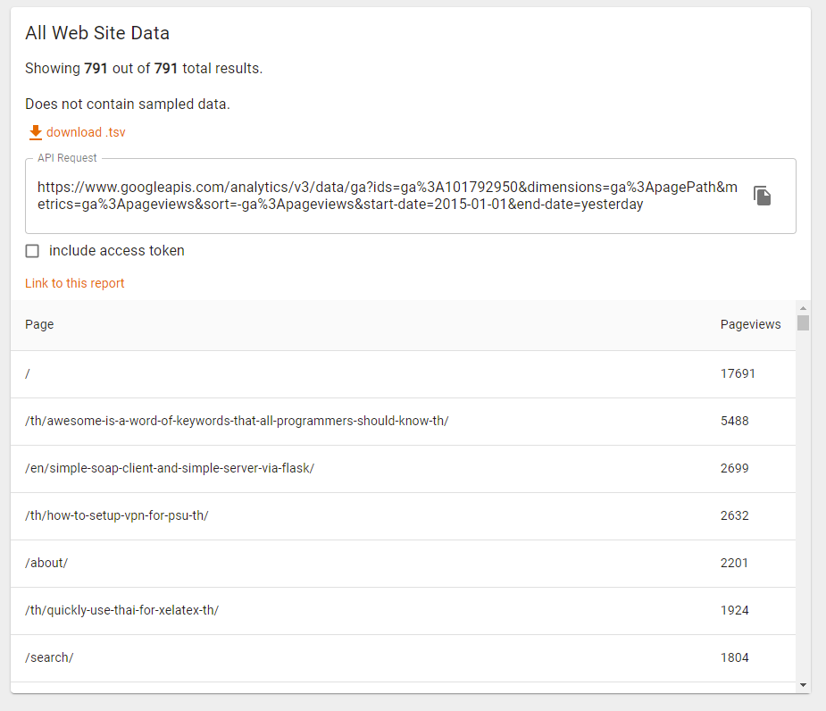
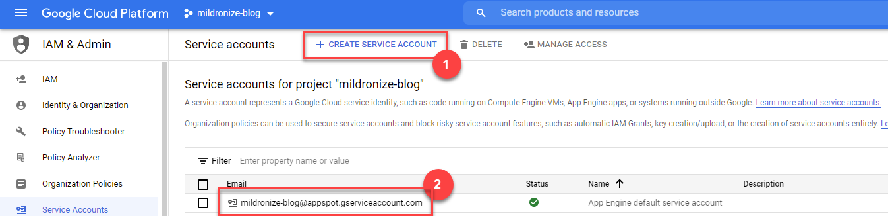
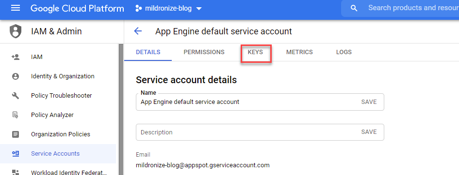
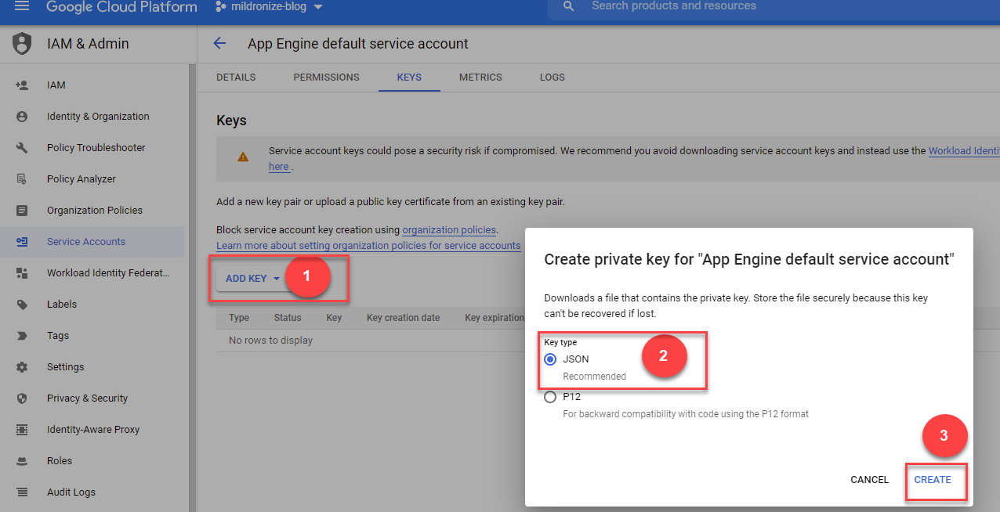
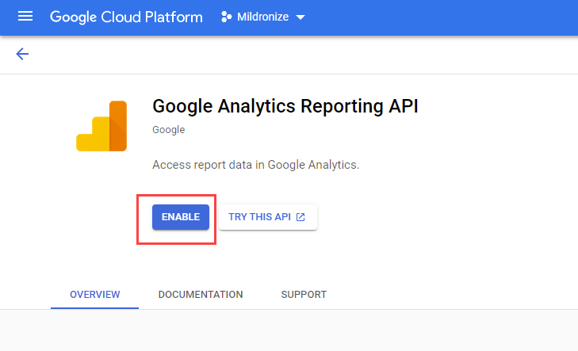
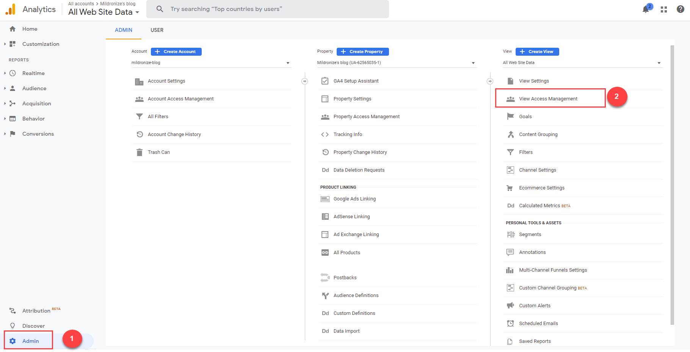
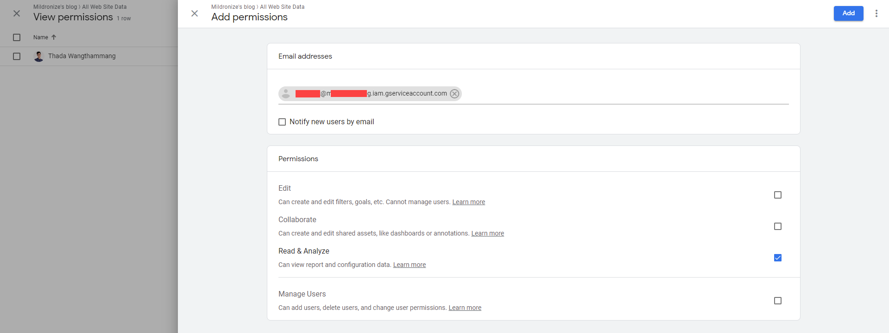

# Begin with GA

Analyzing user acquisition
Tracking PageViews
Tracking Events
Tracking Load/Render Performance
Tracking Exception

https://wendeehsu.medium.com/google-analytics-in-react-js-c1b78dc1bbda

# How track user behavior

- https://www.codesanook.com/programming-google-analytics-javascript-library-to-track-user-behavior
- https://maxchadwick.xyz/blog/tracking-your-most-popular-blog-post-tags-in-google-analytics-with-jekyll

# How to read page view from GA with specific URL

Example API request

```
https://www.googleapis.com/analytics/v3/data/ga?ids=ga%3A101792950&dimensions=ga%3ApagePath&metrics=ga%3Apageviews&sort=-ga%3Apageviews&start-date=2015-01-01&end-date=yesterday
```

https://ga-dev-tools.web.app/query-explorer/




Ref:
- https://stackoverflow.com/a/19667939/4540808
- https://maxchadwick.xyz/blog/fetching-pageview-counts-google-analytics-api-ruby

# Read GA

Your application must use OAuth 2.0 to authorize requests. No other authorization protocols are supported.

https://developers.google.com/analytics/devguides/reporting/core/v4/authorization

[Service Accounts](https://developers.google.com/accounts/docs/OAuth2ServiceAccount)

Service accounts are useful for automated, offline, or scheduled access to Google Analytics data for your own account. For example, to build a live dashboard of your own Google Analytics data and share it with other users.

To get started using Analytics API, you need to first [use the setup tool](https://console.developers.google.com/start/api?id=analytics&credential=client_key), which guides you through creating a project in the Google API Console, enabling the API, and creating credentials.

To set up a [new service account](https://developers.google.com/identity/protocols/oauth2/service-account), do the following:

1. Go: https://console.cloud.google.com/apis/api/analytics.googleapis.com/credentials, then go to project you want.
2. Click **Create credentials > Service account key**.
  
3. Click **key** tab
  
4. Choose whether to download the service account's public/private key as a standard P12 file, or as a JSON file that can be loaded by a Google API client library.
  

Your new public/private key pair is generated and downloaded to your machine; it serves as the only copy of this key. You are responsible for storing it securely.

**Note:** You need to add the service account email address as an authorized user of the view (profile) you want to access.

# Enable Google Analytics Reporting API

https://console.cloud.google.com/apis/library/analyticsreporting.googleapis.com



# Read GA

[How to work with Node.js and the Google Analytics Reporting API](https://www.multiminds.eu/blog/2018/11/google-analytics-reporting-api/)


[Hello Analytics Reporting API v4; Python quickstart for service accounts ](https://developers.google.com/analytics/devguides/reporting/core/v4/quickstart/service-py)

```
quickstart@PROJECT-ID.iam.gserviceaccount.com
```

Use this email address to [add a user](https://support.google.com/analytics/answer/1009702) to the Google analytics view you want to access via the API. For this tutorial only [Read & Analyze](https://support.google.com/analytics/answer/2884495) permissions are needed.

## Add users

You can add as many users as you need. To add a new user to an account/property/view:

1. [Sign in to Google Analytics.](https://analytics.google.com/)
2. Click **[Admin](https://support.google.com/analytics/answer/6132368)**, and navigate to the desired **[account/property/view](https://support.google.com/analytics/answer/6099198)**.
3. In the Account, Property, or View column (depending upon whether you want to add users at the account, property, or view level), click **Access Management**.
  
4. In the *Account permissions* list, click **+**, then click **Add users**.
6. Enter the email address for the user's [Google Account](https://support.google.com/accounts/). In this case add email from service account above.

7. Select **Notify new users by email** to send a message to the user.
8. Select the permissions you want. For this tutorial only [Read & Analyze](https://support.google.com/analytics/answer/2884495) permissions are needed. Learn more about [permissions](https://support.google.com/analytics/answer/2884495).
9.  Click **Add**.

## Get Page View from Google Analytics by Page path

```js
const { google } = require('googleapis');
const service_account = require('./key.json');
const reporting = google.analyticsreporting('v4');

const scopes = ['https://www.googleapis.com/auth/analytics.readonly'];

const jwt = new google.auth.JWT(
  service_account.client_email,
  null,
  service_account.private_key,
  scopes
);

// The find the view ID in Google Analytics go to admin, select the rights view and click view settings.
const view_id = 'YOUR_VIEW_ID';

let getReports = async function (reports) {

  await jwt.authorize();

  const request = {
    'headers': { 'Content-Type': 'application/json' }, 'auth': jwt, 'resource': reports
  };

  // https://developers.google.com/analytics/devguides/reporting/core/v4/rest/v4/reports/batchGet
  return await reporting.reports.batchGet(request);

};

const basic_report = {
  // https://developers.google.com/analytics/devguides/reporting/core/v4/rest/v4/reports/batchGet
  'reportRequests': [
    {
      'viewId': view_id,
      'dateRanges': [{ 'startDate': 'yesterday', 'endDate': 'yesterday' }],
      'metrics': [{ 'expression': 'ga:pageviews' }],
      'dimensions': [{ 'name': 'ga:pagePath' }]
    }
  ]
};

async function main() {
  const data = (await getReports(basic_report)).data;
  data.reports[0].data.rows.forEach(element => {
    console.log(`path: '${element.dimensions[0]} (${element.metrics[0].values[0]})'`)
  });
}

main();
```
**Example Output**

```
path: '/ (30)'
path: '/draft (3)'
path: '/getting-started-tdd-in-30-seconds-with-python-lm28n32 (1)'
path: '/react-design-patterns-ho462dz (3)'
path: '/react-import-export-component-pattern-whaab42 (4)'
path: '/จัดการ-side-effects-ใน-react-ด้วย-hook-use-effect-wes5jlp (1)'
path: '/ได้-99-คะแนนจาก-google-insights-เรียนรู้การทำ-web-optimization-i4kssit (1)'
path: '/ทำ-task-management-ด้วย-template-my-things-fully-inspired-by-things-3-application-p8c504z (2)'
path: '/รู้จักกับฐานข้อมูลอนุกรมเวลา-open-tsdb-กันเถอะ-jmm9qn9 (1)'
path: '/เราควรเพิ่มประสิทธิภาพของ-single-page-application-โดยใช้-server-side-rendering-ssr-หรือไม่-8jexlus (4)'
path: '/สิ่งที่ได้รับจากการเรียนวิศวกรรมคอมพิวเตอร์ปริญญาโท-9tdymnn (4)'
```

# Read More
- Try out request [Google Analytics Query Explorer](https://ga-dev-tools.web.app/query-explorer/)
- [How to work with Node.js and the Google Analytics Reporting API](https://www.multiminds.eu/blog/2018/11/google-analytics-reporting-api/)
- https://github.com/googleapis/google-api-nodejs-client/blob/master/samples/analyticsReporting/batchGet.js
- https://developers.google.com/analytics/devguides/reporting/core/v4/rest/v4/reports/batchGet
