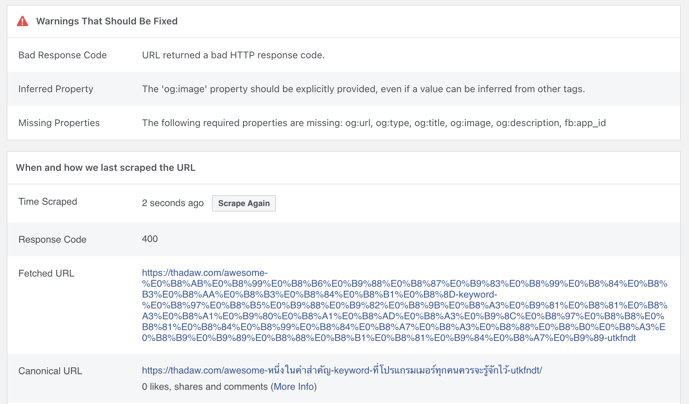
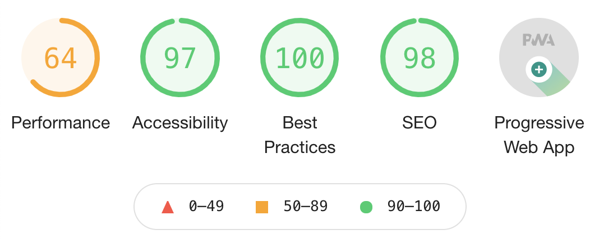
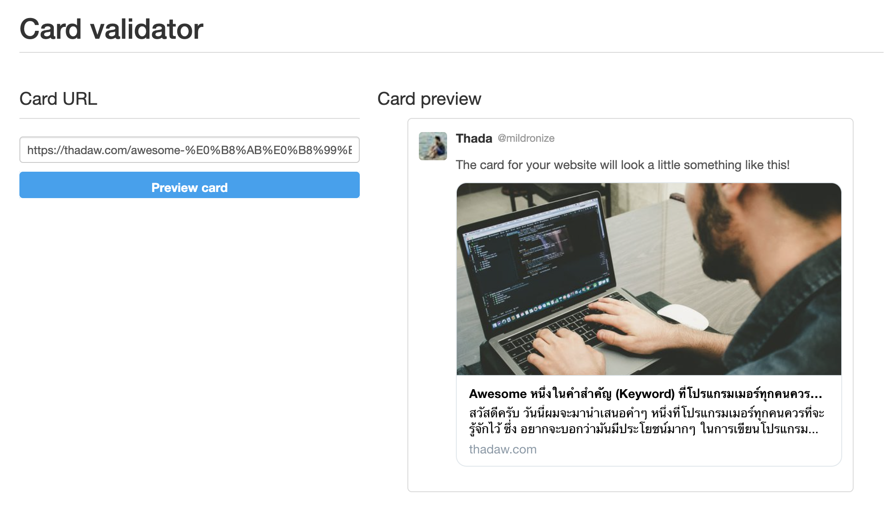
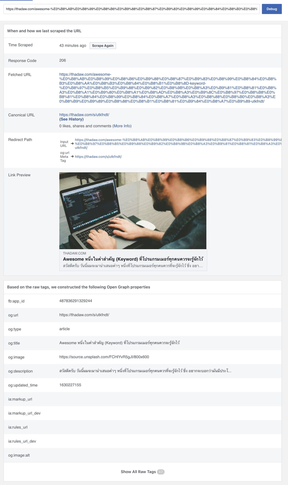
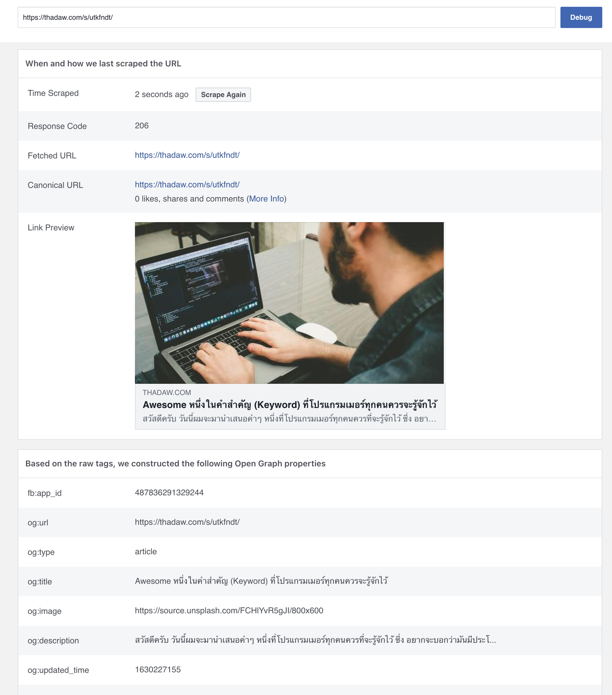

# บันทึก

ถ้าเป็น static file เช่น

```
https://thadaw.com/post/index.html == https://thadaw.com/post/
```

แต่ถ้าใช้

```
https://thadaw.com/post มันจะ redirect ไปยัง https://thadaw.com/post/
```

ถ้าใน Facebook debugger มันจะโชว์



# Light house

Improve Later



# สรุป

เพื่อป้องกัน Redirect ซ้อนอีกที ใน static file (index.html)

ให้ใช้ Trailing Slash นะ แบบนี้

```
https://thadaw.com/post/
```

# Debug Tools

- Facebook: https://developers.facebook.com/tools/debug/
- Twitter: https://cards-dev.twitter.com/validator

# Complete

## Twitter



## Facebook

### Full URL



### Short URL



