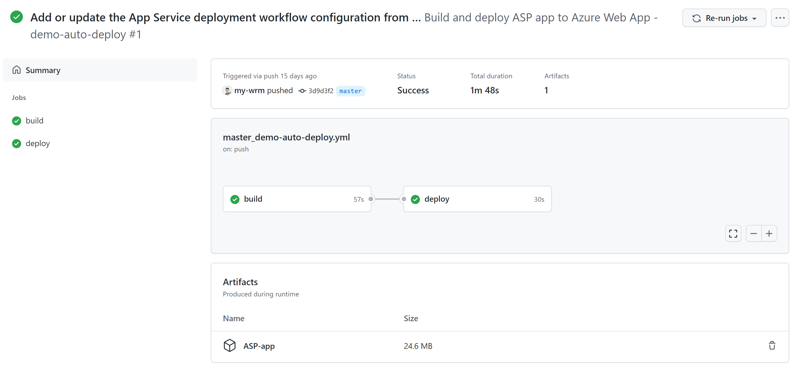

```yml
name: Build and deploy ASP app to Azure Web App

on:
  push:
    branches:
      - master
  workflow_dispatch:

jobs:
  build:
    runs-on: 'windows-latest'

    steps:
    - uses: actions/checkout@v2

    - name: Setup MSBuild path
      uses: microsoft/setup-msbuild@v1.0.2

    - name: Setup NuGet
      uses: NuGet/setup-nuget@v1.0.5

    - name: Restore NuGet packages
      run: nuget restore

    - name: Publish to folder
      run: msbuild /nologo /verbosity:m /t:Build /t:pipelinePreDeployCopyAllFilesToOneFolder /p:_PackageTempDir="\published\"

    - name: Upload artifact for deployment job
      uses: actions/upload-artifact@v2
      with:
        name: ASP-app
        path: '/published/**'

  deploy:
    runs-on: 'windows-latest'
    needs: build
    environment:
      name: 'production'
      url: ${{ steps.deploy-to-webapp.outputs.webapp-url }}

    steps:
    - name: Download artifact from build job
      uses: actions/download-artifact@v2
      with:
        name: ASP-app

    - name: Deploy to Azure Web App
      id: deploy-to-webapp
      uses: azure/webapps-deploy@v2
      with:
        app-name: 'demo-auto-deploy'
        publish-profile: ${{ secrets.AzureAppService_PublishProfile }}
        package: .
```


Ref: https://timheuer.com/blog/building-net-framework-apps-using-github-actions/
