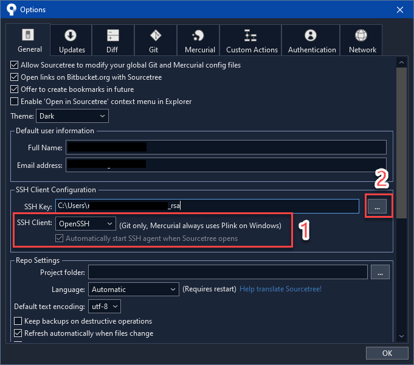

ถ้าใครจะตั้งค่า SSH สำหรับ Remote Server อื่นๆ ก็ใช้หลักการเดียวกันได้ เพียงแต่ในบทความนี้ยกตัวอย่าง GitHub

บทความนี้จะแบ่งจะเป็น 2 ส่วนใหญ่ๆ คือฝั่ง Unix-based (Mac OS, Ubuntu, WSL) และฝั่ง Windows ครับ ก่อนจะเข้าเรื่อง ผมขออธิบายหลักการของ SSH เบื้องต้นนะครับ การเชื่อมต่อผ่าน SSH หรือ Secure Shell นั้น คือการเชื่อมต่อไปเครื่องต้นทาง (Local) ไปยังเครื่องปลายทาง (Remote) ผ่านการเข้ารหัส ซึ่งมั่นใจได้ว่าการเชื่อมต่อนั้นปลอดภัยในระดับที่ยอมรับได้ในระดับสากล

ในการเชื่อมต่อนั้นจะเป็นแบบ Asymmetric Encryption หรือ การเข้ารหัสแบบไม่สมมาตร
โดยก่อนจะมีการส่งข้อมูลจะมีการสร้างคู่ของกุญแจ ที่ก็ต้องใช้ร่วมกันเท่านั้น เราจะเรียกว่า Public key และ Private key ซึ่งวิธีเข้ารหัสที่ได้รับนิยมคือ RSA

- Public key คือ กุญแจสาธารณะ ซึ่งคือสามารถเผยแพร่ให้ เครื่องปลายทางได้
- Private key คือ กุญแจส่วนตัว ซึ่งไม่ควรเผยแพร่ และเจ้าของข้อมูลควรจะถือไว้เท่านั้น

โดยก่อนที่จะมีการส่งข้อมูลจะมีการเข้ารหัสด้วย Public Key ทุกครั้ง และเมื่อข้อมูลถูกส่งมายั่งเครื่องต้นทางที่มี Private key แล้วก็จะสามารถถอดรหัสเพื่อเห็นข้อมูลจริงๆ ได้


# Mac OS, Ubuntu, WSL

สร้าง SSH key

```bash
$ ssh-keygen -t rsa -b 4096 -C "your_email@example.com" -f /path/to/key
```

> Note: ถ้าเป็น Windows ต้องใส่ `-f /path/to/key` ไม่งั้นจะ error ว่า [SSH-Keygen "no such file or directory"][3]

Copy ข้อมูลในไฟล์ `~/.ssh/id_rsa.pub` (ซึ่งก็คือ Public Key) ไปวางที่ GitHub account settings (https://github.com/settings/keys).


ลองทดสอบ SSH key:

```bash
$ ssh -T git@github.com
Hi [Your Username]! You've successfully authenticated, but GitHub does not provide shell access.
```

ไปยังโฟลเดอร์ที่ของ Git Repo ในเครื่องเราแล้วเปลี่ยน Git remote ให้เป็นแบบ SSH

```bash
$ git remote set-url origin git@github.com:username/your-repository.git
```

จากนั้นลอง commit และ push ดู ระบบไม่ควรถามหารหัสผ่านแล้ว

Ref: [Finnian Anderson][4]


# Windows 10, 11

เมื่อปี 2018 ผมได้เขียนบทความ [วิธีตั้งค่าการใช้งาน Github (แบบไม่ต้องกรอกรหัสผ่านทุกครั้ง) ผ่าน SSH บน Windows](/s/mo4feik/) ซึ่งได้แนะนำวิธีการใช้ Putty สำหรับทำงานเป็นเบื้องหลัง แต่เราจำเป็นต้องเปิดตัว agent ขึ้นมาทุกครั้ง หรือถ้าไม่อย่างนั้นก็ต้อง ตั้งค่า startup เอง

เมื่อปี 2019 Windows ได้ปล่อยความสามารถอย่างหนึ่งคือ OpenSSH Client ที่เป็น service อยู่บน Windows ซึ่งดีมากๆ เลย ที่เราไม่ต้องพึ่งโปรแกรมอื่นๆ อย่างเช่น Putty

ในหัวข้อนี้จะเน้นที่ Powershell เท่านั้นนะครับ ถ้าใครใช้ WSL หรือ Git Bash บน Windows แล้วแนะนำให้ใช้หัวข้อข้างบนแทน

## เตรียม SSH สำหรับ Windows 10

OpenSSH ได้ถูกปล่อยออกมาเป็นส่วนหนึ่งของ Windows 10 ทำให้เราสามารถใช้คำสั่ง SSH ผ่าน cmd หรือ powershell ได้

1. เปิด `Manage optional features` จาก start menu แล้วติดตั้ง `OpenSSH Client`

2. เปิด Powershell แบบ Admin

  ```powershell
  Get-Service -Name ssh-agent | Set-Service -StartupType Automatic
  Get-Service -Name ssh-agent | Set-Service -Status Running
  ```

Ref: สามารถดูการตั้งค่าแบบ UI ได้ที่ [newbedev.com][1]

## How to Setup (Powershell)

ดูข้อมูลจากข้างบนได้เลย

## How to make Powershell remember the SSH key passphrase.

Ref: [Daniel Dogeanu][2]

1. ตั้งค่าให้ SSH สามารถที่จะเพิ่ม key ลงไปใน agent โดยการแก้ไขไฟล์ config ที่อยู่ใน `$HOME\.ssh\config`

  ```
  Host *
    AddKeysToAgent yes
    IdentitiesOnly yes
  ```

  โดยที่เราสามารถใส่ config ของ SSH key ที่เราสร้างขึ้นมาได้ หรือจะสามารถใส่หลาย key ได้ด้วย

  ```
  Host github.com
    HostName github.com
    User your_user_name
    IdentityFile ~/.ssh/your_file_name
  ```

2. Add your SSH key to the `ssh-agent` by issuing the `ssh-add` command and entering your passphrase:

  ```
  ssh-add $HOME/.ssh/your_file_name
  ```

3. Done! Now restart your Powershell

# การใช้งานหลาย Key ในเครื่องเดียวกัน

```
~/.ssh/config
```

```
Host *
	AddKeysToAgent yes
	IdentitiesOnly yes

Host github.com
	HostName github.com
	User personal-user
	IdentityFile ~/.ssh/personal_rsa

Host work.github.com
	HostName github.com
	User work-user
	IdentityFile ~/.ssh/work_rsa
```

วิธีการใช้

```
git remote set-url origin git@work.github.com:your-username/your-repo.git
```

```
git remote set-url origin git@github.com:your-username/your-repo.git
```

[1]: https://newbedev.com/how-to-run-ssh-add-on-windows
[2]: https://gist.github.com/danieldogeanu/16c61e9b80345c5837b9e5045a701c99 "How to make Powershell remember the SSH key passphrase."
[3]: https://newbedev.com/ssh-keygen-no-such-file-or-directory
[4]: https://gist.github.com/developius/c81f021eb5c5916013dc
[5]: https://richardballard.co.uk/ssh-keys-on-windows-10/ "SSH keys on Windows 10"
[6]: https://docs.microsoft.com/en-us/windows-server/administration/openssh/openssh_keymanagement "Official Docs"

ถ้าลองทำแล้วได้ไม่ได้ยังไง มาแบ่งปันกันได้นะครับ

## วิธีใช้งานร่วมกับ SourceTree



> ต้องใช้ SourceTree แบบ admin ไม่งั้นมันจะ Error "ssh-agent failed with code-1 system.componentmodel.win32exception access is denied"

Sourcetree สามารถอ่านไฟล์ `~/.ssh/config` ได้ ดังนั้น custom hostname เราจะสามารถใช้งานได้

ให้เราอัพเดท Remote ไปที่

```
git@work.github.com:your-username/your-repo.git
```
