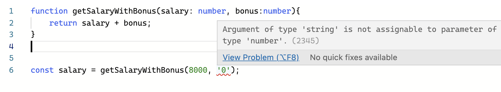
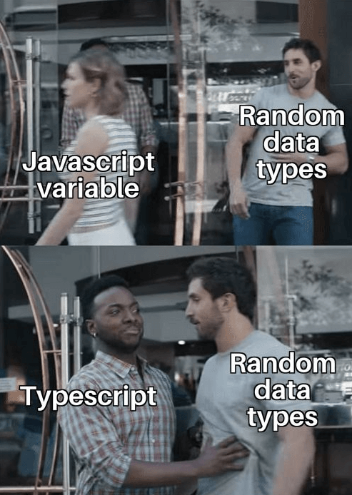
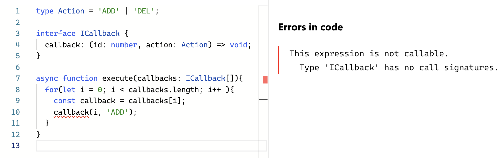

# What is TypeScript?

- Typescript is an open-source programming language created by Microsoft.
- a superset of Javascript which adds static typing to the language.
- It is worth mentioning that in the end Typescript compiles to Javascript, so the final code can run on any environment which supports JS.
- It can be both client-side (web browser) or server-side (Node.js).


# "Why do I need static typing?
#### If Typescript compiles to Javascript doesn’t it mean that Javascript is enough?"


## TypeScript may save your project from failure


```js
function getSalaryWithBonus(salary, bonus){
    return salary + bonus;
}
```

Really complicated financial system function


```js
const salary = getSalaryWithBonus(8000, '0');
// Result is 80000
```

The result is ‘80000’ as a string instead of 8000 as number


## Look at Type

```ts
function getSalaryWithBonus(salary: number, bonus: number){
  return salary + bonus;
}
```

In Typescript, you can explicitly define function parameters types




<!-- TypeScript prevents you from passing the wrong type of argument to the function -->




## Typescript documents itself

```js
function renderItems(items){
    // here function does something with items
}
```


### If you want to know what “items” actually are in JavaScript, you have a few options:

- read the documentation (if one exist),
- add `console.log(items)` in the definition of this function, run the application and check the “items” argument in the console,
- try to find out where the function is used and from there track down what data is put into it,
- ask your colleagues if someone has been recently working on it,


```ts
type Item = {
    id: number;
    title: string;
    description: string;
}

function renderItems(items: Item[]){
    // here function does something with items
}
```

Better?


# Great for Code Editor Support

- Mouse hover support
- Code auto-completion
- Real-time type checking
- Easier code refactor


# JavaScript Object Complexitiy

```js
const result = await fetch('/get-members');
for(const member of result.response.data.members){
  console.log(`My customer: `);
  for(const customer of member.customers){
    console.log(customer.name);
  }
}
```

How do you know that is exactly `result` structure?


# Defining Type


```ts
interface ICustomer{
  name: string;
  birthDate: Date;
}
interface IMember {
  name: string;
  birthDate: Date;
  customers: ICustomer[]
}
interface IResult {
  response: {
    data: {
      members: IMember[]
    }
  }
}

const result = await fetch('/get-members') as IResult;
```


# Type Reuse?


```ts
interface IPerson {
  name: string;
  birthDate: Date;
}

interface ICustomer extends IPerson {}

interface IMember extends IPerson {
  customers: ICustomer[]
}

interface IResult {
  response: {
    data: {
      members: IMember[]
    }
  }
}

const result = await fetch('/get-members') as IResult;
```


# JavaScript Callback


```js
async function execute(callbacks){
  for(let i = 0; i < callbacks.length; i++ ){
    const callback = callbacks[i];
    callback(i, 'ADD');
  }
}
```


# Defining Callback Function Structure


## Something wrong ??

```ts
type Action = 'ADD' | 'DEL';

interface ICallback {
  callback: (id: number, action: Action) => void;
}

async function execute(callbacks: ICallback[]){
  for(let i = 0; i < callbacks.length; i++ ){
    const callback = callbacks[i];
    callback(i, 'ADD');
  }
}
```




👉 [Debug with TypeScript Playground](https://www.typescriptlang.org/play?#code/C4TwDgpgBAggxsAlgewHZQLxQOQwCJ7ZQA+OeAogDLYDcAUHYqsBAE4BmAhnNAJIDCnADZCARtwDWUAN50oUOMLGSAXFAAUiACZrUAVwC2otgBoo3JGjXxLqAJSYAfFABuybfQC+UBpwDOIKhwUOx6QbZQEAAeEHB6LOqKIuJwEn5qAkopEgDaALp2svLsyKzqQhDAUIiYUAAMNNVQADwKWZJ+AHQVqADmwAAWjYgA1CNQhXLyCmh+VUnKqbUL2X45iHn0023JkppmuATYdltQnnTnQA)


# TypeScript Fact


## 1. Can we use TypeScript without any type?

```ts
function add(a, b) {
  return a + b;
}
```


## Yes!

Using configuration file, `tsconfig.json`:

```json
{
  "compilerOptions": {
    "noImplicitAny": false
  }
}
```


Using `noImplicitAny: true` when force to allow type

```ts
function add(a: number, b: number) {
  return a + b;
}
```

using `any` type when you don't know the exactly type.


## 2. Different Type but same definition, is still same object?


```ts
const util = require('util');s
interface IMember {
  firstName: string;
}
const mild1: IMember = {
  firstName: 'Thada',
}
interface ICustomer {
  firstName: string;
}
const mild2: ICustomer = {
  firstName: 'Thada',
}
console.log(util.isDeepStrictEqual(mild1, mild2));
// Result is True
```
TypeScript


```js
const util = require('util');
const mild1 = {
    firstName: 'Thada',
};
const mild2 = {
    firstName: 'Thada',
};
console.log(util.isDeepStrictEqual(mild1, mild2));
// Result is True
```

Compile to JavaScript


## 3. Runtime Types is the Same as Declared Types?


### May be no!,

Let's see,

```ts
function setLightSwitch(value: boolean) {
  if(value === true) turnLightOn();
  else if (value === false) turnLightOff();
  else console.log(`I'm afraid I can't do that.`);
}
```


```ts
interface LightApiResponse {
  value: boolean;
}

async function setLight() {
  const response = await fetch('/light-status');
  const result: LightApiResponse = await response.json();
  setLightSwitch(result.value);
}
```

If the API returns `string`, the function `setLightSwitch` will not get `boolean` value.


## 4. TypeScript Types Have Effect on Runtime Performance?


## No! ,

Because types and type operations are erased when you generate JavaScript, they cannot have an effect on runtime performance.


# 5. Can we complie TypeScript to JavaScript?


## Yes!

```bash
tsc ./app.ts
node ./app.js
```


# 6. Do we need to compile before run the TypeScript?


## No need!

```bash
ts-node ./app.ts
# same as node ./app.js
```


# <!-- fit --> Wish type be with you!


# Read More

- [Why use TypeScript? Could it be the best way to write frontend in 2021?](https://tsh.io/blog/why-use-typescript/)
- [It's not JavaScript's ugly cousin. See how Typescript improves Developer Experience](https://tsh.io/blog/typescript-improves-developer-experience/)
- [Practical code examples of why Typescript is the best choice for frontend](https://tsh.io/blog/why-typescript/)
- Effective TypeScript Book

# Good to Know

- He show how to setup SWC on typeScript. [How to speed up your TypeScript project?](https://tsh.io/blog/how-to-speed-up-your-typescript-project/)

# Slides

<iframe src="https://thadaw.com/talk/no-type-no-life-typescript/" height="200" width="300" title="Iframe Example"></iframe>


