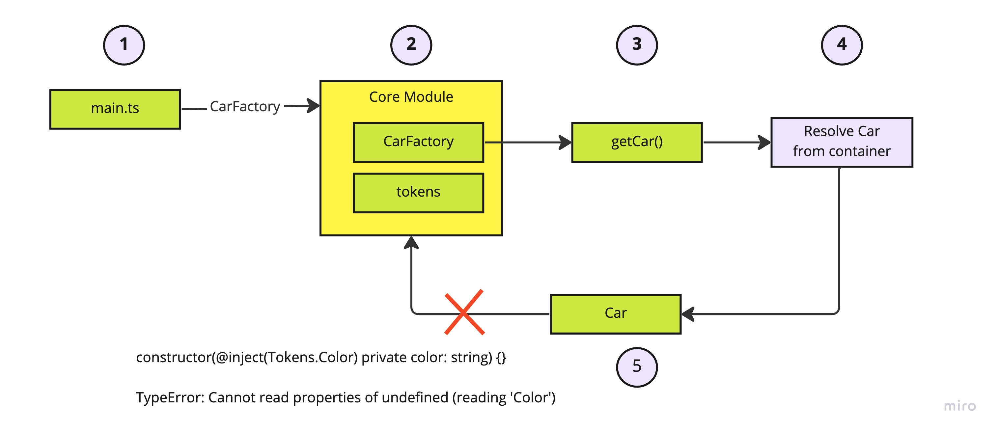

ผมลืมไปว่า JS Module มันนับตัวเองเป็นหนึ่ง Component เลยถึงแม้ว่าเราเข้าถึง object จากคนละไฟล์ใน module
แต่ถ้าเรา import จาก module โดยตรง จะทำให้เกิด circular dependency เวลาใช้ Dependency Injection ได้ ดูจากรูป



## Code Example

ในนี้ใช้ Tsyringe ในการทำ Dependency Injection

<https://github.com/mildronize/ts-unintended-circular-dependency>

## วิธีแก้

- พยายามอย่า import object จากใน module เพราะให้ใช้การทำ import ไปที่ไฟล์โดยตรงแทน

เช่น ในไฟล์ `main.ts`

```typescript
import 'reflect-metadata';
// 1. Error (Circular Dependency)
import { CarFactory } from './core';
// 2. No Error
// import { CarFactory } from './core/core';

const car = CarFactory.getCar();
console.log(`Car color is ${car.getColor()}`);
```

หรือ

```typescript
import { injectable, inject } from 'tsyringe';

// 1. Error (Circular Dependency)
import { Tokens } from './core';
// 2. No Error
// import { Tokens } from './core/constant';

@injectable()
export class Car {
  constructor(@inject(Tokens.Color) private color: string) {}

  public getColor() {
    return this.color;
  }
}
```
