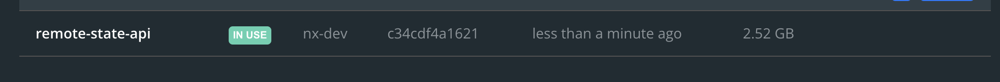
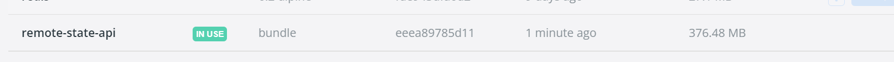

**Before**



**After**



โดยสรุปลดจาก 2.52 GB เหลือ 376.48 MB โดยลดไปประมาณ 80%


- [NestJS + esbuild workarounds](https://dev.to/antongolub/nestjs-esbuild-workarounds-99i)


## Final Solution

custom esbuild config

```ts
import { build, BuildOptions } from 'esbuild';
import glob from 'tiny-glob';
import { typecheckPlugin } from '@jgoz/esbuild-plugin-typecheck';
import fs from 'fs';
import path from 'path';
import { config as appConfig } from '@storm-portal/domain';
import { program } from 'commander';

import { esbuildDecorators } from '@anatine/esbuild-decorators';

const cwd = process.cwd();
const outfile = path.resolve(cwd, 'output.js');
const tsconfig = path.resolve(cwd, 'tsconfig.json');

// const isDevelopment = process.env.development === 'true' ? true : false;
const isVerbose = process.env.verbose === 'true' ? true : false;

interface ICommandOption {
  output: string;
  watch: boolean;
}

export interface IProgramMetadata {
  version: string;
}

program
  .description('Script for building atom CLI')
  .option('-w, --watch', 'Enable watch mode')
  .option('-o, --output <path>', 'output file')
  .action(async () => {
    const opts = program.opts() as ICommandOption;
    await main({
      watch: opts.watch ?? false,
      output: opts.output ? path.resolve(opts.output) : 'dist',
    });
  });

program.parse(process.argv);

async function main(option: ICommandOption) {
  // const entryPoints = await glob('./src/cli/*.ts');

  const config: BuildOptions = {
    entryPoints: ['apps/remote-state-server/src/main.ts'],
    bundle: true,
    platform: 'node',
    // target: 'node16',
    target: ['node18', 'es2021'],
    // format: 'esm',
    outdir: option.output,
    tsconfig,
    plugins: [
      typecheckPlugin(),
      esbuildDecorators({
        tsconfig,
        cwd,
      }),
    ],
    // outExtension: { '.js': '.mjs' },
  };
  console.log(option.output);
  const buildConfig: BuildOptions = {
    external: [
      'commander',
      'cache-manager',
      '@nestjs/microservices',
      'prisma',
      '@prisma/client',
      'kafkajs',
      'mqtt',
      'amqplib',
      'amqp-connection-manager',
      'nats',
      '@grpc/grpc-js',
      '@grpc/proto-loader',
      '@nestjs/websockets/socket-module',
      'class-transformer/storage',
    ],
    // minify: true,
    ...config,
  };

  const developConfig: BuildOptions = {
    ...config,
    external: ['commander'],
    watch: {
      onRebuild,
    },
  };

  await build(option.watch ? developConfig : buildConfig);
}

function onRebuild(error: any, result: any): void {
  if (error) {
    console.error('watch build failed');
    if (isVerbose) console.error(result, error);
  } else console.log(new Date().toISOString() + ' watch build succeeded ');
}
```

project.json

```json
// project.json
{
  "targets": {
    "build-esbuild": {
      "executor": "nx:run-commands",
      "options": {
        "commands": [
          "tsx src/scripts/build.ts --output '../../dist/apps/remote-state-server'"
        ],
        "parallel": false,
        "cwd": "apps/remote-state-server"
      }
    }
}
```

```dockerfile
###################
# BUILD
###################

FROM node:18 As development
RUN curl -f https://get.pnpm.io/v6.16.js | node - add --global pnpm

WORKDIR /app

COPY --chown=node:node . .

RUN pnpm install --frozen-lockfile

RUN pnpx nx run remote-state-server:build-esbuild

USER node

###################
# Install Dependencies
###################

FROM node:18 As build
RUN curl -f https://get.pnpm.io/v6.16.js | node - add --global pnpm

WORKDIR /app

COPY --chown=node:node apps/remote-state-server/prisma ./prisma/
COPY --chown=node:node --from=development /app/dist/apps/remote-state-server .

ENV NODE_ENV production
RUN pnpm install @prisma/client@^4.7.1

USER node

###################
# PRODUCTION
###################

# Not Natively support ARM64 (M1)
FROM node:18-alpine As production

WORKDIR /app

COPY --chown=node:node --from=build /app .

# For Prisma client in Alpine
# Fix "Error: Unable to establish a connection to query-engine-node-api library. It seems there is a problem with your OpenSSL installation!"
# Ref: https://github.com/prisma/prisma/issues/14073
RUN apk add --update --no-cache openssl1.1-compat

# We don't have the existing sqlite file
# So, we will create a fresh sqlite every time when build
# This migration should be run every time when build
RUN npx prisma migrate deploy
# Prepare prima library
RUN npx prisma generate

ENV PORT=3333
EXPOSE ${PORT}

CMD [ "node", "main.js" ]
```

## Ref
### Docker

- Multi-Stage: https://www.tomray.dev/nestjs-docker-production#putting-it-all-together
- Best Practice: https://snyk.io/blog/10-best-practices-to-containerize-nodejs-web-applications-with-docker/
- Reduce File Size Node.js: https://medium.com/trendyol-tech/how-we-reduce-node-docker-image-size-in-3-steps-ff2762b51d5a
- Honey, I shrunk the node_modules! ...and improved app’s performance in the process. On node module size: https://tsh.io/blog/reduce-node-modules-for-better-performance/

### Docker Read more
- https://medium.com/swlh/nx-nestjs-react-docker-deploys-928a55fc19fd
- https://www.codefeetime.com/post/using-docker-compose-with-nx-monorepo-for-multi-apps-development/

### Kube
- https://creotip.io/posts/nx-monorepo-running-microservices-locally-with-docker-kubernetes
