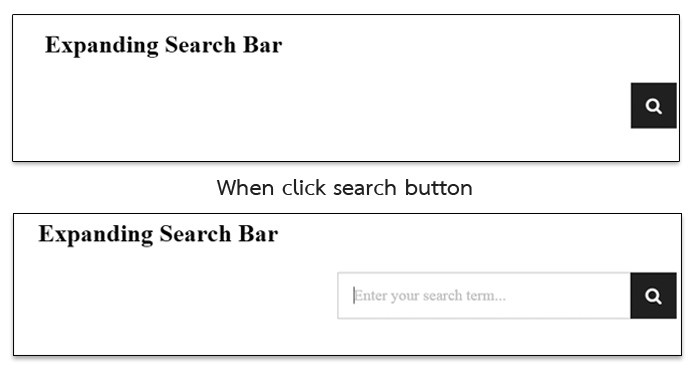

<!-- demo: /demo/responsive-expanding-search-bar/ -->
**Expanding Search Bar** is an expanding search bar extension for any HTML page or Jekyll. This extension is a lightweight version of [Expanding Search Bar Deconstructed](http://tympanus.net/Tutorials/ExpandingSearchBar/) for using  in Jekyll or HTML. This extension is used in [my blog](http://mildronize.github.io).

Because [my blog](http://mildronize.github.io) have used icon set from [Font Awesome](http://fontawesome.io). I change icon set from the [original project](#original-project-documentation) into [Font Awesome](http://fontawesome.io) as in [my blog](http://mildronize.github.io).

## Usage

1. copy all of project's resource to your project.

    ```
    /css
    /fonts
    /js
    ```

2. Insert css header into your HTML

    ```html
    <link rel="stylesheet" type="text/css" href="css/font-awesome-4.3.0.min.css" />
    <link rel="stylesheet" type="text/css" href="css/expanding-search-bar.css" />
    ```

3. Place below code into top of HTML code or anywhere what you want.

    ```html
    <div id="sb-search" class="sb-search">
      <form>
          <input class="sb-search-input search-bar" placeholder="Enter your search term..." type="text" value="" name="search" id="search">
          <input class="sb-search-submit" type="submit" value="">
          <span class="fa fa-search sb-icon-search"></span>
      </form>
    </div>
    ```

4. Add JS at bottom of HTML code

    ```html
    <script src="js/classie.js"></script>
    <script src="js/uisearch.js"></script>
    <script>
      new UISearch( document.getElementById( 'sb-search' ) );
    </script>
    ```

## Source
- [Github](https://github.com/mildronize/ExpandingSearchBar)
- [Download](https://github.com/mildronize/ExpandingSearchBar/archive/master.zip)

## Original project documentation
A tutorial on how to create a mobile-friendly and responsive expanding search bar.

[article on Codrops](http://tympanus.net/codrops/?p=15599)

[demo](http://tympanus.net/Tutorials/ExpandingSearchBar/)

[LICENSING & TERMS OF USE](http://tympanus.net/codrops/licensing/)
