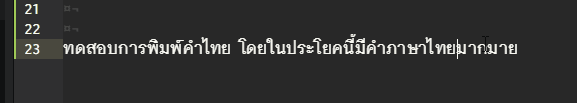
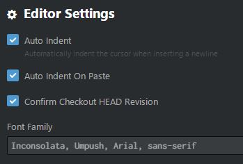

> อัพเดท 2015-07-05: [Atom Editor ออกรุ่น 1.0 แล้ว](https://www.blognone.com/node/69792) ผมได้ทดสอบแล้วแต่ก็ยังไม่สามารถใช้งานภาษาไทยได้

> หมายเหตุ: ถ้าใครยังไม่รู้จัก Atom Editor ลองอ่าน[บทความรีวิวจาก Blognone ดูนะครับ](https://www.blognone.com/node/56176)

## ปัญหาที่พบ
ปัญหาที่ผมพบในการพิมพ์ภาษาไทยบน [Atom Editor](https://atom.io) คือ cursor ที่แสดงผลขณะกำลังพิมพ์นั้นไม่ตรงกับ สิ่งที่แสดงผลจริงๆ

หลังจากผมได้พบกับปัญหานี้ผมได้ ไปค้นหาปัญหานี้ใน google ผลปรากฏว่าได้มีคนที่ประสบปัญหาแบบเดียวกันกับผม ซึ่งตอนนี้ได้มีคนไปตั้งประเด็นนี้ไว้ใน Github ของ Atom Editor แล้ว ใน [Some unicode characters seem to confuse Atom #1849](https://github.com/atom/atom/issues/1849) ตั้งแต่ปี 2557 ซึ่งตอนนี้ (ณ วันที่เขียนบทความนี้) ยังไม่ได้แก้ไขปัญหานี้ได้

## ลักษณะของปัญหา

โดยภาษาไทยเป็นการเข้ารหัส เพื่อการแสดงผลแบบ Unicode ซึ่งจะใช้ข้อมูลหลายๆ byte ในการแทนตัวอักษรภาษาไทยหนึ่งตัว และด้วยเหตุนี้ Atom editor ไม่สามารถแยกแยะได้ว่าตัวอักษรภาษาไทยแต่ละตัวนั้น สิ้นสุดที่อักขระ(byte) ตัวไหนจึงทำให้การแสดงผลตำแหน่ง cursor มีการผิดพลาดเกิดขึ้น

เพื่อความเข้าใจมากยิ่งขึ้น สามารถอ่านคำอธิบาย [การแทนตัวอักษรภาษาไทยในระบบการเข้ารหัสแบบต่างๆ] เพิ่มเติมได้

## วิธีการแก้ไขปัญหาเบื้องต้น

หลังจากผมได้ทดสอบเปลี่ยนฟอนต์ภาษาไทยหลายๆ ฟอนต์ ใน Atom Editor บน Windows 8.1 พบว่า ฟอนต์ Umpush มีปัญหาน้อยที่สุด ซึ่งเท่าที่ผมพบ มีปัญหาแค่ตัวอักษร "สระอำ" แค่ตัวเดียว

ถ้าใครมีวิธีการแก้ปัญหาที่ดีกว่านี้ ก็สามารถนำมาแบ่งปันได้นะครับ

ซึ่งตอนนี้ใน Atom Editor ผมได้ตั้งค่าฟอนต์ใน ไฟล์ `config.cson` ซึ่งอยู่ใน root ของ setting ของ Atom ดังนี้

`fontFamily: "Inconsolata, Umpush, Arial, sans-serif"`

หรือสามารถตั้งค่าผ่าน GUI ของ Atom Editor ได้ ที่ File > Settings > Editor Settings (หัวข้อ)

### คำอธิบาย
- ใช้ฟอนต์ [Inconsolata](http://levien.com/type/myfonts/inconsolata.html) เป็นฟอนต์ ภาษาอังกฤษหลักๆ
- ใช้ฟอนต์ [Umpush](ftp://linux.thai.net/pub/thailinux/software/thai-ttf) สำหรับการแสดงผลภาษาไทย ([หน้าแรก](http://linux.thai.net/projects/thaifonts-scalable))

หรือเอาง่ายๆ เปลี่ยน Editor ไปเลย เปลี่ยนไปใช้ [Brackets](http://brackets.io/) แทน ไม่มีปัญหาเรื่องการพิมพ์ภาษาไทยแน่ๆ  เดี๋ยวในอนาคตผมอาจจะมารีวิวโปรแกรม Brackets กันครับ

## คำที่เกี่ยวข้อง
- [Error when I put my cursor to the text](https://github.com/atom/atom/issues/6413)
- [Cursor positioning on certain Unicode characters](https://github.com/atom/atom/issues/3498)
- [incorrect cursor placement on lines with accented characters](https://github.com/atom/atom/issues/5975)
- [wrong cursor location with multi-byte characters](https://github.com/atom/atom/issues/4595)

