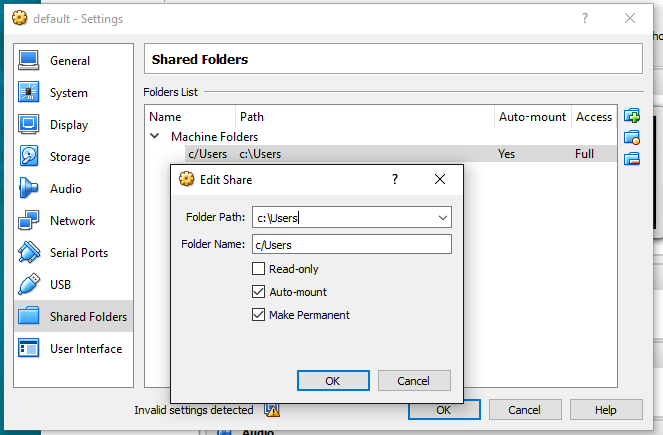

## เกริ่นนำ สักนิด...

ก่อนอ่านบทความนี้น่าจะมีความรู้พื้นฐานเรื่อง `Docker` และ `Docker Machine` มาก่อน

สืบเนื่องจาก Docker ที่รันอยู่บน Windows นั้นทำงานอยู่ใน Linux VM ไม่ได้ทำงานบน Windows ตรงๆ

จึงการ mount folder (หรือ ในฝั่งของ Docker เค้าเรียกว่า Volume) นั้น
Mount ได้อย่างมีข้อจำกัด

> Note: สามารถอ่านแนวคิดของ Docker เพิ่มเติมได้ที่เว็บของ Docker เองในหัวข้อ ["Learn the key concepts before installing"](https://docs.docker.com/engine/installation/windows/#learn-the-key-concepts-before-installing)

## ตอบ

เกิดจาก VM ที่รัน docker อยู่นั้น ทำการ shared folder ไว้แค่ path ของ `C:\Users` เท่านั้น

ทำให้ ไม่สามารถ mount path อื่นๆ ได้ เช่น `docker run -v "other/path:"docker/container/path"`

โดยค่าเริ่มต้น VM ที่รัน Docker อยู่นั้น ทำกาารการ share folder ไว้ดังนี้
กำหนดให้

```
Folder Path: C:\Users
Folder Name: c/Users
```

ดังรูป



**สรุปคำสั่ง Docker โดยทำการ mount volume**

```
docker run --rm -it -v "//[Folder Name]/your/folder:/docker/container/path" IMAGE_NAME
```

## แล้วเราสามารถ Mount ไปยัง path อื่นๆ ได้มั้ย
คิดว่า น่าจะได้ครับ ยังไม่เคยลอง ลองอ่านบทความเพิ่มเติมดู

- <http://stackoverflow.com/questions/30864466/whats-the-best-way-to-share-files-from-windows-to-boot2docker-vm>
- <http://www.incrediblemolk.com/sharing-a-windows-folder-with-the-boot2docker-vm>

## อ่านเพิ่มเติม
- Issue on Github: ["unable to see folder files in volume mounted from windows host"](https://github.com/docker/docker/issues/18419)
