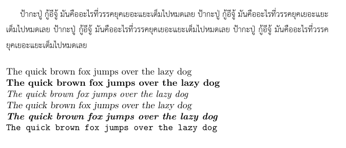

เนื่องจากผมได้สืบค้นการพิมพ์ไทย ปรากฎว่าหลายๆ แหล่งข้อมูลยังใช้งานยากอยู่ จึงนำมาประยุกต์ เพื่อให้สามารถพิมพ์ได้โดยเร็ว โดยที่ไม่ต้องกระทบส่วนอื่นๆ ของไฟล์ `.tex` ครับ

> อ่านก่อน: วิธีการนี้เหมาะสำหรับต้องการพิมพ์ภาษาไทยเป็นภาษารอง จากภาษาอังกฤษ


## ตัวอย่างไฟล์ .tex

```latex
\documentclass[a4paper]{article}
\usepackage{fontspec}
\usepackage{xunicode}
\usepackage{xltxtra}
\XeTeXlinebreaklocale “th_TH” % สำหรับตัดคำภาษาไทย

\newenvironment{thai}{
    \renewcommand{\baselinestretch}{1.2}
    \fontspec{TH Sarabun New}[Scale=1.23]
}
{\par}

\begin{document}
\noindent

\begin{thai}
  ป้ากะปู่ กู้อีจู้ มันคืออะไรที่วรรคยุคเยอะแยะเต็มไปหมดเลย ป้ากะปู่ กู้อีจู้ มันคืออะไรที่วรรคยุคเยอะแยะเต็มไปหมดเลย ป้ากะปู่ กู้อีจู้ มันคืออะไรที่วรรคยุคเยอะแยะเต็มไปหมดเลย ป้ากะปู่ กู้อีจู้ มันคืออะไรที่วรรคยุคเยอะแยะเต็มไปหมดเลย\\
\end{thai}

\noindent The quick brown fox jumps over the lazy dog\\
\textbf{The quick brown fox jumps over the lazy dog}\\
\textit{The quick brown fox jumps over the lazy dog}\\
\textsl{The quick brown fox jumps over the lazy dog}\\
\textbf{\textit{The quick brown fox jumps over the lazy dog}}\\
\texttt{The quick brown fox jumps over the lazy dog}\\

\end{document}
```

> คำเตือน: ในตัวอย่างไฟล์ .tex ข้างบนถูกทดสอบบน XeLatex จาก MikTek บน Windows ถ้าทำงานบนระบบอื่นๆ อาจจะมีปัญหาได้

เมื่อแปลงโดยใช้ `XeLaTeX` จะได้ผลลัพธ์แบบนี้



## วิธีตั้งค่าให้สามารถพิมพ์ภาษาไทยได้
เราจะใช้ฟอนต์ `TH Sarabun New` สำหรับเป็นตัวอย่าง และต้องติดตั้งฟอนต์ไว้ในเครื่องแล้ว

1. แทรก packages ที่จำเป็น รวมถึงการตั้งค่าการตัดคำภาษาไทย

    ```latex
    \usepackage{fontspec}
    \usepackage{xunicode}
    \usepackage{xltxtra}
    \XeTeXlinebreaklocale “th_TH” % สำหรับตัดคำภาษาไทย
    ```

2. กำหนดสภาพแวดล้อมใหม่(`\newenvironment`) สำหรับพิมพ์ภาษาไทยดังนี้

    ```latex
    \newenvironment{thai}{
        \renewcommand{\baselinestretch}{1.2}    % กำหนดขนาดบรรทัด เป็น 1.2
        \fontspec{TH Sarabun New}[Scale=1.23]   % ขยายตัวอกษร เป็น 1.23 เท่า
    }
    {\par}
    ```

## การใช้งาน

```latex
\begin{thai}
ใส่ข้อความภาษาไทยในนี้
\end{thai}
```

## Useful Resources
- [การใช้งานภาษาไทยโดยใช้ XeLaTeX](https://thailatex.wordpress.com/miktex-27-xetex-with-thai/)
- [คู่มือการใช้งาน XeLaTeX ฉบับภาษาไทย โดย ดร.ประมวล สุธีจารุวัฒน ](http://www.ie.eng.chula.ac.th/~pramual/books/XeTeX/)
- [Tutorial for declaring a new enviroment by sharelatex](https://www.sharelatex.com/learn/Environments)
