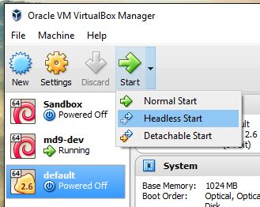

> สำหรับความสามารถนี้รองรับเฉพาะ **VirtualBox รุ่น 5.0** เป็นต้นไปนะครับ สามารถดูรายละเอียดเพิ่มเติมได้ที่[บล็อกของ oracle](https://blogs.oracle.com/virtualization/entry/oracle_vm_virtualbox_5_07) เลยครับ

สวัสดีครับ วันนี้ผมจะนำเสนอวิธีการเริ่มการทำงาน virtual machine (VM) โดยไม่มี GUI ขึ้นมากินทรัพยากรของคอมเตอร์เครื่องเรา (Host Machine) โดยวิธีการเหมาะสำหรับการใช้งานแบบ remote เท่านั้น หรือก็คือ คุณจะต้องใช้ ssh เพื่อเชื่อมเข้าไปใช้งาน VM

> สำหรับคนที่ใช้ windows โปรแกรมที่แนะนำสำหรับการใช้ ssh คือ [Putty](http://www.putty.org/) ครับ

## วิธีการใช้งานด้วย GUI


## วิธีการใช้ผ่าน Command Line (CLI)
> สำหรับคนที่ใช้ Windows ให้ใช้ path เต็มๆ ของ Virtualbox แทน หรือตั้งค่า variable environment ก็ได้ เช่น `"C:\Program Files\Oracle\VirtualBox\VBoxManage"`

- แสดงรายชื่อของ Virtual machine ที่มีอยู่ในเครื่อง

  ```bash
  $ VBoxManage list vms
  "Sandbox" {754f8cac-1fff-4863-952e-ba81ebf9efc7}
  "md9-dev" {dd6cfb08-0914-4b6f-b78a-7aa301fc8813}
  "default" {fb0f8838-0f24-44d3-bd6f-8855ff2e4262}
  ```

- เริ่มต้นการทำงาน Virtual machine แบบทำงานเบื้องหลัง (headless mode)

  ```bash
  $ VBoxManage startvm default --type headless
  ```

- ปิดการทำงาน Virtual machine

  ```bash
  $ VBoxManage controlvm default poweroff
  ```

## อ่านเพิ่มเติม
- ["Start VirtualBox VM in Headless Mode" by Gregory Schier](http://schier.co/blog/2013/03/13/start-virtualbox-vm-in-headless-mode.html)
- [Vbox headless - Official VirtualBox Doc](https://www.virtualbox.org/manual/ch07.html#vboxheadless)
- [vboxmanage startvm - Official VirtualBox Doc](https://www.virtualbox.org/manual/ch08.html#vboxmanage-startvm)
- [ตัวอย่างการนำคำสั่งการเริ่มต้น vm ของ virtualbox ไปใช้งาน](https://github.com/mildronize/windows-toolbox/blob/a1962e0e26d33f19d8c6f582c42b0c423d9bc644/vbox.bat)
