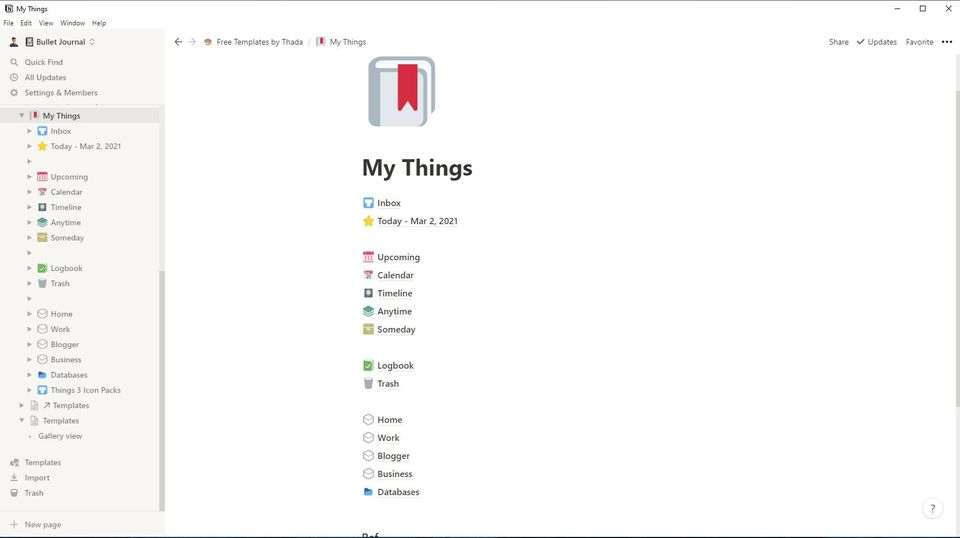
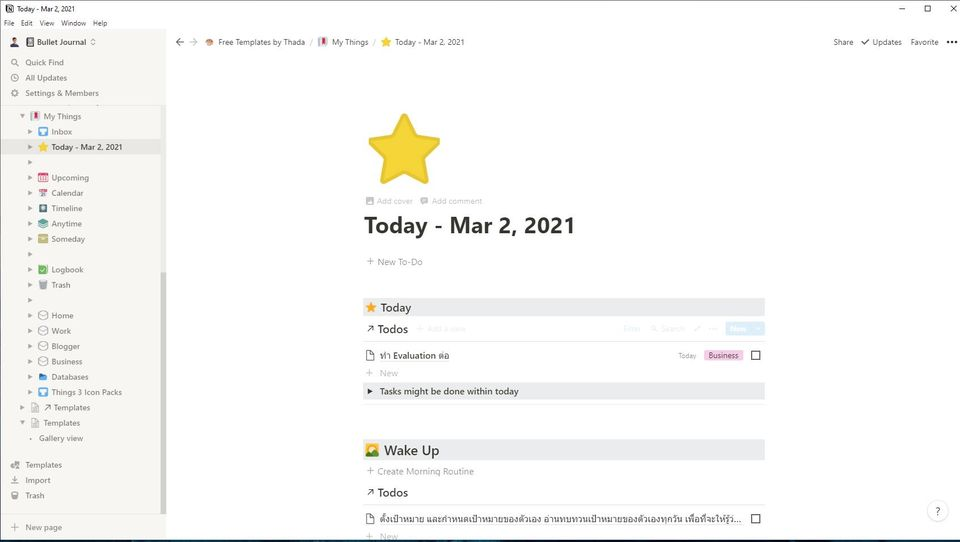
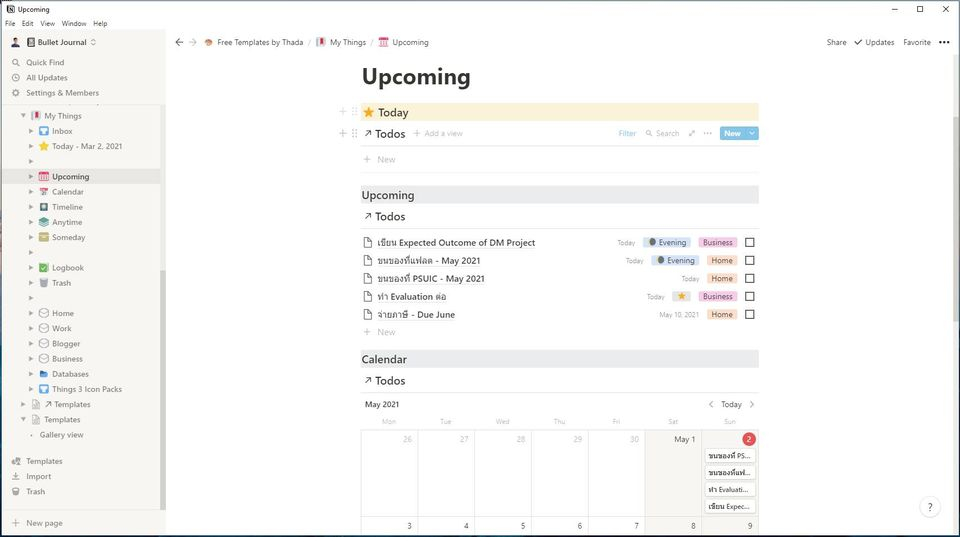

สวัสดีครับวันนี้มาแชร์ Template: My Things  📥 ( Fully inspired by [Things 3](https://culturedcode.com/things/) Application)

ผมใช้ Notion มาแล้ว 2 ปี ปรับ process การทำงานมาหลายแบบมาก ดู August Bradley แล้วก็ทำตามแล้วไม่ใช่ตัวเอง เลยปรับหลายๆ หลักการทั้ง GTD, แอพ Things 3 ปรับ workflow ต่างๆ ให้ไม่ยุ่งยาก ใช้งานได้ ไม่มีปัญหาบน มือถือด้วย

Key Concept คือ เน้นใช้ง่าย ไม่ทำให้กดดันตัวเอง ไม่ต้อง Strict เกินไปแบบ Time Block แต่ต้องเกิดประโยชน์ที่สุด

เป็น Template สำหรับ Todo การจัดการรายการที่ต้องทำ + สิ่งที่อยากทำ (จากนี้ขอเรียกว่า todo ) ช่วยให้ focus กับรายการสิ่งที่อยากทำและต้องทำมากขึ้น และยืดหยุ่น โดยมีจุดเด่น คือ
 1. 😀 Separation of Concern: ไม่แสดง todo ทั้งหมดในหน้าเดียว แต่จะแยกตามวันเวลา หมวดหมู่  (Area) เพื่อลดความล้า และเหนื่อยในการรีวิว todo จำนวนมาก หรืออาจจะทำให้ท้อได้
 2. 📥 Inbox System: เมื่อเราคิดอะไรได้ เราสามารถโยน todo นั้นไปจัดหมวดหมู่ว่าอยู่ประเภทไหน Dealine วันไหนได้อีกที
 3. ⭐️Today page: สำหรับการเลือก todo ที่วางแผนจะทำวันนี้ โดยสามารถระบุเวลาที่คาดว่าจะทำได้ มี 5 ช่วงเวลา wake up, morning, afternoon, evening, bedtime
    
 4. หน้า ⭐️ Today Page จะมี Template สำหรับจะทำ todos ให้เผื่อนึกไม่ออกว่าควรจะทำอะไรเช่น Bedtime มีอ่านหนังสือ ทาครีมบำรุง เป็นต้น
 5. 🗓Upcoming page: สำหรับแสดง todo ที่มี Due Date หรือ Deadline ไว้แล้ว โดยเรียงจากเร็วที่สุดก่อน
    
 6. 🟩 Anytime page: สำหรับ todo ที่ยังไม่ลงเวลา deadline
 7. 🗃Somday:  สำหรับ todo ที่จะไม่ทำในเร็วๆ นี้
 8. 📗Logbook: สำหรับ todo ที่ทำเสร็จแล้ว โดยเรียงจากวันที่อัพเดทล่าสุด (เมื่อเราทำ todo เสร็จ จะมาอยู่หน้านี้เอง ) สำหรับ review ว่าเราทำอะไรไปแล้วบ้าง
 9.  🗑 Trash : ก็ตามชื่อเลย
 10. ใช้ประโยชน์จาก แทบ Navigation ด้านซ้ายในการเปลี่ยนหน้าไปมา เพราะรู้สึกว่า มาใส่ทุกอย่างในหน้าเดียว แล้วกดมันให้ใช้งานยาก
 11. ส่วน Calendar กับ Timeline ก็ตามชื่อเลยครับ
 12. การใช้ Field Hide จะใช้กับ Linked Database ที่ต้องเอานำ todo ไปใส่ เพื่อย้ายตำแหน่งของ todo ไม่มีผลอะไร ของข้อมูล หลักๆ ทำให้ดู Clean ขึ้น ใช้เมนู Data Management ของหน้า  📥 Inbox เพื่อซ่อน todo

## วิธีใช้

1. การใช้งานดูทั่วจะไปจะใช้หน้า Today เป็นหลัก เพื่อดูว่าควรทำอะไรเวลาไหน
2. การสร้าง todo ใหม่
   - สามารถสร้าง todo ปกติ หรือ แทรกใน database ก็ได้
   - สามารถทำได้ทุกหน้า แต่แนะนำให้สร้างที่ inbox หรือ today จะสะดวกกว่า
3. การย้าย todo หรือ เปลี่ยน หมวดหมู่(Area)
   - สามารถลากจาก หน้าใดๆ ไป หน้าอื่นๆ ได้เลยครับ แต่ต้องลากใส่ database block จะนะครับ เพราะแต่ละ database block จะเป็น link ไปยัง database ตัวจริงแล้ว filter ออกมา ดังนั้น เมื่อลากเข้าไปแล้ว มันก็จะตั้งค่า field  อัตโนมัติ

## Database

ใช้ Database 1 อัน เพื่อให้ง่ายต่อการจัดการ และใช้งาน ลดความซ้ำซ้อน การออกแบบทั้งหมดเป็นการ Filter ทั้งหมด โดยมี Field ดังนี้
- Done: สำหรับ Mark ว่าทำ todo เสร็จ
- Due Date: ก็วันที่จะทำ
- Area: เป็นหมวดหมู่ของ todo ถ้าไม่มี Area จะอยู่ใน Inbox
- Archive: ให้เลือก Someday หรือ อาจจะใส่อย่างอื่นก็ได้
- Time: เป็นตัวเลือกว่าจะทำงานในวันนี้ ถ้าเลือกอย่างใดอย่างหนึ่งจะอยู่ในหน้า Today แต่ถ้าไม่เลือกจะอยู่ใน Anytime หรือ Upcoming (ถ้า Upcoming จะมี Due Date)
 - โดยเลือกได้ 5 ช่วงเวลาว่าจะทำ Task ช่วงเวลาไหน  wake up, morning, afternoon, evening, bedtime
- Tags: เป็นข้อมูลเพิ่มเติม อยากใส่อะไรก็ได้
- Urgent: มี 5 Min คือ งานที่ทำเสร็จภายใน 5 นาที ถ้าว่าง ควรทำทันที และ With in today คือ todo  ที่ยืดหยุ่นทำตอนไหนก็ได้ แต่ควรจะเสร็จภายในวันนั้น
- Priority: มี important ก็คืองานสำคัญครับ แต่อาจจะไม่เร่งด่วน
- Hide: เอาไว้ซ่อนครับ เพื่อความสวยงาม
- Last Update: เอาไว้แสดงในหน้า Logbook ครับ

## เสริมเรื่อง Things 3

ถ้าใครอยู่ในวงการนี้ คงน่าจะรู้จักแอพ [things 3](https://culturedcode.com/things/) นะครับ เป็นแอพที่ขายขาดรอบเดียว ไม่มีจ่ายรายเดือนเหมือน Notion ถือว่าดังมากๆ ในเรื่องของ feature ที่เป็นเอกลักษณ์มากๆ และสามารถประยุกได้หลากหลาย

ถ้าใครนึกแนวทางการใช้งานไม่ออก แนะนำให้ดูคลิปสอน Things 3 นะครับ เท่าที่ดูยังไม่มีคนไทยมารีวิว จะเห็นภาพมาก

สุดท้ายนี้ ลองนำไปประยุกต์ใช้งานให้เข้ากับตัวเองดูนะครับ ชอบไม่ชอบยังไงก็บอกได้ครับ หรือใครมีคำถามอะไรก็ยินดีเลยครับ  ขอบคุณที่อ่านจนจบ จริงๆ ที่ Template ที่ทำไว้เยอะ แต่ยังไม่ได้เอามาแบ่งปันกัน วันนี้ถือว่าได้มาแชร์กัน สวัสดีครับ

Download Template
http://bit.ly/mildthada-notion-my-things

---

*Cross published at [Notion Thailand FB Group](https://www.facebook.com/groups/notionthai/posts/369652924407139)*

