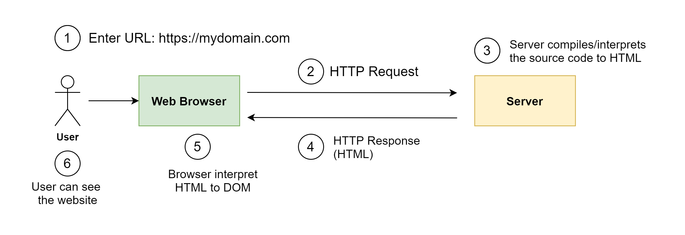
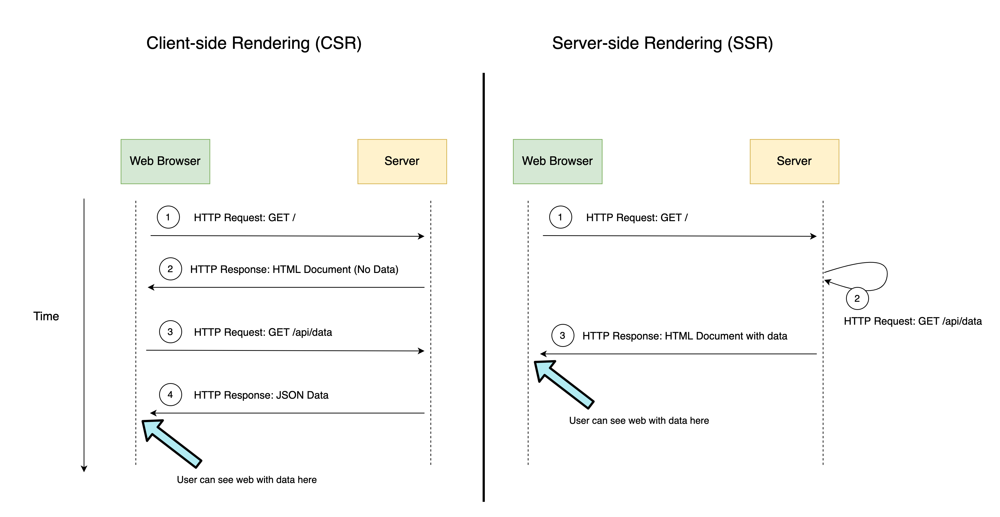

ได้มีโอกาสคุยกับพี่ชาย ก็ยังรู้สึกว่าหลายๆ คนยังไม่รู้จักคำว่า SSR หรือ Server-side Rendering บวกกับการมาของ [React 18](https://reactjs.org/blog/2021/06/08/the-plan-for-react-18.html) ที่นำเสนอ [Server Component](https://www.youtube.com/watch?v=TQQPAU21ZUw) เลยรู้สึกตื่นเต้น วันนี้เลยอยากมาแชร์ให้ฟังกันครับ

ต้องบอกว่า SSR มาพร้อมกับการเขียน JavaScript ยุคสมัยใหม่ เช่น [React](https://reactjs.org/), [Vue](https://vuejs.org/), [Angular](https://angular.io/) ที่เราไม่แก้ไข DOM ตรงๆ แต่ใช้กลไกบางอย่างที่ทำให้แก้ไข DOM เท่าที่จำเป็นเท่านั้น เช่น [Virtual DOM](https://reactjs.org/docs/faq-internals.html) ทำให้ประสิทธิภาพดีขึ้นกว่าการเขียนแบบเดิมๆ เช่น Vanilla JavaScript หรือใช้ jQuery นั้นเอง เดี๋ยวเราจะคุยประเด็นนี้ในบทความต่อนะครับ

> Note: Vanilla เป็น Adjective ที่มาขยายการเขียนด้วย JavaScript เพื่อมาเน้นว่านี้คือการเขียน JavaScript ล้วนๆ นะ ไม่มีอะไรอื่นมาผสม

# SSR ไม่ใช่เรื่องใหม่

ถ้าย้อนกลับไปเมื่อ 10 กว่าปีที่แล้ว สมัยที่เราเขียน PHP เพื่อทำ Web Application ซึ่ง PHP เองก็ภาษาฝั่ง Server หมายความว่า PHP source code จะถูก interpret ที่ server แล้วส่ง response กลับมาเป็น HTML มายัง Client ลองมาดูรูปประกอบเพื่อให้เห็นภาพมากขึ้น




จากในรูปในขั้นตอนที่ 3 server ก็จะ interpret ให้เป็น HTML แล้วส่งกลับให้ User ให้เห็น Result ของเว็บไซต์

ซึ่งภาษาฝั่ง Server จะเป็น PHP, Java, Node.js, C#, Go หรืออะไรก็แล้วแต่ ทำหน้าที่รับ request จาก user แล้วแปลงผลเท่านั้น

คำถามต่อไป คือแล้ว JavaScript ถูกทำงานที่ไหน แน่นอนว่าต้องเป็นที่ Browser อยู่แล้ว ซึ่งโดย Server จะส่ง HTML + CSS + JavaScript เมื่อ Browser โหลด HTML และ CSS เสร็จก็เรียกให้ JavaScript ทำงาน

> Note: เพื่อป้องกันการสับสน ถึงแม้ว่า NodeJS จะเขียนด้วยภาษา JavaScript ที่ทำงานอยู่บน [JavaScript runtime built on Chrome's V8 JavaScript engine](https://nodejs.org/) ซึ่งทำหน้าที่ execute จาก JavaScript เป็น HTML Response (ที่รวม CSS และ JavaScript (ฝั่ง Client) เข้าด้วยกัน) จากนั้น JavaScript ที่เป็น Client Side จะถูกเรียกก็ต้องเมื่อโหลดบน Browser เท่านั้น

# SSR เป็นกลไกปกติของ Web Application

ถ้าเราสังเกตุกลไกการทำงานของ Web Application นั้น มันคือการ render HTML ที่ฝั่ง server ซึ่งก็ตรงตัวกับคำว่า Server-side Rendering ที่หมายถึงการ Render ที่ฝั่ง Server นั้นเอง

# มี Web Application อยู่แล้ว แล้วทำไมต้องมี SSR อีก ?

แบบนี้ครับ จากต้นบทความผมได้บอกไปแล้วว่า SSR
มาพร้อมกับการเขียน JavaScript ยุคสมัยใหม่ เช่น React, Vue, Angular เป็นต้น

SSR เกิดมาขึ้นมาจากการเขียน SPA หรือ Single Page Application ครับ ต้องบอกว่า React, Vue, Angular ทำให้การเขียน Single Page Application เป็นที่นิยมมากในปัจจุบัน ซึ่ง SPA สาเหตุที่เรียกว่า SPA ก็คือมันมีหน้าเดียวครับ การ Routing เกิดขึ้นที่ Client ไม่ใช่ Server

> Routing คือ ตัวกลางในการจัดการว่าเมื่อมีการเข้าถึง URL หรือ Path นั้น ของเว็บให้ไปเรียก Controller หรือตัวที่เกี่ยวข้องมาจัดการครับ เช่น https://mydomain.com ต้องไปเรียก Controller ที่เป็น Index หรือ https://mydomain.com/users ต้องไปเรียก Controller ที่จัดการ path `/users` ว่าต้องทำยังไงต่อไป

กลับมาที่ Web Application ทั่วไป Routing จะอยู่ที่ server ครับ เมื่อมีการเข้าถึง Path  หรือ URL อื่นๆ ตัว Routing ก็จะต้องไปเรียก controller นั้นๆ มาจัดการส่งหน้า HTML ให้ client บางที่เค้าถึงเรียกว่า Multi-Page Application

กลับมาที่ SPA ที่เป็นการ Routing แบบที่เกิดขึ้นที่ Client ดังนั้นเมื่อ Routing เกิดขึ้นที่ client ตัวที่ควบคุมกลไกต่างๆ จึงเป็นหน้าที่ของ JavaScript ที่โหลดมาแค่หน้าเดียวแต่สามารถใช้ URL ที่แตกต่างกันเข้าถึงได้ โดยที่ไม่ต้องพึงพา server เลย

## บทบาทของ SPA รวมถึงข้อดีและข้อเสีย

ในยุคที่ React, Vue, Angular มีความนิยมสูงขึ้นมาก มันจึงทำให้การทำ SPA เป็นเรื่องที่ง่ายขึ้นกว่าแต่ก่อนมากๆ รวมถึงการผลักดัน [PWA Application โดย Google](https://web.dev/progressive-web-apps/)  ซึ่งบทบาทของ SPA หลักๆ คือการมาแทนที่ Mobile Application อย่างพวก Android หรือ iOS ได้ (ไม่ได้ทุกกรณี ขึ้นอยู่กับ Requirement)

> เราอาจจะเรียก SPA ว่าเป็น CSR (Client-side Rendering) ก็ได้ ถ้า SPA นั้น Render บน client ทั้งหมด จากนี้ขอเรียกว่า CSR แทน SPA เพื่อให้ชัดเจนขึ้นว่า SPA ใช้ Approach CSR.

ข้อดีของ SPA ที่เป็น CSR ก็มีหลายอย่างเช่นกัน User Experience ดีขึ้น ความไหลลื่นในการใช้งาน เพราะลดช่องว่างของการรอระหว่างเปลี่ยนหน้า ซึ่งเกิดจากการรอ response จาก server หรือ การเก็บ Cache ข้อมูลเพื่อให้โหลดข้อมูลได้เร็วขึ้น หรือแม้แต่การใช้ประโยชน์จาก [Service Worker](https://developers.google.com/web/fundamentals/primers/service-workers) ในการทำ background process เช่น [push notifications](https://developers.google.com/web/fundamentals/push-notifications) และ [background sync](https://developers.google.com/web/updates/2015/12/background-sync) เป็นต้น
หรือการที่เราสามารถ ติดตั้ง SPA ลงเป็นแอพ​ในมือถือได้เลย (โดยใช้ PWA)

> Note: [PWA บน iOS 12](https://medium.com/@firt/progressive-web-apps-on-ios-are-here-d00430dee3a7) , [PWA บน iOS 14](https://firt.dev/ios-14/) ยังมีข้อจำกัดในหลายๆ เรื่อง

อีกหนึ่งข้อดีของ SSR คือ การที่ Library บาง Library อาจจะช่วยลด development cost ได้โดยที่สามารถ Passing value ผ่านเข้า prop โดยตรง โดยที่ไม่ต้อง implement API endpoint ขึ้นมาใหม่ ยกตัวอย่าง [ReactJS.net](https://reactjs.net/) ที่สามารถส่ง value จาก backend server ไปยังไง view ได้เลย สังเกตุจากใน code ข้างล่าง

```html
<!-- This will render the component server-side -->
@Html.React("CommentsBox", new {
    initialComments = Model.Comments
})
```

ถ้าสังเกตุจาก code React components จะต้องถูกส่งค่าจาก components อื่นใน JavaScript แต่ในนี้ เราส่งค่า `Model.Comments` ผ่าน props ที่ชื่อว่า `initialComments` ได้โดยตรงเลย

ส่วนข้อเสียของ SPA ก็อาจจะเป็น Development Cost ที่สูงขึ้น ถ้าเทียบกับ Web Application (อย่างไร ก็ตามขึ้นอยู่กับความชำนาญของทีมด้วย) เพราะไม่ใช่แค่ Web ที่แสดงผลของจาก backend server แต่ยังต้อง manage state จัดการ authentication หรือ authorization หรืออื่นๆ อีกมากมาย (มากหรือน้อย ขึ้นอยู่กับ requirement)

อีกหนึ่งข้อเสียของ SPA ที่จะไม่พูดไม่ได้เลย และเป็นที่มาของบทความนี้คือ ระยะเวลาในการโหลดครั้งแรกสูง (High Initial Load) เมื่อเทียบกับ SSR

เพื่อให้เห็นภาพมากขึ้นจากรูป SSR และ CSR



> Note: รูปนี้อาจจะไม่ใช่ การ implement SSR ในรูปแบบทั่วไป แต่วาดออกมาเพื่อยกตัวอย่างให้เห็นภาพ เพราะจริงๆ SSR เอง อธิบายแค่การ Render พร้อม data จาก server แล้วเท่านั้นเอง โดยรูปดังกล่าวเป็นการวาดโดยอ้างจากหลักการทำ SSR เบื้องต้นใน [Next.js](https://nextjs.org/) ซึ่งมีการอธิบายเปรียบเทียบอย่างดีแล้วใน[บทความของ logrocket ที่เปรียบ Next.js กับ Create React App](https://blog.logrocket.com/next-js-vs-create-react-app/)

ถ้าเราดูจากรูป CSR ทางซ้ายมือ ในขั้นที่ 2 ที่เว็บโหลดขึ้นมา เรายังไม่ได้ Data มาเลย อาจจะมีแค่ UI หรือจะมี Spinner รอโหลดข้อมูลมา ตัว client จะต้องส่งไปขอข้อมูลมาจากเว็บ อีกรอบถึงจะแสดงว่าเว็บที่สมบูรณ์ได้

ในขณะที่ SSR ทางขวามือ ในขั้นที่ 3 เราก็สามารถได้ หน้าเว็บที่สมบูรณ์ได้เลย เพราะในขั้นตอนที่ 2 ก่อนที่ server จะส่งออกมา ก็ทำจากเรียก API จากตัว server เลย ทำให้ประหยัดเวลากว่า

# แล้วเครื่องมือในปัจจุบันมีแบบไหนกันบ้าง

- ตัวแรกเลยคือ [Create React App](https://reactjs.org/docs/create-a-new-react-app.html) โดยเราสามารถเขียน SPA แบบ CSR ได้โดย default เลย แต่ถ้าจะทำ SSR ใน official docs เค้าแนะนำให้ไปใช้ [Next.js](https://nextjs.org/) แทน ซึ่งทำได้ดีๆ มากๆ
  - แต่ข้อเสียคือ เราอาจจะต้องใช้ backend server ที่เป็น JavaScript
- ส่วนถ้าเป็นการทำ SSR ภาษาอื่นๆ ก็สามารถทำได้ครับ แต่อาจจะต้อง customize เองเช่น [ReactJS.net](https://reactjs.net/) ที่ทำงานร่วมกับ ASP.NET Core หรือภาษา Python, Java ก็มีเหมือนกัน

> Note: ขอไม่พูดถึง [Gatsby](https://www.gatsbyjs.com/) เพราะวัตถุประสงค์การใช้งานต่างกัน ตัวนี้เหมาะสมสำหรับทำ [Static Site Generator](https://www.netlify.com/blog/2020/04/14/what-is-a-static-site-generator-and-3-ways-to-find-the-best-one/) มากกว่า
# หลักในการเลือก

- เลือก SSR
  - ถ้าอยากให้ Faster initial loading.
  - Improve SEO เพราะว่าการทำ Multi-Page จะทำให้ search engine ทำงานได้ดีกว่า และง่ายกว่า
- เลือก CSR
  - ไม่ได้กังวลเรื่อง SEO มาก

แต่อย่างไรก็ตาม การทำ SEO บน SPA ก็เป็นเรื่องที่ท้าทาย ซึ่ง[บทความของ Search Engine Watch](https://www.searchenginewatch.com/2018/04/09/an-seos-survival-guide-to-single-page-applications-spas/) เขียนไว้ดีมาก และพูดเนื้อหาที่เป็นประโยชน์ในการเขียน SPA  เลือกใช้กลไก SSR หรือ CSR อย่างเหมาะสม เพราะการทำ SSR บางครั้งก็ใช้ development cost ที่สูงกว่าปกติ

> Note: ในบทความนี้ขอไม่พูดถึง Complex Architecture อย่าง Micro Frontend นะครับ เพราะถือว่าขึ้นอยู่กับการ Manage ไป อาจจะมีการ Mix กันหลายๆ Approach

# แหล่งข้อมูลดีๆ สำหรับ SPA

จาก[บทความของ Search Engine Watch](https://www.searchenginewatch.com/2018/04/09/an-seos-survival-guide-to-single-page-applications-spas/) ได้หยิบยกตัวอย่างข้อมูลดีๆ สำหรับทำ SEO บน SPA ผมเลยขอหยิบมาเขียนซ้ำอีกรอบ:

- [The Ultimate Guide to JavaScript SEO](https://www.elephate.com/blog/ultimate-guide-javascript-seo/) by Tomasz Rudzki
- General overview of Single Page Applications and how Google treats them: [Watch this video](https://www.youtube.com/watch?v=JlP5rBynK3E) by Google ‎Senior Webmaster Trends Analyst [John Mueller](https://www.linkedin.com/in/johnmu/)
- [Auditing JavaScript for SEO](https://www.briggsby.com/auditing-javascript-for-seo/), and [Core Principles of SEO for JavaScript](https://www.briggsby.com/dealing-with-javascript-for-seo/) by Justin Briggs
- [The Basics of JavaScript Framework SEO in AngularJS](https://builtvisible.com/javascript-framework-seo/) by Richard Baxter
- [Early Results from Split Testing JavaScript for SEO](https://www.distilled.net/resources/split-testing-javascript-for-seo/) by Will Critchlow
- [JavaScript & SEO: The Definitive Resource List](http://www.stateofdigital.com/javascript-seo-the-definitive-resource-list/)
- [SEO Considerations for Single Page Applications](https://blog.twentysixdigital.com/seo/seo-considerations-for-single-page-applications/)
- [Angular Single Page Applications (SPA): What are the Benefits?](https://blog.angular-university.io/why-a-single-page-application-what-are-the-benefits-what-is-a-spa/) by Angular University
- This Microsoft article: [Choose Between Traditional Web Apps and Single Page Apps (SPAs)](https://docs.microsoft.com/en-us/dotnet/standard/modern-web-apps-azure-architecture/choose-between-traditional-web-and-single-page-apps)
- A few different SPA types [by Johann Wagner](https://blog.codecentric.de/en/2017/12/angular-single-page-applications/)
- Very good overview: [Single Page Applications: When & Why You Should Use Them](https://www.scalablepath.com/blog/single-page-applications/)

# Final Thought

สุดท้ายนี้ การทำ SSR ก็ไม่ใช่วิธีการเดียวสำหรับการเพิ่มประสิทธิภาพ แต่เราสามารถใช้ทริคอื่นๆ แทนได้ เพื่อให้ประสิทธิภาพดีขึ้น อาจจะไม่ดีที่สุด แต่ development cost ไม่สูงเกินไป เช่นการทำ caching เป็นต้น

อย่างไรก็ตามบทความนี้เป็นเพียงหนึ่งวิธีการที่สามารถเพิ่มประสิทธิภาพของ SPA การปรับปรุงควรคำนึงถึงในหลายๆ ปัจจัย เช่น ต้นทุน ทีม หรือฝั่ง business เป็นต้น

Enjoy coding...

ความตั้งใจเดิมอยากเขียนไปให้ถึง Server Component ใน React 18 แต่เอาไว้ยกยอดไป Blog หน้า ถ้ามีใครมีประเด็นอะไรอยากเสริมหรือแนะนำ ผมยินดีเลยครับ สำหรับวันนี้ลาไปก่อน สวัสดีครับ


# Acknowledgement

สุดท้ายนี้ (จริงๆแล้วน้า) ขอขอบคุณ[ทีมงาน Admin .NET Thailand](https://www.dotnetthailand.com/) มากๆ ที่ช่วยรีวิวและแนะนำบทความนี้จนสามารถเผยแพร่ออกไปได้
