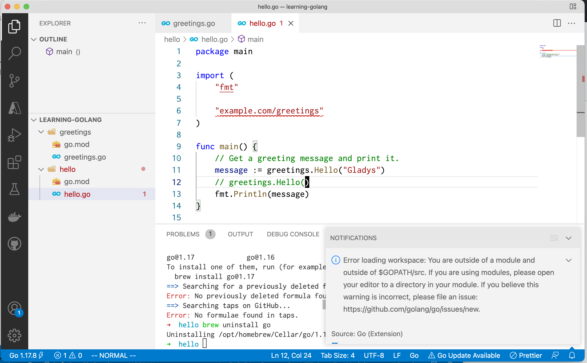
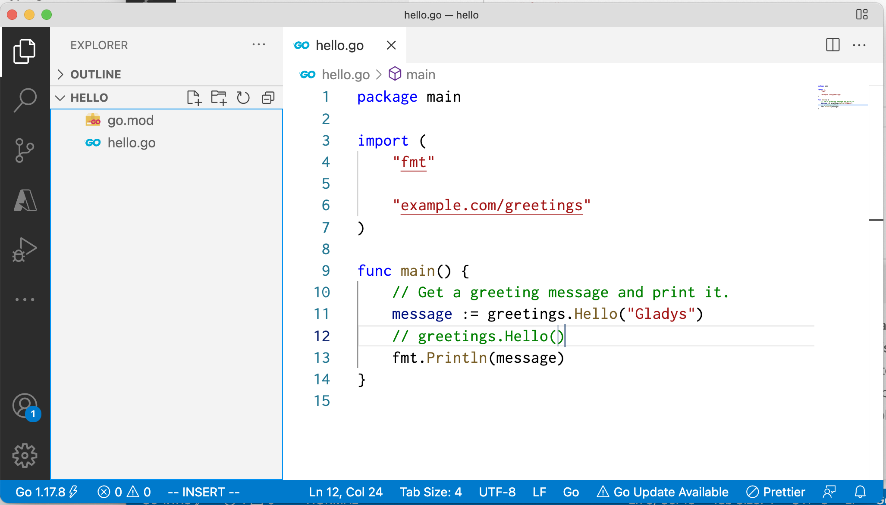
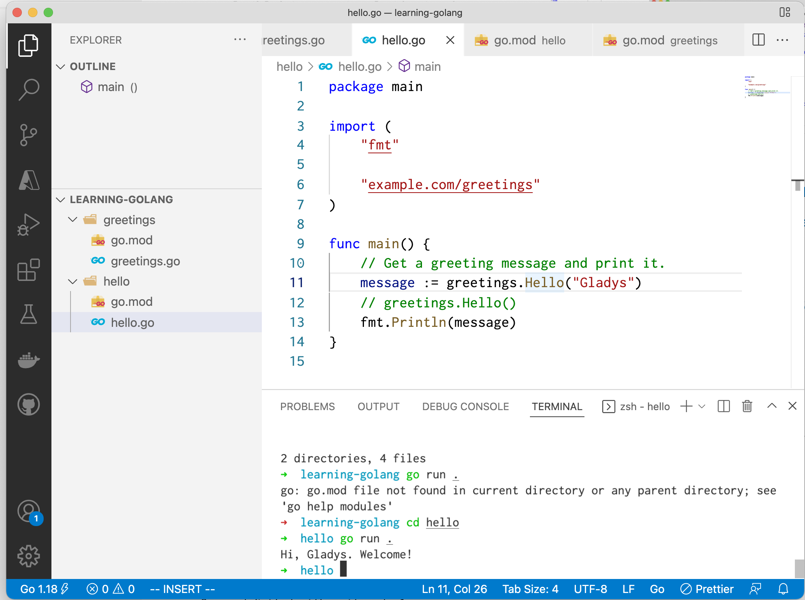

จากที่ลองทำตาม Tutorial ในการ import Go Module ใน Official Docs

1. [Create a module](https://go.dev/doc/tutorial/create-module) -- Write a small module with functions you can call from another module.
2. [Call your code from another module](https://go.dev/doc/tutorial/call-module-code.html) -- Import and use your new module.

มี Project Structure

```
.
├── greetings
│   ├── go.mod
│   └── greetings.go
└── hello
    ├── go.mod
    └── hello.go
```

จากนั้น Vs Code ก็แจ้ง Error ว่า "Error loading workspace: You are outside of a module and outside of $GOPATH/src."



## Solution

จากที่ไปอ่านมา ตัว `gopls` ซึ่งเป็น libs ที่ช่วยในพวก Editor ต่างๆ พบว่า [ถ้าเป็น Go 1.17 ลงไปจะสามารถเปิดได้แค่ 1 module/workspace](https://github.com/golang/tools/blob/master/gopls/doc/workspace.md#one-module) เท่านั้น

พอลองเปิดแยก Module ก็พบว่าจริงไม่ Error แล้ว


ถ้าเราจะ[ใช้งานหลาย Modules พร้อมกันใน 1 Workspace เราควรใช้ Go 1.18](https://github.com/golang/tools/blob/master/gopls/doc/workspace.md#multiple-modules)

พออัพเกรดไป go 1.18 ก็ใช้งานได้แล้ว



## Ref:
https://github.com/golang/go/issues/45015#issuecomment-802556434

