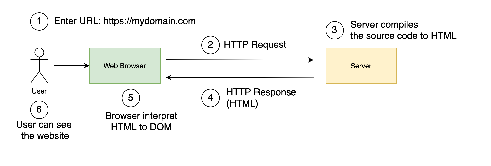

ได้มีโอกาสคุยกับพี่ชาย ก็ยังรู้สึกว่าหลายๆ คนยังไม่รู้จักคำว่า SSR หรือ Server-side Rendering บวกกับการมาของ [React 18](https://reactjs.org/blog/2021/06/08/the-plan-for-react-18.html) ที่นำเสนอ [Server Component](https://www.youtube.com/watch?v=TQQPAU21ZUw) เลยรู้สึกตื่นเต้น วันนี้เลยอยากมาแชร์ให้ฟังกันครับ

ต้องบอกว่า SSR มาพร้อมกับการเขียน JavaScript ยุคสมัยใหม่ เช่น [React](https://reactjs.org/), [Vue](https://vuejs.org/), [Angular](https://angular.io/) ที่เราไม่แก้ไข DOM ตรงๆ แต่ใช้ กลไกบางอย่างที่ทำให้ แก้ไข DOM เท่าที่จำเป็นเท่านั้น เช่น [Virtual DOM](https://reactjs.org/docs/faq-internals.html) มันจึงทำให้ประสิทธิภาพดีขึ้นกว่าการเขียนแบบเดิมๆ เช่น Vanilla JavaScript หรือใช้ jQuery นั้นเอง เดี๋ยวเราจะคุยประเด็นนี้ในบทความต่อนะครับ

> Note: Vanilla เป็น Adjective ที่มาขยายการเขียนด้วย JavaScript เพื่อมาเน้นว่านี้คือการเขียน JavaScript ล้วนๆ นะ ไม่มีอะไรอื่นมาผสม

# SSR ไม่ใช่เรื่องใหม่

ถ้าย้อนกลับไปเมื่อ 10 กว่าปีที่แล้ว สมัยที่เราเขียน PHP เพื่อทำ Web Application ซึ่ง PHP เองก็ภาษาฝั่ง Server หมายความว่า PHP source code จะถูก compile ที่ server แล้วส่ง response กลับมาเป็น HTML มายัง Client ลองมาดูรูปประกอบเพื่อให้เห็นภาพมากขึ้น

จากในรูปในขั้นตอนที่ 3 server ก็จะ compile เป็น HTML แล้วส่งกลับให้ User ให้เห็น Result ของเว็บไซต์

ซึ่งภาษาฝั่ง Server จะเป็น PHP, Java, NodeJS, C#, Go หรืออะไรก็แล้วแต่ ทำหน้าที่รับ request จาก user แล้วแปลงผลเท่านั้น

คำถามต่อไป คือแล้ว JavaScript ถูกทำงานที่ไหน แน่นอนว่าต้องเป็นที่ Browser อยู่แล้ว ซึ่งโดย Server จะส่ง HTML + CSS + JavaScript เมื่อ Browser โหลด HTML และ CSS เสร็จก็เรียกให้ JavaScript ทำงาน

> Note: เพื่อป้องกันการสับสน ถึงแม้ว่า NodeJS จะเขียนด้วยภาษา JavaScript เป็นที่ทำงานอยู่บน [JavaScript runtime built on Chrome's V8 JavaScript engine](https://nodejs.org/) ซึ่งก็ทำหน้าที่ในการ Compile จาก JavaScript เป็น HTML เช่นเดียวกัน จากนั้น JavaScript ที่เป็น Client Side จะถูกเรียกก็ต้องเมื่อโหลดบน Browser เท่านั้น

# SSR กับ Web Application เป็นเรื่องเดียวกัน 

ถ้าเราสังเกตุกลไกการทำงานของ Web Application นั้น มันคือการ render HTML ที่ฝั่ง server ซึ่งก็ตรงตัวกับคำว่า Server-side Rendering ที่หมายถึงการ Render ที่ฝั่ง Server นั้นเอง

# มี Web Application อยู่แล้ว แล้วทำไมต้องมี SSR อีก ?

แบบนี้ครับ จากต้นบทความผมได้บอกไปแล้วว่า SSR 
มาพร้อมกับการเขียน JavaScript ยุคสมัยใหม่ เช่น React, Vue, Angular เป็นต้น

SSR เกิดมาขึ้นมาจากการเขียน SPA หรือ Single Page Application ครับ ต้องบอกว่า React, Vue, Angular ทำให้การเขียน Single Page Application เป็นที่นิยมมากในปัจจุบัน ซึ่ง SPA สาเหตุที่เรียกว่า SPA ก็คือมันมีหน้าเดียวครับ การ Routing เกิดขึ้นที่ Client ไม่ใช่ Server

> Routing คือ ตัวกลางในการจัดการว่าเมื่อมีการเข้าถึง URL หรือ Path นั้น ของเว็บให้ไปเรียก Controller หรือตัวที่เกี่ยวข้องมาจัดการครับ เช่น https://mydomain.com ต้องไปเรียก Controller ที่เป็น Index หรือ https://mydomain.com/users ต้องไปเรียก Controller ที่จัดการ path `/users` ว่าต้องทำยังไงต่อไป

กลับมาที่ Web Application ทั่วไป Routing จะอยู่ที่ server ครับ เมื่อมีการเข้าถึง Path  หรือ URL อื่นๆ ตัว Routing ก็จะต้องไปเรียก controller นั้นๆ มาจัดการส่งหน้า HTML ให้ client บางที่เค้าถึงเรียกว่า Multi-Page Application

กลับมาที่ SPA ที่เป็นการ Routing แบบที่เกิดขึ้นที่ Client ดังนั้นเมื่อ Routing เกิดขึ้นที่ client ตัวที่ควบคุมกลไกต่างๆ จึงเป็นหน้าที่ของ JavaScript ที่โหลดมาแค่หน้าเดียวแต่สามารถใช้ URL ที่แตกต่างกันเข้าถึงได้ โดยที่ไม่ต้องพึงพา server เลย

## บทบาทของ SPA รวมถึงข้อดีและข้อเสีย